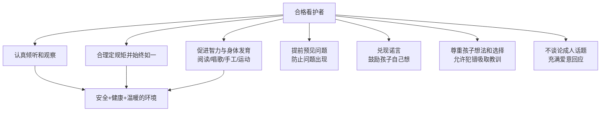
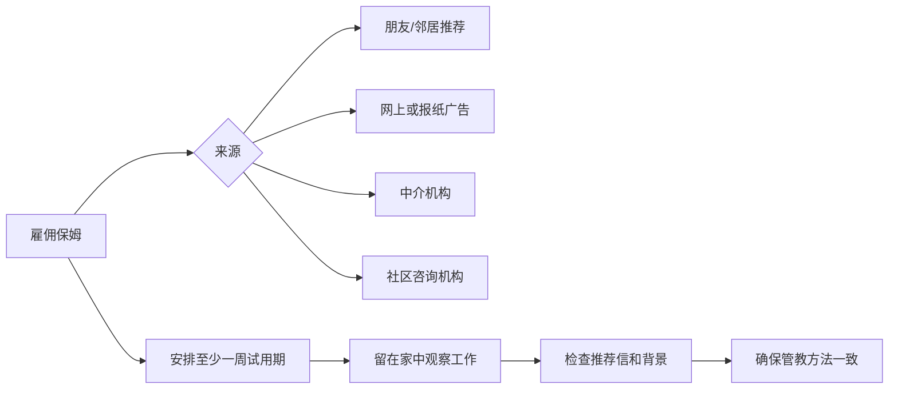
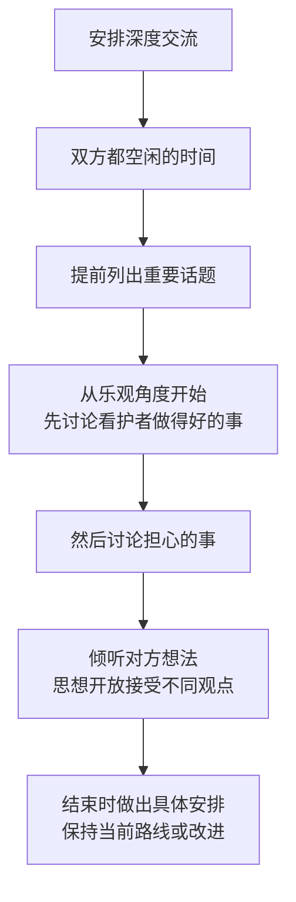
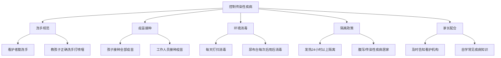
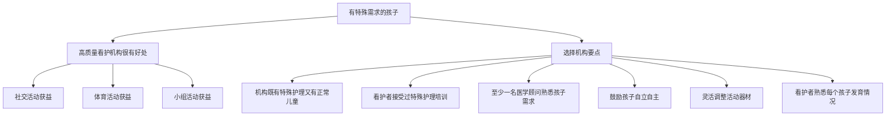

# 第14课：早期教育与看护

## 学习目标

- 掌握评估合格儿童看护者的核心标准和面试问题
- 理解家庭看护（保姆/祖父母）与看护机构（日托/幼儿园）的优缺点
- 学会与看护者建立良好合作关系的方法
- 掌握孩子生病时的看护决策和用药安全原则
- 了解看护机构中常见传染性疾病的防控措施
- 掌握看护环境的安全检查清单
- 了解有特殊需求孩子的看护选择要点

## 一、如何选择儿童看护者

### 看护者应具备的核心素质

### 选择前的自我评估

在看护者面试之前，先问自己以下问题：

| 考量维度 | 具体问题 |
|---------|---------|
| 看护地点 | 自家、别人家还是看护机构？距离多远合适？ |
| 时间安排 | 每周哪些天、哪些时段需要看护？如何接送？ |
| 备用方案 | 孩子或看护者生病了怎么办？节假日如何安排？ |
| 经济能力 | 能承受多少费用？ |
| 看护理念 | 希望孩子参加多少活动？接受多少体系教育？管教方式？ |
| 规模要求 | 希望多大的看护机构？多少孩子一起？ |

> [!IMPORTANT] 动态调整
> 孩子的成长十分快速。今天看来正确的选择，将来可能不再是最佳选择。要**不断评估孩子的需求和当前的看护方式**是否仍合适。

### 看护者面试问题清单

- 你如何管教、喂养、安抚孩子？
- 你如何为孩子安排活动和作息时间？
- 你处理孩子过度哭闹、意外事故的方法是什么？
- 你如何汇报孩子一天的活动内容？
- 你是否有推荐信和资格证书？

---

## 二、儿童的家庭看护

### 保姆看护

| 优点 | 缺点 |
|------|------|
| 孩子待在熟悉环境中 | 很难找到高素质、低薪水的保姆 |
| 接受个性化看护 | 需承担最低工资、社保、税务等雇主责任 |
| 不接触其他孩子，减少疾病传播 | 保姆可能侵犯家庭隐私 |
| 孩子生病时无需请假接回 | 很难准确了解工作情况 |
| 保姆可帮忙做简单家务 | 保姆生病/有事时需安排替代者 |
| | 保姆可能未受过急救培训 |

> [!WARNING] 保姆必备技能
> 保姆必须学习**心肺复苏术及其他急救措施**，你可以为她支付培训费用。同时要确保她了解如何给孩子喂药、药品管理等基本健康知识。

### 家庭看护机构

家庭看护机构是指在他人家中为一群孩子提供看护服务的小型机构，通常有6名以下孩子和1名看护者。

**选择注意事项**：
- 最好选择有营业执照的
- 评估看护者如何换尿布、采取安全措施
- 查看推荐信、资格证书
- 检查居家环境安全
- 了解其他孩子的年龄和特殊需求
- 询问看护者生病时的备选方案
- 确认处理紧急情况的方案

| 优点 | 缺点 |
|------|------|
| 孩子感觉如在家中般舒适 | 无法了解孩子遇到的所有事情 |
| 有同龄玩伴，促进社交 | 有些看护者以看电视为主要活动 |
| 看护方式灵活，个性化安排 | 缺乏监督和指导 |
| 孩子获得更多关注 | 可能无针对特殊需求的方案 |
| 费用通常低于正规托儿所 | 看护人可能带亲属一起看护，质量不稳定 |

### 祖父母看护

> [!NOTE] 祖父母的独特角色
> 祖父母绝对不是"另一个保姆"。存在血缘的传承关系，孩子将来会理解并尊重这种传承。祖父母应**充分利用这种不可取代的角色优势**，与孩子分享故事、读故事书，带孩子融入自己的世界。

**祖父母看护要点**：
- 孩子乘车必须使用合适的汽车安全座椅
- 所有药物锁好，放在孩子看不到够不着的地方
- 了解最新的育儿医学知识（仰卧睡觉、安全非处方药等）
- 对看护机构或保姆的质量进行**再评估**，让子女放心
- 把自己介绍给看护人员并留下联系方式

---

## 三、儿童看护机构

### 机构类型与对比

| 维度 | 家庭看护机构 | 托儿所/幼儿园 |
|------|-------------|--------------|
| 经营场所 | 看护者家中 | 商用住宅 |
| 规模 | 小型（通常6人以下） | 较大，按年龄分班 |
| 营业执照 | 部分有 | 大多数有 |
| 人员 | 1名看护者+可能有助手 | 多名看护者，学历较高 |
| 监管 | 监督较少 | 由教育委员会管理 |
| 连贯性 | 较灵活 | 可能有人员流动率高的问题 |

### 选择看护机构的14个关键问题

1. **招聘要求**：看护者至少上过专科学校？接种疫苗？接受过早教培训？
2. **师生比例**：孩子与看护者的比例是否合理（年龄越小比例越高）？
3. **班级规模**：每个班有多少孩子？
4. **人员稳定性**：是否经常换工作人员？
5. **禁烟政策**：看护者是否被禁止吸烟（包括机构外）？
6. **疫苗接种**：看护者是否接种了百白破和流感疫苗？
7. **看护目的**：强调教学还是让孩子按自身步调成长？
8. **入托手续**：需要哪些孩子资料（健康、发育、个人需求）？
9. **证照检查**：是否有合法的营业执照和健康证书？
10. **生病处理**：孩子或工作人员生病时如何处理？
11. **费用**：总费用多少？缺勤是否仍需付费？
12. **每日活动**：体力活动与安静活动是否合理搭配？
13. **家长参与**：机构欢迎家长参与吗？允许白天看望孩子吗？
14. **规章制度**：接送、药品管理、紧急疏散、纪律约束的规定？

### 参观考察要点

> [!TIP] 实地考察清单
> - 看护者与孩子的互动是否温暖有爱
> - 看护者是否恶狠狠地拍打孩子或过分限制活动
> - 活动场地是否干净整洁、器材充足且无损坏
> - 食物是否合理存放、营养丰富
> - 用餐地点与厕所、尿布更换台是否明确分开
> - 洗手池是否方便看护者和孩子使用
> - 即使孩子睡觉，也应始终有人看护

### 仰卧睡眠

> [!WARNING] 重要安全措施
> 约20%的婴儿猝死综合征发生在儿童看护机构。在选择看护机构前，务必确认该机构遵循**让孩子仰卧睡觉**的简单程序，并确保被褥干净、不会引起过敏。

---

## 四、与看护者建立良好关系

### 日常沟通

- 接送孩子时与看护者聊聊天，分享家中高兴或沮丧的事
- 告知看护者早上发生的可能影响孩子情绪的事情
- 接孩子时了解当天的重要事情（排便、饮食、新玩法、学习进度）
- 发现生病迹象时及时与看护者讨论并达成一致

### 应对竞争心态

> [!NOTE] 不要介意"孩子在我面前更乖"
> 当看护者说"他从来不会对我这样做"时——**不要太介意**。孩子在他最信任的人面前才会有不太礼貌的行为。把你和看护者视为**合作伙伴**而非竞争对手。

### 深度交流的技巧

### 化解矛盾六步法

1. **弄清问题**：了解涉及的人员，但不要责备任何人
2. **听取建议**：认真听取其他人的意见
3. **制定计划**：确定每位看护者的看护任务
4. **考虑应变**：计划与实际情况不符时如何应对
5. **付诸实施**：将计划执行到位
6. **定期复盘**：在特定时间会面讨论计划是否奏效

---

## 五、孩子生病了该怎么办

### 送医/回家决策

| 症状 | 建议 |
|------|------|
| 发热 | 通常需要回家休养 |
| 渗出型皮疹 | 需回家 |
| 24小时内呕吐2次以上 | 需回家 |
| 频繁腹泻或不正常排便2次以上 | 需回家 |
| 普通感冒无发热 | 根据看护机构规定判断 |

> [!IMPORTANT] 核心原则
> 处理孩子生病的原则：一方面保证生病的孩子获得必须的合理看护，另一方面保证其他健康的孩子不被传染。

### 提前预案

- 与上司沟通：能否远程办公或安排同事顶替
- 与伴侣、其他家庭成员和信得过的朋友商议分担方案
- 寻找替代看护者
- 选择孩子熟悉的、了解孩子健康状况的看护者

### 用药安全

> [!DANGER] 给药注意事项
> - 从儿科医生处拿到**手写服药说明**交给照顾孩子的人
> - 药品必须有药房标签：孩子姓名、服药剂量和方法、过期日期
> - **不要骗孩子说药片是糖果**——应该让他知道是什么药、为什么需要吃
> - 要求照顾者记录每次喂药的剂量和时间

### 生病孩子的看护选项

| 选项 | 说明 |
|------|------|
| 留在家中 | 首选，由父母或可信赖的亲戚/保姆照顾 |
| 家庭看护机构 | 部分可同时照顾生病孩子，需隔离 |
| 专业上门看护| 家政中介提供上门看护服务 |
| 看护机构隔离区 | 大型机构设康复室，有专门员工和隔离区 |

---

## 六、控制传染性疾病

### 洗手规范

看护者必须洗手的情况：
- 每天到达看护机构后
- 离开一群孩子去看护另一群孩子时
- 接触食物前后
- 给孩子喂药前后
- 给孩子换尿布后
- 自己上厕所或帮孩子上厕所后
- 接触鼻涕、血液、呕吐物、口水或伤口后
- 接触沙子后
- 倒垃圾后

> [!TIP] 洗手是预防疾病最有效的方法
> 教孩子在上厕所后、擤鼻涕后、拿食物前认真洗手。打喷嚏时用**上臂捂住嘴巴**而非用手。不与别人共用餐具和水杯。

### 降低疾病传播的措施

### 看护机构中常见疾病

| 疾病 | 传播途径 | 防控要点 |
|------|---------|---------|
| 普通感冒/流感 | 口腔/鼻腔分泌物、接触带病毒表面 | 勤洗手、打喷嚏捂嘴、不共用餐具 |
| 巨细胞病毒/细小病毒 | 直接接触体液 | 孕期女性需警惕，保持良好卫生 |
| 腹泻 | 粪便-口途径 | 排稀便时居家，确诊后需化验再返园 |
| 结膜炎/脓疱疮 | 接触传播 | 早发现早治疗，看护机构会通知预防 |
| 头虱 | 直接接触头发 | 药物治疗，**不应隔离** |
| 甲肝 | 粪-口途径 | 疫苗接种普及后患儿已减少 |
| 乙肝 | 血液传播 | 出生即接种，看护机构很少传播 |
| 癣 | 直接接触/共用物品 | 早发现早用药，**不应隔离** |

> [!NOTE] 艾滋病毒（HIV）
> 没有关于HIV在儿童看护机构中传播的报道。没有必要将感染HIV的孩子与其他孩子隔离。采取标准的血液和体液处置措施即可。

---

## 七、避免伤害以及照顾有特殊需求的孩子

### 汽车与接送安全

> [!DANGER] 车祸是对孩子生命安全的**最大威胁**
> - 孩子必须坐在配了五点式安全带的汽车安全座椅上，座位永远是后排
> - 汽车周围绝不可让孩子单独停留——驾驶者倒车时可能撞倒孩子
> - 载多个孩子时，找一个成年人帮忙看护
> - 拼车接送时：确保每个孩子正确坐安全座椅、不超载、保险覆盖全员
> - 校车也应配备腿部及肩部安全带

### 拼车安全原则

- 在路边或能避开车辆的车道搭载/放下孩子
- 没有成年人陪伴时，孩子不要横穿马路后上车
- 让家长亲自将孩子放在安全座椅上并系好安全带
- 关紧车门，锁好车窗，确保孩子手脚都在车内
- 安排最短的行车路线，避开危险路段
- 绝不可将孩子单独留在车里

> [!WARNING] 校车安全
> 大多数校车安全事故发生在**孩子上下车过程中**。孩子应提前5分钟到站，待校车完全停稳再上车，物品掉在车旁一定告诉司机后再捡。

### 游泳安全

- 任何供孩子使用的泳池、湖泊、小溪等需经公共卫生部门检查
- 池边围栏至少1.2米高，围栏门有自动锁
- **禁止使用可移动的充气式游泳池**
- 孩子在水中时需**接触式看护**（成人在一臂之内）

### 看护机构安全检查清单

**室内**：
- 地板平整干净不打滑
- 药品、清洁剂锁好，孩子够不到
- 急救箱用品齐全，放在孩子够不到的地方
- 书架、衣柜等高大家具固定在墙面上
- 插座安装插座盖
- 无遗落的纽扣电池（吞食会严重伤害胃肠道）
- 暖气片在孩子够不到的地方且遮挡
- 热水温度不高于49°C
- 二楼及以上窗户装有护栏
- 窗帘挂绳孩子够不到（最好无绳窗帘）

**室外**：
- 无垃圾、尖锐物体和动物粪便
- 游戏器材表面光滑、固定结实
- 器材下方有减震平面（向四周延伸至少1.8米）
- 秋千座位轻便柔韧，无裂口或勾状物
- 滑梯底部有减速平面，金属滑梯置于阴凉处
- 沙箱不用时盖上盖子
- 危险区域有栅栏禁止进入

> [!TIP] 定期查询
> 通过消费品安全委员会网站查询被召回玩具信息，看护机构可订阅召回警示邮件。

### 照顾有特殊需求的孩子

**选择特殊需求看护机构的要点**：
1. 最好同时照顾特殊需求和正常发育的孩子——对双方都有益
2. 看护者接受过特殊护理培训
3. 至少有一名医学顾问熟悉孩子的保健措施
4. 在安全范围内鼓励孩子自立自主
5. 根据孩子能力差异灵活调整器材和活动
6. 提供特殊器材（如哮喘儿童呼吸训练器材）
7. 看护者能辨别症状并做正确用药决定
8. 外出活动时确保特殊需求孩子的乘车安全
9. 紧急情况下可联系儿科医生，应对措施写在看护计划中

> [!IMPORTANT] 你比任何人都了解你的孩子
> 虽然以上建议可以为你提供帮助，但**你比任何人都了解你的孩子**。在为孩子选择或更换看护机构时，主要还是依靠你自己的判断。

---

> [!TIP] 核心要点
> 选择儿童看护者是一个关乎孩子健康和安全的重要决定。无论是选择家庭看护、儿童看护机构还是祖父母看护，都需要全面评估看护者的素质、环境和理念是否与自己一致。与看护者建立良好的合作关系，做好孩子生病时的预案，关注传染性疾病的防控，以及确保看护环境的安全，是每个家长都必须掌握的核心技能。

## 实践检验

> [!QUESTION] 自测题
> 1. 合格儿童看护者应具备哪些核心素质？请列出至少5项。
> 2. 家庭看护（保姆）和儿童看护机构的优缺点分别是什么？
> 3. 选择儿童看护机构时应问哪14个关键问题中的5个？
> 4. 孩子生病时，哪些症状表明需要回家休养？
> 5. 看护机构中控制传染性疾病最重要的措施是什么？
> 6. 如何对有特殊需求的孩子选择合适的看护机构？

查看答案

1. 认真倾听观察、合理定规矩并始终如一、通过阅读唱歌手工等促进发育、具备预见和防止问题的能力、兑现诺言鼓励孩子自己思考、尊重孩子想法和选择、不讨论成人话题、充满爱意回应等。
2. 家庭看护优点：熟悉环境、个性化看护、减少疾病传播；缺点：难找高素质保姆、成本高、缺乏监督。看护机构优点：规范化管理、多人员保障、教育体系完善；缺点：个性化看护少、可能存在人员流动率高、入托需排队。
3. 包括但不限于：招聘要求、师生比例、人员稳定性、看护目的、生病处理政策、费用、每日活动安排、家长参与程度等。
4. 发热、渗出型皮疹、24小时内呕吐2次以上、频繁腹泻或不正常排便2次以上。
5. 勤洗手——看护者和孩子都严格遵守洗手规范。此外还包括疫苗接种、环境消毒和隔离政策。
6. (1) 机构最好同时收治特殊需求和正常儿童；(2) 看护者接受过特殊护理培训；(3) 有医学顾问；(4) 鼓励孩子自立；(5) 灵活调整器材和活动；(6) 有紧急情况处理预案。

## 下一步

继续学习 [[0015-er-tong-an-quan|第15课：儿童安全]]，深入了解儿童在各个场景下的安全防护知识。

需要复习本课程相关术语？请查阅 [[../reference/glossary|术语表]]。也可查看 [[../reference/quick-reference|快速参考]] 中的疫苗接种时间表。