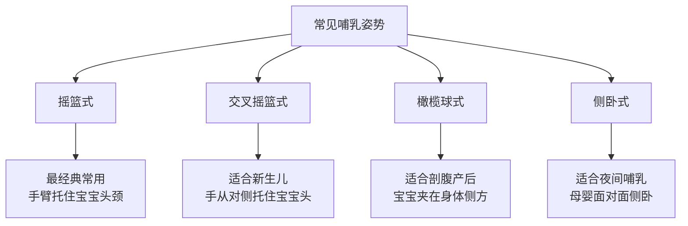
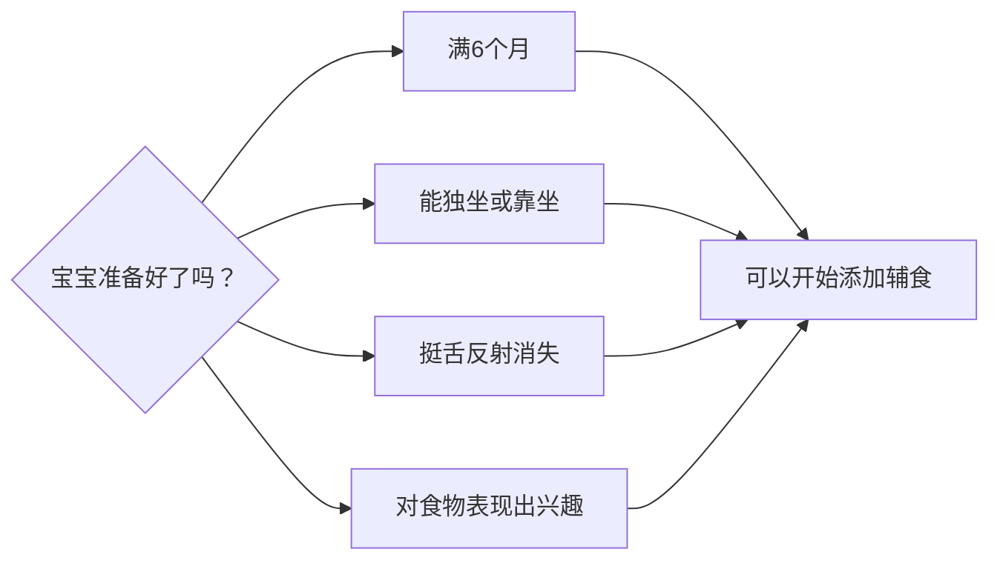

# 喂养指南

> 喂养是育儿中最核心也最常遇到挑战的领域之一。本指南汇总母乳喂养、配方奶喂养及辅食添加的关键要点，帮助父母做出知情选择，建立健康的喂养习惯。

---

## 1. 母乳喂养要点

### 母乳喂养的优势

母乳是新生儿最理想的食物，含有最适合婴儿消化吸收的营养成分以及抗体、益生元等活性物质，可降低婴儿感染、过敏、肥胖等风险，同时有利于母婴情感连接和母亲产后恢复。

### 哺乳姿势

> [!tip] 含接姿势检查
> - 宝宝嘴张得很大，像打哈欠一样含住大部分乳晕
> - 下唇外翻，下巴紧贴乳房
> - 鼻尖轻触乳房但能自由呼吸
> - 能看到/听到吞咽声
> - 乳头**不**疼痛

### 喂养频率与时长

| 月龄 | 喂养次数/天 | 单侧时长 | 说明 |
|------|------------|---------|------|
| 0-1个月 | 8-12次 | 10-20分钟 | 按需喂养，每2-3小时一次，包括夜间 |
| 1-2个月 | 7-9次 | 10-15分钟 | 逐渐建立规律，夜间仍需喂养 |
| 3-5个月 | 6-8次 | 10-15分钟 | 效率提高，单侧可吃饱 |
| 6-12个月 | 4-6次 | 5-10分钟 | 辅食添加后奶量减少但仍为重要营养来源 |

### 判断吃够的标准

> [!note] 吃饱的信号
> - 每天湿尿布：第1-2天≥1-2块，第3-4天≥4块，第5天+≥6块
> - 每天排便：第1个月≥3-4次/天（黄色稀便）
> - 体重增长：出生后第1周恢复出生体重，之后每月增长约500-1000g
> - 喂养后宝宝满足入睡或安静放松
> - 清醒时精神好、眼睛明亮

### 常见问题与解决

| 问题 | 可能原因 | 解决建议 |
|------|---------|---------|
| 乳头疼痛/皲裂 | 含接姿势不正确 | 调整含接姿势，哺乳后挤乳汁涂抹乳头 |
| 乳汁不足 | 吸吮刺激不足、压力大 | 增加喂养频率，确保有效吸吮，充分休息和水分摄入 |
| 乳房胀硬 | 乳汁淤积 | 温热敷后哺乳，从外侧向乳头方向轻柔按摩 |
| 乳腺炎 | 乳汁淤积继发感染 | 持续排空乳房，发热时就医，可能需要抗生素 |
| 乳头扁平或内陷 | 先天因素 | 可使用乳头牵引器或保护罩，多数不影响哺乳 |

> 详细内容参见 [[lessons/0004-xin-sheng-er-ri-chang-hu-li|第04课：新生儿日常护理]]

---

## 2. 配方奶喂养要点

### 配方奶的选择

| 类型 | 适用情况 | 说明 |
|------|---------|------|
| 普通配方奶 | 健康足月婴儿 | 以牛乳为基础，调整营养成分配方接近母乳 |
| 水解蛋白配方 | 牛奶蛋白过敏高风险或已确诊的婴儿 | 蛋白质被部分或完全水解，降低致敏性 |
| 无乳糖配方 | 乳糖不耐受（继发性，如腹泻后） | 以葡萄糖聚合物替代乳糖 |
| 早产儿配方 | 早产儿/低出生体重儿 | 更高的能量和蛋白质密度 |
| 大豆配方 | 半乳糖血症或素食家庭 | 目前不推荐常规使用（植酸影响矿物质吸收） |

> [!warning] 配方奶准备注意事项
> - **严格按说明冲调**，过浓增加肾脏负担，过稀营养不足
> - 水温控制在**40-50°C**（约70°C的水冲调后冷却至喂养温度）
> - 冲调后2小时内未用完应丢弃
> - **不要用微波炉加热**，可能造成局部烫伤
> - 奶瓶和奶嘴每次使用后彻底清洗消毒（至少3个月前）

### 喂养量与频率参考

| 月龄 | 每次量 | 每天次数 | 每天总量 |
|------|--------|---------|---------|
| 0-2周 | 30-60ml | 8-12次 | 240-720ml |
| 2周-2个月 | 60-90ml | 7-9次 | 480-810ml |
| 2-4个月 | 90-120ml | 6-8次 | 540-960ml |
| 4-6个月 | 120-180ml | 5-7次 | 600-900ml |
| 6-12个月 | 180-240ml | 4-6次 | 720-960ml |
| 12个月+ | 约240ml | 2-3次 | 约480-720ml |

> [!tip] 判断奶量是否合适
> 每个宝宝需求不同，关键在于观察**生长曲线**（体重、身高稳定增长）和**湿尿布数量**（每天6块以上）。不要强迫宝宝喝完奶瓶中剩余的量。

### 混合喂养

当母乳不足或母亲需要返回工作，可采取混合喂养。建议先母乳喂养，再补充配方奶。吸吮母乳可维持乳汁分泌。如需断母乳，应循序渐进，每周减少1-2次母乳喂养。

> 详细内容参见 [[lessons/0006-di-1-ge-yue|第06课：第1个月]]

---

## 3. 辅食添加原则

### 何时开始添加辅食

> [!warning] 关键原则
> - **必须满4个月以上才能添加辅食**，推荐满6个月开始
> - 过早添加增加过敏和窒息风险
> - 过晚添加导致营养不足（尤其是铁和锌）和进食困难

### 添加顺序与食物选择

| 阶段 | 年龄 | 质地 | 推荐食物 | 注意事项 |
|------|------|------|---------|---------|
| 第一阶段 | 6个月 | 稀泥糊状 | 铁强化米粉、南瓜泥、胡萝卜泥、土豆泥、苹果泥、梨泥 | 先加米粉，用勺子喂不要用奶瓶 |
| 第二阶段 | 7-8个月 | 厚泥糊/碎末 | 牛肉泥、鸡肉泥、鱼肉泥、豆腐、蛋黄、碎蔬菜 | 引入红肉补铁，每3-5天引入一种新食物 |
| 第三阶段 | 8-9个月 | 碎末/小软块 | 手指食物：蒸软的胡萝卜条、香蕉块、熟意面 | 练习抓握和自主进食 |
| 第四阶段 | 10-12个月 | 碎块/小片 | 碎菜肉末、小块水果、全蛋、软米饭、馒头 | 过渡到家庭食物，鼓励自己吃 |
| 第五阶段 | 12个月+ | 家庭食物 | 除蜂蜜外的各种健康食物 | 少盐少糖，培养健康饮食习惯 |

### 需要留意的致敏食物

传统上建议延迟引入花生、鸡蛋、海鲜等致敏食物，但最新的研究证据表明，**早期引入（6个月后）反而可能降低食物过敏风险**。每次只引入一种致敏食物，观察3-5天。

常见致敏食物：
- 鸡蛋（先试蛋黄，再试蛋白）
- 花生酱/花生（稀释后少量尝试）
- 坚果酱
- 鱼和贝类
- 大豆制品
- 小麦制品

> [!tip] 如果家族有严重食物过敏史，建议在儿科医生指导下引入致敏食物。

### 辅食制作的卫生要求

- 制作前和喂养前彻底洗手
- 食材新鲜，蔬菜水果充分清洗
- 肉类彻底煮熟
- 做好的辅食冷藏不超过24小时，冷冻可保存1个月
- 解冻后的辅食**不要再次冷冻**
- 用过的餐具及时清洗

> 详细内容参见 [[lessons/0008-4-7-yue-ling|第08课：4-7月龄]]

---

## 4. 各年龄段食量参考

### 6-12个月（辅食+奶）

| 食物类别 | 每天推荐量 | 举例 |
|---------|-----------|------|
| 母乳/配方奶 | 600-900ml | 4-6次喂养 |
| 谷物 | 2-4份 | 1份=2-4勺米粉/小半碗粥 |
| 蔬菜 | 2-3份 | 1份=1-2勺蔬菜泥 |
| 水果 | 2-3份 | 1份=1-2勺水果泥 |
| 蛋白质 | 1-2份 | 1份=1-2勺肉泥/半个蛋黄/半两豆腐 |

### 1-2岁

| 食物类别 | 每天推荐量 | 备注 |
|---------|-----------|------|
| 奶制品 | 约480ml（全脂奶） | 可引入全脂牛奶，不要低脂/脱脂 |
| 谷物 | 3-5份（1份=半碗米饭/一片面包） | 尽量选全谷物 |
| 蔬菜 | 2-3份（1份=2-3勺） | 多种颜色搭配 |
| 水果 | 2-3份（1份=半颗苹果/小半碗水果丁） | 不要果汁，吃完整水果 |
| 蛋白质 | 2-3份（1份=30g肉/半个蛋） | 鱼、禽、肉、蛋、豆类 |
| 脂肪 | 适量 | 来自奶制品、植物油、牛油果等 |

### 3-5岁

| 食物类别 | 每天推荐量（根据《中国居民膳食指南》） |
|---------|--------------------------------------|
| 谷薯类 | 100-200g（生重） |
| 蔬菜 | 150-250g |
| 水果 | 150-250g |
| 肉蛋类 | 50-75g（肉禽鱼）+ 1个蛋 |
| 奶制品 | 300-400ml（或等量奶制品） |
| 大豆/豆制品 | 15-25g |
| 油 | 15-25g |
| 盐 | <3g |

> [!warning] 各年龄段通用注意事项
> - **不要给<1岁婴儿喂蜂蜜**
> - **避免整粒坚果、瓜子、爆米花、整颗葡萄、热狗肠**等窒息高风险食物（至少到4岁）
> - **限制果汁**：1-3岁不超过120ml/天，4-6岁不超过180ml/天
> - **避免含糖饮料和高糖零食**
> - **建立规律的就餐时间**，每天3餐+1-2次点心，间隔2.5-3小时
> - **不要用食物作为奖励或惩罚**
> - **允许宝宝决定吃多少**，父母决定提供什么食物

---

## 喂养问题快速排查

| 问题 | 可能原因 | 建议 |
|------|---------|------|
| 拒绝新食物 | 对新事物天然警惕（新食物恐惧症） | 可能需要接触10-15次才能接受，不强迫，持续尝试 |
| 挑食 | 正常发育阶段（1-3岁常见） | 提供多种选择，保持耐心，树立良好榜样 |
| 进食量减少 | 生长速度放缓，自然现象 | 观察生长曲线，只要曲线正常不必焦虑 |
| 吐食/扔食物 | 探索行为，也是自主意识表达 | 平静回应，教"不吃了"的表示方式 |
| 边吃边玩 | 注意力分散 | 固定就餐位置，减少干扰物 |
| 体重增长不良 | 摄入不足/疾病/代谢问题 | 记录3天饮食日记，就医评估 |
| 超重 | 摄入能量过剩/活动不足 | 调整饮食结构，减少高热量零食，增加户外活动 |

> **相关课程链接**
> - [[lessons/0004-xin-sheng-er-ri-chang-hu-li|第04课：新生儿日常护理]] — 新生儿喂养
> - [[lessons/0006-di-1-ge-yue|第06课：第1个月]] — 1个月内喂养
> - [[lessons/0008-4-7-yue-ling|第08课：4-7月龄]] — 辅食添加
> - [[lessons/0010-1-sui-bao-bao|第10课：1岁宝宝]] — 1岁饮食
> - [[lessons/0013-4-5-sui|第13课：4-5岁宝宝]] — 学龄前健康饮食