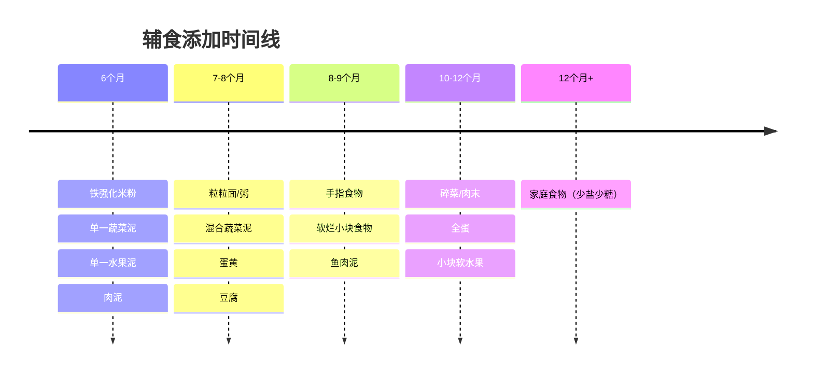
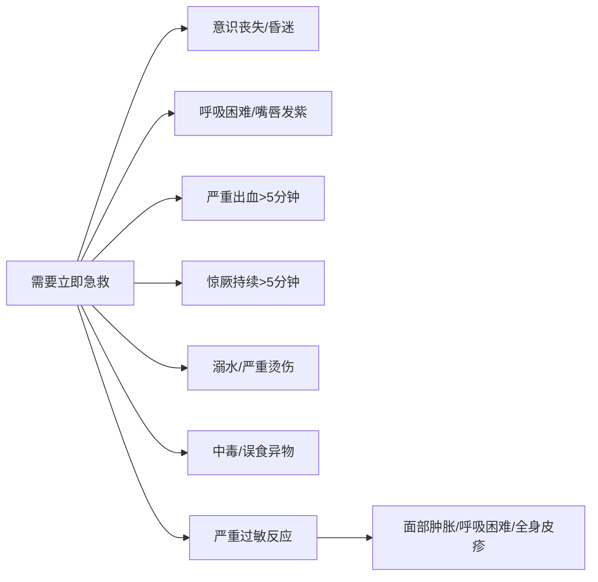

# 快速参考

> 本页汇集课程中最常查阅的速查信息，方便日常快速浏览和决策。

---

## 1. 儿童生长发育里程碑速查表

### 0-12个月

| 月龄 | 大运动 | 精细运动 | 语言/社交 |
|------|--------|----------|-----------|
| 1个月 | 俯卧时抬头片刻 | 手握拳，有抓握反射 | 注视20-30cm处的面孔 |
| 2个月 | 俯卧抬头45度 | 手可短暂张开 | 发出咕咕声，出现社交性微笑 |
| 3个月 | 俯卧抬头90度，有支撑坐立 | 双手可碰在一起 | 笑出声，辨认熟悉面孔 |
| 4个月 | 俯卧用前臂支撑，从仰卧翻至侧卧 | 伸手抓物 | 牙牙学语，表达高兴/不高兴 |
| 5个月 | 从仰卧翻至俯卧 | 将物体从一手换至另一手 | 对自己的名字有反应 |
| 6个月 | 独坐片刻，开始匍匐移动 | 用整手抓握（掌心抓握） | 发出辅音组合（ba、ma、da） |
| 7个月 | 独坐稳，可能开始爬行 | 用桡侧抓握（拇指+食指侧） | 有目的地发出"baba/mama" |
| 8个月 | 爬行熟练，扶着站起 | 用拇指和食指捏取小物（钳形抓握开始） | 理解"不"，玩躲猫猫 |
| 9个月 | 扶着家具行走（巡航） | 钳形抓握成熟 | 对陌生人表现害羞/焦虑 |
| 10个月 | 从站姿坐下 | 有意识地松开手中的物体 | 模仿声音和手势 |
| 11个月 | 独立站立片刻 | 用勺子尝试自喂 | 说出第一个有意义的词 |
| 12个月 | 独立行走几步 | 用杯子喝水，用勺子自喂 | 说1-3个词，执行简单指令 |

### 1-5岁

| 年龄 | 大运动 | 精细运动 | 语言 | 社交/认知 |
|------|--------|----------|------|-----------|
| 15个月 | 走稳、跑几步 | 自发涂鸦 | 说3-6个词 | 模仿做家务 |
| 18个月 | 跑、爬楼梯扶着上 | 搭3-4块积木 | 说10-20个词 | 开始表达"我的" |
| 2岁 | 双脚跳、踢球 | 搭6块积木、一页一页翻书 | 说50+词、2-3词短句 | 平行游戏、模仿成人 |
| 2.5岁 | 单脚站片刻 | 画竖线/横线 | 说200+词、用代词"我" | 开始有性别意识 |
| 3岁 | 骑三轮车、双脚交替上楼 | 画圆圈、用剪刀 | 说300+词、3-5词句子 | 合作游戏、有想象力 |
| 4岁 | 单脚跳、接球 | 画十字、扣扣子 | 讲故事、问"为什么" | 合作游戏、认部分颜色和数字 |
| 5岁 | 翻跟头、跳绳 | 画三角形、写字 | 流利对话、用将来时 | 遵守规则、独立穿衣 |

> 详细内容参见 [[lessons/0006-di-1-ge-yue|第06课]] 至 [[lessons/0013-4-5-sui|第13课]]

---

## 2. 辅食添加顺序表

### 辅食添加核心原则

> [!tip] 辅食添加核心要点
> - **时间**：满6个月（约180天）开始添加，不早于4个月、不晚于6个月
> - **顺序**：先加铁强化米粉，再逐步添加蔬菜、水果、肉泥
> - **单一引入**：每次只添加一种新食物，观察3-5天，确认无过敏后再加下一种
> - **质地演进**：泥糊状 → 碎末状 → 小块状 → 手指食物 → 家庭食物
> - **继续喂养**：添加辅食后继续母乳/配方奶喂养至12个月以上

> [!warning] 注意
> - 1岁前不要给蜂蜜（肉毒杆菌中毒风险）
> - 避免整粒坚果、爆米花、整颗葡萄等窒息高风险食物
> - 不强迫进食，尊重宝宝饱足信号
> - 不过早添加盐和糖，培养清淡口味

详见 [[lessons/0008-4-7-yue-ling|第08课：4-7月龄]]

---

## 3. 疫苗接种时间表（中国常见疫苗）

| 年龄 | 接种疫苗 |
|------|---------|
| 出生时 | 卡介苗（BCG）、乙肝疫苗第1剂（HepB-1） |
| 1月龄 | 乙肝疫苗第2剂（HepB-2） |
| 2月龄 | 脊灰灭活疫苗第1剂（IPV-1） |
| 3月龄 | 百白破第1剂（DTaP-1）、脊灰灭活疫苗第2剂（IPV-2） |
| 4月龄 | 百白破第2剂（DTaP-2）、脊灰减毒活疫苗第1剂（bOPV-1） |
| 5月龄 | 百白破第3剂（DTaP-3） |
| 6月龄 | 乙肝疫苗第3剂（HepB-3）、流脑A群第1剂（MPSV-A-1） |
| 8月龄 | 麻腮风疫苗第1剂（MMR-1）、乙脑减毒活疫苗第1剂（JE-1） |
| 9月龄 | 流脑A群第2剂（MPSV-A-2） |
| 12月龄 | 水痘疫苗第1剂（Var-1，非免疫规划） |
| 18月龄 | 百白破第4剂（DTaP-4）、麻腮风疫苗第2剂（MMR-2）、甲肝疫苗第1剂（HepA-1） |
| 2岁 | 乙脑减毒活疫苗第2剂（JE-2）、甲肝疫苗第2剂（HepA-2） |
| 3岁 | 流脑AC多糖疫苗第1剂（MPSV-AC-1） |
| 4岁 | 脊灰减毒活疫苗第2剂（bOPV-2） |
| 6岁 | 百白破第5剂（DTaP-5）、流脑AC多糖疫苗第2剂（MPSV-AC-2） |

> [!info] 接种提示
> - 上表为**国家免疫规划程序**，非免疫规划疫苗（如13价肺炎疫苗、轮状病毒疫苗、流感疫苗、水痘疫苗等）建议咨询当地接种点
> - 接种前确保宝宝健康，有发热或急性疾病应暂缓
> - 接种后留观30分钟

详见 [[lessons/0031-yi-miao-jie-zhong|第31课：疫苗接种]]

---

## 4. 常见疾病症状与处理速查表

| 症状 | 可能原因 | 家庭处理 | 何时就医 |
|------|---------|---------|---------|
| 发热 <38.5°C | 感染、疫苗接种反应 | 减少衣物、多饮水、监测体温 | >3月龄发热>3天或精神差 |
| 发热 ≥38.5°C | 细菌/病毒感染 | 可遵医嘱使用退热药（布洛芬或对乙酰氨基酚） | <3月龄任何发热立即就医 |
| 咳嗽（轻度） | 感冒、过敏 | 增加空气湿度、1岁以上可喝温蜂蜜水 | 呼吸急促、嘴唇发紫、持续>2周 |
| 咳嗽（剧烈） | 百日咳、肺炎、异物吸入 | 保持呼吸道通畅 | 犬吠样咳嗽（哮吼）、呼吸困难 |
| 腹泻 | 病毒性胃肠炎、食物不耐受 | 预防脱水、继续喂养、补锌 | 脱水征、血便、持续>7天 |
| 呕吐 | 胃肠炎、颅内压增高（罕见） | 少量多次补液、暂禁食1-2小时 | 呕吐物含黄绿色/血性、剧烈头痛、嗜睡 |
| 皮疹伴发热 | 幼儿急疹、麻疹、猩红热 | 监测体温、保持皮肤清洁 | 皮疹迅速蔓延、精神萎靡、呼吸异常 |
| 耳痛 | 中耳炎 | 可口服退热止痛药 | 婴幼儿抓耳哭闹伴发热 |
| 便秘 | 饮食纤维素不足、水分不够 | 增加水果蔬菜、多喝水、腹部按摩 | 持续>2周、伴有腹胀呕吐 |
| 鼻塞流涕 | 感冒、过敏 | 生理盐水洗鼻、加湿器 | 呼吸困难影响吃奶/睡眠 |

详细信息参见：
- [[lessons/0027-fa-re|第27课：发热]]
- [[lessons/0016-fu-bu-xiao-hua-wen-ti|第16课：腹部与消化道问题]]
- [[lessons/0019-xiong-bu-fei-bu-wen-ti|第19课：胸部和肺部问题]]
- [[lessons/0022-er-bi-yan-hou-wen-ti|第22课：耳鼻咽喉问题]]
- [[lessons/0033-pi-fu-wen-ti|第33课：皮肤问题]]

---

## 5. 家庭急救箱清单

> [!note] 建议准备一个专用的家庭急救箱，存放在儿童接触不到但成人方便获取的位置，并定期检查有效期。

### 基本工具
| 物品 | 用途 |
|------|------|
| 电子体温计（肛温/耳温） | 测量体温 |
| 儿童专用剪刀和镊子 | 剪纱布、取出小异物 |
| 安全别针 | 固定绷带 |
| 手电筒或头灯 | 检查伤口和咽喉 |
| 一次性冰袋 | 冷敷消肿 |
| 三角巾 | 固定手臂/悬吊 |

### 敷料与包扎
| 物品 | 用途 |
|------|------|
| 无菌纱布垫（多种尺寸） | 覆盖伤口 |
| 弹性绷带（多种宽度） | 固定敷料、加压包扎 |
| 创可贴（防水型） | 小伤口保护 |
| 医用胶带 | 固定纱布 |
| 一次性医用手套（无粉） | 避免感染 |

### 药品与护理品
| 物品 | 用途 |
|------|------|
| 对乙酰氨基酚（儿童滴剂/混悬液） | 退热、止痛 |
| 布洛芬（儿童混悬液） | 退热、止痛（6个月以上） |
| 口服补液盐Ⅲ（ORS） | 预防和治疗腹泻脱水 |
| 生理盐水滴鼻剂/喷鼻剂 | 缓解鼻塞 |
| 炉甘石洗剂 | 止痒（蚊虫叮咬、荨麻疹） |
| 碘伏（非酒精型） | 伤口消毒 |
| 抗生素软膏（莫匹罗星/百多邦） | 伤口感染预防 |
| 氢化可的松乳膏（1%） | 过敏、湿疹止痒 |
| 镊子式指甲剪 | 婴儿指甲修剪 |

> [!warning] 用药提醒
> - **不要给6个月以下婴儿使用布洛芬**
> - **不要给儿童使用阿司匹林**（可能诱发瑞氏综合征）
> - 任何用药前先咨询医生或药师
> - 定期检查药品有效期

### 急救参考卡
在急救箱中附一张卡片，写下：
- 急救电话：120
- 中毒咨询热线
- 就近医院急诊科电话
- 家庭成员过敏史

详见 [[lessons/0023-er-tong-ji-zhen|第23课：儿童急诊]]

---

## 6. 何时应该就医的警示信号

### 需要立即拨打120（急救）的情况

### 需要立即去急诊的情况

> [!warning] 出现以下任一症状应立即前往急诊
>
> - <3月龄婴儿任何发热（体温≥38°C）
> - 发热伴惊厥发作
> - 呼吸急促、鼻翼扇动、胸骨上凹陷
> - 脱水征：超过6-8小时无尿、哭时无泪、眼窝凹陷、口唇干燥
> - 呕吐物含血或黄绿色胆汁
> - 大便含血（尤其是果酱样血便）
> - 头部摔伤后出现呕吐、意识改变
> - 怀疑骨折或关节脱位
> - 严重腹痛、腹部僵硬、蜷缩不动
> - 眼睛异物或化学物入眼
> - 皮肤出现瘀点状皮疹（按压不褪色）

### 需要预约门诊的情况

| 症状 | 建议就诊时限 |
|------|-------------|
| 发热持续>3天 | 1-2天内 |
| 咳嗽持续>2周 | 1-2周内 |
| 腹泻持续>7天 | 3-5天内 |
| 反复腹痛 | 1-2周内 |
| 生长发育明显滞后 | 1个月内 |
| 疑似视力/听力问题 | 1-2周内 |
| 持续情绪/行为问题 | 1个月内 |
| 反复发作的头痛 | 1-2周内 |

> 详细急诊指南参见 [[lessons/0023-er-tong-ji-zhen|第23课：儿童急诊]]

---

> **相关课程链接**
> - [[lessons/0005-liao-jie-ni-de-xin-sheng-er|第05课：了解你的新生儿]] — 新生儿反射与发育
> - [[lessons/0008-4-7-yue-ling|第08课：4-7月龄]] — 辅食添加
> - [[lessons/0031-yi-miao-jie-zhong|第31课：疫苗接种]] — 疫苗时间表
> - [[lessons/0027-fa-re|第27课：发热]] — 发热处理
> - [[lessons/0023-er-tong-ji-zhen|第23课：儿童急诊]] — 急诊处理