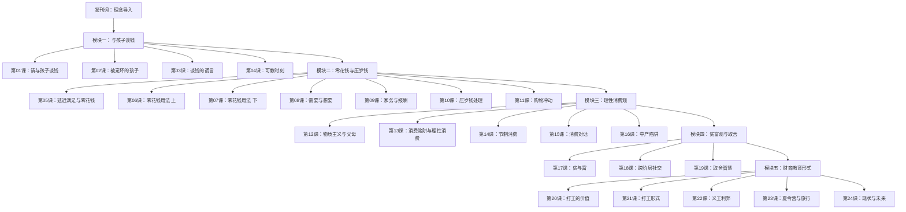
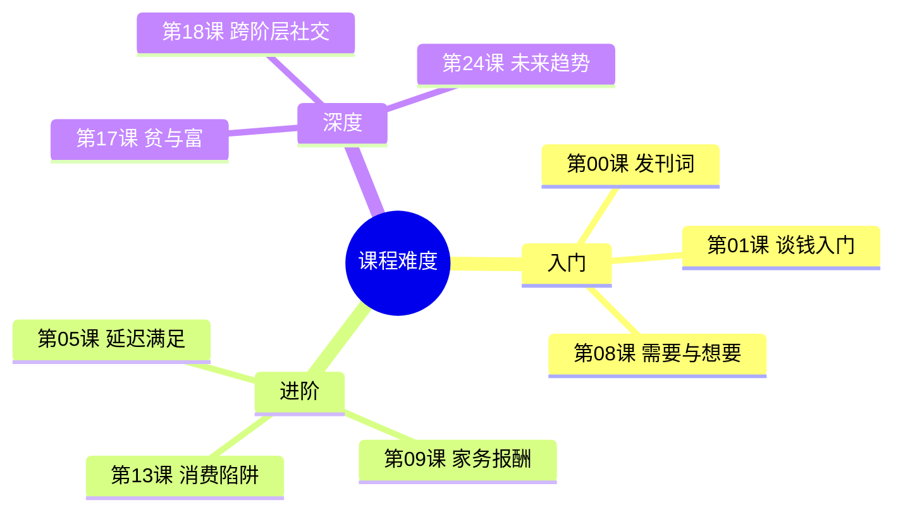

# 课程地图



## 学习路径建议

### 路径一：按顺序完整学习（推荐）

课程从基础到进阶环环相扣，建议按编号顺序学习：

```
发刊词 → 第01-04课（谈钱方法论）→ 第05-11课（零花钱实操）
→ 第12-16课（消费观）→ 第17-19课（价值观）→ 第20-24课（拓展形式）
```

### 路径二：按需选学

| 如果你的痛点 | 推荐课程 |
|-------------|---------|
| 不知道如何开口谈钱 | 第01课、第03课 |
| 孩子乱花钱、攀比 | 第05课、第08课、第11-13课 |
| 压岁钱不会处理 | 第10课 |
| 家务要不要给钱 | 第09课 |
| 孩子嫌穷/炫富 | 第17课、第18课 |
| 想让孩子体验赚钱 | 第20课、第21课 |

## 参考文档

- [[reference/核心框架|核心框架：弗里德曼花钱四原则]]
- [[reference/术语表|亲子财商术语表]]
- [[reference/年龄沟通指南|各年龄段沟通指南]]

## 难度分级

