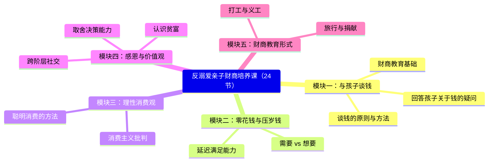

# 第00课：发刊词——财商教育，从谈钱开始

## 课程背景

本课程基于中信出版社畅销书 **《反溺爱》(The Opposite of Spoiled)** ，作者为美国《纽约时报》个人理财专栏作家 **罗恩-利伯 (Ron Lieber)**。

讲师张磊在原著基础上，结合中国家庭实际情况，加入了 **40多个中国家庭案例、40多个重要知识点、20多个实操方法**，形成了这套共24节的亲子财商培养课。

## 为什么需要财商教育

### 三个常见困境

| 场景 | 常见误区 | 更好的方式 |
|------|----------|------------|
| 压岁钱处理 | 全部没收或全部放手 | 教孩子规划管理 |
| 家务报酬 | 不给就不做，或无条件给 | 建立责任与报酬的关联 |
| 商场哭闹要玩具 | 当众教训或一再妥协 | 利用机会教价值观 |

> [!TIP] 核心理念
> **金钱是中立的**，它能作为**教育的工具**。哪怕是一美元，如果使用得当，也可以给孩子灌输我们希望他们秉持的价值观。

## 五大模块概览

### 模块一：与孩子谈钱（第01-04课）

- 财商教育的基本原则
- 跟不同年龄段谈钱的具体方法
- 应对乱花钱的策略
- 回答孩子关于家庭财富的疑问

### 模块二：零花钱与压岁钱

- 分清"需要"与"想要"
- 延迟满足能力的培养

### 模块三：理性消费观

- 成熟消费方式与实际案例
- 节制消费 = 帮爸妈赚钱

### 模块四：感恩与价值观

- 正确认识贫富
- 跨阶层社交能力
- 决策与取舍能力

> [!EXAMPLE] 跨阶层社交
> 善于跟同阶层的人打交道是 **情商高**；可以跟不同阶层的人打交道是 **财商高**。

### 模块五：财商教育形式

打工、做义工、捐献、旅行——财商教育机会丰富多样，但需要有好的策略。

## 核心观点提炼

1. **每个有关金钱的问题都与价值观有关**
2. 通过零用钱培养 **耐心**
3. 通过告知工作意义培养 **毅力**
4. 通过聪明消费培养 **取舍智慧**
5. 通过捐献习惯培养 **慷慨性格**

## 本课总结

财商教育不是教孩子如何赚钱，而是通过**金钱这个工具**，培养孩子的**价值观和品格**。谈钱就是谈价值观，这是贯穿本课程始终的核心线索。

> [!WARNING]
> 不要等到自己"大彻大悟"再教孩子——**错误的等待只会等来悔恨**。财商教育是长期工程，与孩子一起成长才是正道。

## 自测题

> [!QUESTION] 复习自测
>
> 1. 本书作者罗恩-利伯对金钱的基本观点是什么？
> 2. 本课程的五大模块分别是什么？
> 3. 为什么说"善于和不同阶层的人打交道是财商高"？
> 4. 课程中提到的"20多个实操方法"适用于什么场景？
>
> 

> 
点击查看参考答案

>
> 1. 金钱是中立的，可以作为教育的工具，用来灌输我们希望孩子秉持的价值观。
> 2. 模块一：与孩子谈钱；模块二：零花钱与压岁钱；模块三：理性消费观；模块四：感恩与价值观；模块五：财商教育形式。
> 3. 跨阶层社交需要理解不同经济背景下的价值观和生活方式，这需要更高的财商素养和同理心。
> 4. 适用于日常生活中的各种财商教育场景，如零花钱管理、消费决策、家务报酬等。
>
> 
