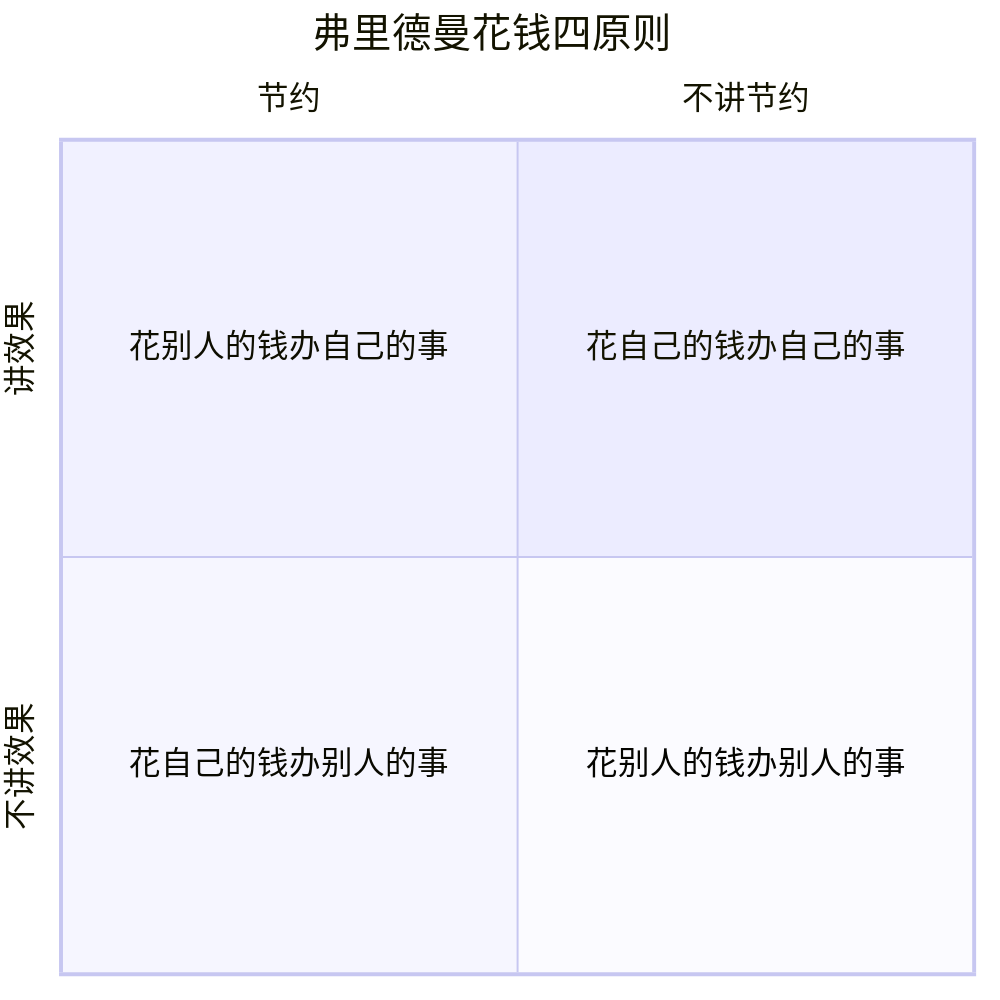

# 第01课：财商教育第一步——请与孩子谈钱

## 引言

根据2017年普信集团(T. Rowe Price)调查报告显示：**多达七成**的家长不愿意跟孩子讨论有关钱的话题。

财商教育的一切，都要从**跟孩子谈钱**开始。

## 家长不愿谈钱的三个原因

| 原因 | 错误认知 | 正确的理解 |
|------|----------|------------|
| 怕孩子变贪婪 | 谈钱会让孩子"掉进钱眼里" | 回避谈钱反而让孩子对钱过分敏感 |
| 觉得孩子太小 | 孩子听不懂，谈了白谈 | 孩子的理解力超乎想象，需调整沟通方式 |
| 自己也不懂 | 自己财商低，不敢乱讲 | 财商教育是长期工程，应与孩子一起成长 |

> [!TIP] 类比思考
> 谈钱如谈性——**越早越安全**。你不教孩子，就会有别人来教孩子，甚至利用孩子。

## 弗里德曼花钱四原则

诺贝尔经济学奖得主 **米尔顿-弗里德曼 (Milton Friedman)** 提出的花钱四原则是财商教育的核心框架：



### 四句话精解

| 原则 | 表述 | 效果 | 评价 |
|------|------|------|------|
| 1 | 花自己的钱，办自己的事 | 既讲节约，又讲效果 | **最佳** |
| 2 | 花自己的钱，办别人的事 | 只讲节约，不讲效果 | 次优 |
| 3 | 花别人的钱，办自己的事 | 只讲效果，不讲节约 | 较差 |
| 4 | 花别人的钱，办别人的事 | 既不讲节约，也不讲效果 | **最差** |

> [!WARNING] 常见误区
> 家长强迫孩子上不喜欢的兴趣班——**花自己的钱，让孩子办家长的事**，正是最糟糕的第四种情况。

### 教育启示

**为孩子创造机会**，让他们在合适的年龄、合适的场合 **花自己的钱，办自己的事**，才能真正提高财商。

## 不同年龄段谈钱方法

### 学龄前（3-6岁）：行为示范

- **最佳方式不是语言，而是行为**
- 孩子观察力和模仿能力强，家长做好榜样
- 使用**现金交易**，让孩子对购买行为有直观认识
- 让孩子从存钱罐拿钱买日常食物，建立"钱-物"联系

> [!TIP] 操作建议
> 让孩子用自己的钱购物后，可以回家后**报销**——因为这是家长发起的消费，不是孩子主动要买的。

### 小学至初中（7-15岁）：理解机会成本

- 开始了解 **机会成本** 概念
- 让孩子明白：**选择一样 = 放弃另一样**

#### 机会成本的日常运用

```
"如果你买这双鞋，就不能买那个运动表了——本学期预算已超标"
"如果你这周末去看电影，下周的踢球时间就要取消——功课时间优先"
```

#### 应对冲动消费的策略

| 场景 | 孩子自己有钱 | 孩子要求家长买 |
|------|-------------|---------------|
| 策略 | 鼓励24小时冷静期 | 关联消费限制 |
| 话术 | "冷静24小时再决定" | "如果买这个，生日礼物就不能买了" |

> [!EXAMPLE] 重要原则
> 孩子需要明白：**购买力不是取之不尽用之不竭的**。这是绝大多数人一辈子要面对的问题。

## 本课总结

1. **谈钱如谈性，越早越安全**——回避不是保护
2. **弗里德曼四原则**是财商教育的基础语法，一通百通
3. **不同年龄段用不同方法**：3-6岁看行为，7-15岁学机会成本
4. **家长的保护应该是托底**：在困难时帮助，在救急时资助，而非无限度满足

## 自测题

> [!QUESTION] 复习自测
>
> 1. 根据调查，有多大比例的家长不愿意跟孩子讨论钱的话题？
> 2. 弗里德曼四原则中"最糟糕"的是哪一种情况？请举例说明。
> 3. 针对3-6岁学龄前儿童，最好的谈钱方式是什么？
> 4. 7-15岁孩子出现冲动消费时，推荐的处理方法是什么？
>
> <details>
> <summary>点击查看参考答案</summary>
>
> 1. 70%（七成），根据2017年普信集团调查数据。
> 2. 第四种：花别人的钱，办别人的事——既不讲节约也不讲效果。例如：家长强迫孩子上不喜欢的兴趣班，孩子既没兴趣（"别人的事"），钱也不是自己出的（"别人的钱"）。
> 3. 不是通过语言，而是通过**行为示范**。家长做榜样，用现金交易让孩子直观理解钱与物的关系。
> 4. 如果孩子自己有钱，鼓励**24小时冷静期**再决定；如果要求家长买，则关联其他消费限制（如生日礼物预算）。
>
> </details>