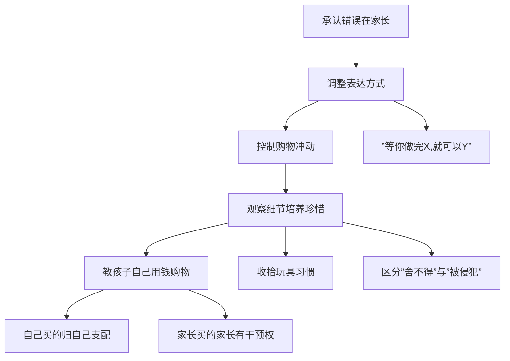

# 第02课：用财商教育拯救"被宠坏"的孩子

## 引言

当美国家长被问到"你觉得别人在描述自己的孩子时，最糟糕的词是什么"，大多数人回答：**宠坏**。这个词的出现频率甚至超过了刻薄、残忍、种族歧视、暴力等词汇。

> [!WARNING] 核心警示
> "宠坏"代表家长的行为影响了孩子的人格发展——这是 **父母的失职**。

## 被宠坏的两个典型案例

### 案例一：不知感恩的孩子

山东泰安的王俊宏家庭，夫妻月收入仅3000元，小学三年级的孩子每月零花钱超过500元。同学过生日，孩子二话不说花200元买礼物。孩子完全不懂得父母赚钱的辛苦。

### 案例二：不断升级的失控

天津的周强，孩子以买书为由要钱，实际全花在小卖部。被发现后，孩子改以 **偷钱** 的方式继续。每次认错痛哭流涕，但一而再再而三地管不住自己。

## 被宠坏孩子的四个共通点

根据《反溺爱》原著，被宠坏的孩子具有以下四个特征：

| 特征 | 表现 | 后果 |
|------|------|------|
| 很少分担家务或其他责任 | 衣来伸手、饭来张口 | 缺失责任感和感恩之心 |
| 没有太多行为与作息规范 | 随心所欲、不受约束 | 不守规矩、不懂协作、影响人际关系 |
| 被给予过多关注与协助 | 一切都被安排好 | 失去自我追求、没有目标感 |
| 拥有很多个人物品 | 要什么有什么 | 觉得一切都是应得的，不懂珍惜 |

### 深度分析：过多关注的致命后果

> [!EXAMPLE] 真实案例
> 一位雅思老师的富家学生说："我对任何事情都不感兴趣……反正我也不需要奋斗，爸妈已经很有钱了，我这辈子什么也不用干都花不完。"
>
> 父母无意识地允许他**没有目标、没有计划**，最终使他失去了存在感和奋斗的动力。

**溺爱像无色无味的毒药**——让孩子失去了锻炼自己、突破自己的机会；又像一张看不见的网——束缚住孩子的梦想和斗志。

## 财商教育作为解决方案

### 五步纠正法

#### 第一步：承认错误在家长

被宠坏不是孩子的错，家长要率先做出调整，且调整必须**持续连贯**，不能三天打鱼两天晒网。

#### 第二步：使用"等你做完X，就可以Y"句式

建立 **先付出后回报** 的条件关系：

- "等你打扫完房间，就可以玩一会了"
- "等你吃完蔬菜，就可以吃点巧克力了"
- "等你把床铺好，就可以玩玩具了"

#### 第三步：控制购物频率

> [!TIP] 饥饿是最好的调味料
> 让孩子保持一点 **匮乏感** ——有助于感恩生活，为目标奋斗。乔布斯说：Stay hungry, stay foolish.

#### 第四步：观察细节，培养珍惜

| 行为 | 含义 | 应对 |
|------|------|------|
| 玩完玩具随手扔 | 不珍惜 | 示范收纳，养成好习惯 |
| 玩具被收走而哭（舍不得玩具） | 珍惜物品 | 正面引导 |
| 玩具被收走而哭（因为财物被侵犯） | 所有权意识 | 结合第五步，教用钱买东西 |

#### 第五步：教孩子自己用钱买东西

- 明确规则：**自己买的东西，家长不霸道处置**
- 家长买的东西，家长有权利干预
- 一段时间后，孩子会明白：**世界不是以他为中心**

## 本课总结

> [!QUOTE] 原著金句
> 每个与金钱有关的问题都与价值观有关：
> - **零用钱**与**耐心**有关
> - **捐献**与**慷慨**有关
> - **工作**与**毅力**有关
> - **节俭与精明**与在想要和需要之间协调有关

被宠坏的孩子归根结底是**价值观的错位**——不懂珍惜、不懂感恩、缺乏对他人的尊重、不知道资源有限。**财商教育恰恰是纠正这些问题的根本途径**，因为谈钱就是谈品质、谈价值观。

## 自测题

> [!QUESTION] 复习自测
>
> 1. 被宠坏的孩子有哪四个共通点？
> 2. 为什么"家长给予过多关注与协助"是对孩子负面影响最大的一点？
> 3. 五步纠正法的核心逻辑是什么？
> 4. "等你做完X，就可以Y"这种句式的作用是什么？
>
> 

> 
点击查看参考答案

>
> 1. (1) 很少分担家务或其他责任；(2) 没有太多行为与作息规范；(3) 被给予过多关注与协助；(4) 拥有很多个人物品。
> 2. 过多的关注和协助会**剥夺孩子的奋斗动力和自我追求**，让孩子觉得"反正有父母安排好一切"，最终失去目标感和成就感。
> 3. 从认可"错误在家长"出发，通过**调整表达方式、控制物质给予、培养珍惜习惯、建立所有权规则**四条路径，最终让孩子理解资源有限、付出才有回报。
> 4. 让孩子始终感受**先付出才能有回报**，建立条件关系，约束随心所欲的行为模式。
>
> 
