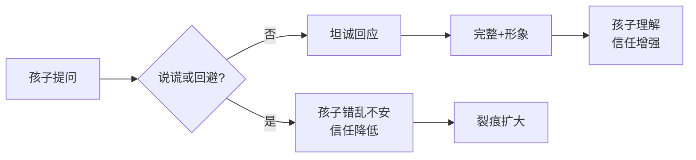

# 第03课：与孩子谈钱时，你说过谎吗？

## 引言

与孩子谈钱时，你是否说过类似的话？

- "这个玩具你不能玩，容易过敏，有生命危险"（买不起，但不说真话）
- "那双鞋纯是广告吹出来的，咱们买不起"（转身自己买了名牌包）
- "爸爸的钱都在妈妈那里，你去问妈妈吧"（踢皮球式回避）

> [!WARNING] 惊人数据
> 根据普信集团调查：**77%** 的父母会对孩子在钱的事情上撒谎，其中 **15%** 是至少每周骗一次的"惯犯"。

## 对金钱撒谎的后果

### 新加坡南洋理工大学的研究

一项涉及 **379名新加坡年轻人** 的心理学研究表明：

| 童年经历 | 成年后果 |
|----------|----------|
| 更经常被父母骗 | 更容易骗父母 |
| 被欺骗式教育 | 精神压力更大 |
| 认知错乱 | 心理和社交挑战更多 |
| 缺乏安全感 | 更容易愧疚、自私、发展出操纵性人格 |

> [!TIP] 关键洞察
> 父母每天教育孩子"诚实是最好的品质"，却又做出说谎的示范——这会让孩子感到 **错乱和不安**，逐渐缺乏对他人的信任。

## 回避问题同样有害

### 13岁卡登的故事

13岁的卡登利用玩游戏的时间，登陆薪资调查网站，计算出父亲（一位财务规划师）的年收入是70万美元。

> 当父母总是回避孩子的疑问，孩子会：
> 1. 自己想办法找到答案——**很可能是错误的答案**
> 2. 久而久之，重大问题不再问父母
> 3. 亲子关系的裂缝逐渐扩大

## 如何诚实回答关于家庭财富的问题

### 核心原则

### 回答三原则

| 原则 | 说明 | 反例 | 正例 |
|------|------|------|------|
| **完整** | 提供语境，让孩子理解数字的意义 | "爸爸每月挣15800" | 结合本地购买力解释 |
| **形象** | 用具体事例、类比帮助理解 | "三大攻坚战取得关键进展" | 用甘草堂、计数器展示财富分布 |
| **无性别差异** | 对儿子女儿的谈钱频率保持一致 | 只跟儿子谈 | 同等对待 |

### 经典案例：Jeff Soffloff的100根甘草堂

家庭事务咨询公司Bloom & Soffloff创始人Jeff Soffloff被孩子问"咱们家算有钱人还是穷人"时：

1. 让孩子用 **100根甘草堂**（可替换为牙签）从左到右表示"从穷到富"
2. 孩子选在第10根，Jeff说不对
3. 孩子一路往右数，Jeff都说不对
4. 最后孩子惊讶地发现要在**最右边**
5. Jeff把最右边那根剪成 **1/4**
6. 顺势引出"需要与想要"的讨论

## 两种需要适当隐瞒的情况

> [!TIP] 特殊情况
> 虽然提倡诚实，但有两种情况反而需要适当保留：

### 情况一：突然变得非常有钱

- 不要直接告诉孩子"以后买东西可以不看价钱"
- 这会**剥夺孩子的存在感和进步动力**
- 引用：**Samantha Ettus** "你一定不会愿意做任何阻碍孩子努力奋斗、实现自己最大价值的事情"
- 引用：**巴菲特** "留给孩子足够的财富去做任何想做的事，而非什么也不用做"

### 情况二：谈论别人的财务状况

- 避免具体数据，尊重他人隐私
- 不要夸大别人遇到的困难
- 防止孩子变成 **势利眼**

## 附论：说谎本身是一种能力

> [!NOTE] 脑科学视角
> 孩子开始说谎是**大脑发育的重要里程碑**，需要具备：
> - 理解他人想法与自己不同（心理理论）
> - 意志力（抑制说出真相的冲动）
> - 流畅的语言表达能力

说谎本身是**中性的能力**：
- 用好了 = **高财商的体现**（储蓄计划、团队愿景、"画大饼"）
- 用不好 = 不合时宜的欺骗

## 本课总结

1. **诚实不是道德问题，而是教育方法问题**——谎言虽然省事，但代价巨大
2. **回避比说谎好不了多少**——孩子会自己寻找（错误的）答案
3. 回答孩子要 **完整 + 形象 + 无性别差异**
4. 突然暴富和谈论别人财务时，需要适当保留

## 自测题

> [!QUESTION] 复习自测
>
> 1. 普信集团调查显示，有多大比例的父母会对孩子在钱的问题上撒谎？
> 2. 新加坡南洋理工大学的研究揭示了什么样的因果链条？
> 3. 回答孩子关于钱的三个原则是什么？
> 4. 哪两种特殊情况下需要适当隐瞒财务状况？为什么？
> 5. 为什么说"孩子说谎是大脑发育的里程碑"？
>
> 

> 
点击查看参考答案

>
> 1. 77%的父母会撒谎，其中15%是每周至少骗一次的惯犯。
> 2. 童年被父母欺骗 → 成年后更容易对父母说谎 → 心理和社交挑战增多 → 更容易感到精神压力、愧疚、自私、发展出操纵性人格。
> 3. (1) **完整**：提供语境，帮助理解；(2) **形象**：用具体类比；(3) **无性别差异**：男女同等对待。
> 4. (1) 突然变得非常有钱——避免剥夺孩子的存在感和奋斗动力；(2) 谈论别人的财务状况——避免让孩子变成势利眼，尊重他人隐私。
> 5. 成功撒谎需要理解他人想法不同、拥有克制说出真相的意志力、以及流畅的语言表达能力——这些都是大脑高级认知功能发展的标志。
>
> 
