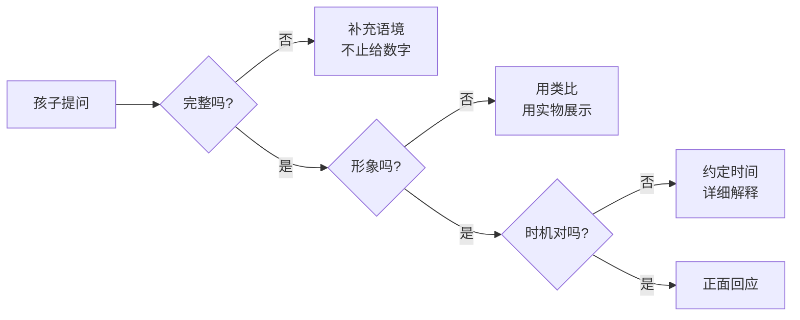
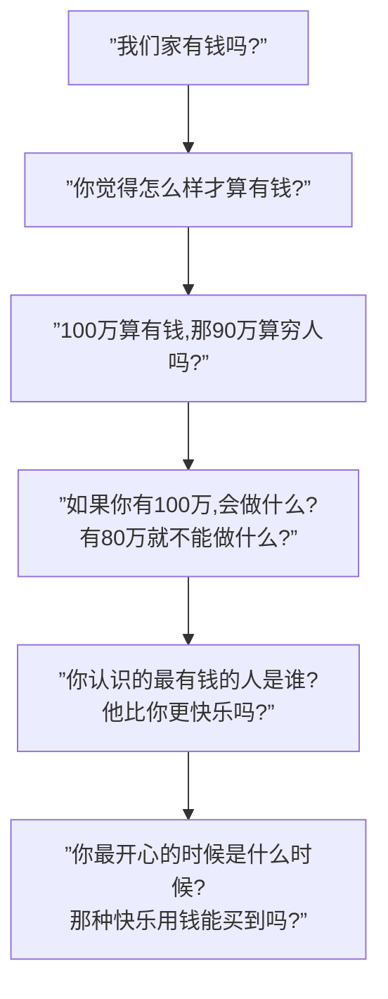

# 第04课：财商教育的好机会

## 引言

上节课我们学习了应该对孩子坦诚相待，但在具体场景中，家长常常还是不知道如何回答。这节课提供**五大经典问题的具体回答策略**，以及三个核心答题原则。

> [!WARNING] 常见误区
> 有些家长的回答看似在回应，实则越描越黑：
>
> - 孩子："妈妈你为什么总买便宜东西，咱家是不是很穷？"
> - 妈妈："咱们不穷，那些贵的东西都是骗人的。"
> - 问题：如果东西不好，为什么会出售？为什么还卖得贵？

## 答题三项原则



### 原则一：回答要完整

仅仅给出数字是不够的——需要提供**语境和上下文**。

> [!EXAMPLE] 反例
> 孩子问"爸爸你每月赚多少钱"，爸爸回答"15800"——一个五六岁的孩子对这个数字毫无概念。
>
> 更好的方式是结合**本地的购买力**和**家庭实际收支**来解释。

### 原则二：回答要形象

抽象的经济术语对孩子来说如同天书。用**具象的事物**帮助理解。

### 原则三：把握合适时机

不是所有问题都要**当场回答**。如果问题复杂，可以约定时间：

```
"等爸爸做完手头的事，带你观察一下"
"今晚吃完饭，爸爸坐下来好好跟你讲"
```

## 五大经典问题及回答策略

### 问题一："我们穷吗？/我们有钱吗？"

**问题本质**：4-5岁的孩子提问时，他们真正关心的是——**"我们是弱者吗？我们的生活安全吗？"**

> [!TIP] 第一步：先反问
> "你为什么会这么问呢？"
>
> 让孩子说出他们担心的原因，再针对性回答。

**进阶策略：通过提问引导思考**



**参考回答模板：**

> 有钱没钱对不同的人差别很大。对爸爸妈妈来说，我们有足够的钱买**需要**的东西，也能买许多**想要**的东西。但每个人想要的东西不一样——有些人胃口大，有些人胃口小——有些人尽管很有钱，还没有那些没钱的人开心。

---

### 问题二："为什么你总爱买便宜东西？咱家是不是很穷？"

**关键区别**：这个问题反映的是孩子观察到父母频繁购买打折商品，进而**担心家境**。

**双重目标**：

| 目标 | 具体做法 |
|------|----------|
| 澄清认知 | 买便宜货 ≠ 贫穷，节省的钱用于更有意义的事情 |
| 养成原则 | 原则一：不为便宜而买**不需要**的东西；原则二：不为便宜而买**没质量保障**的东西 |

---

### 问题三："你为什么要去上班？不能不上班吗？"

**常见错误回答**：

| 错误回答 | 传达的信息 |
|----------|------------|
| "妈妈不上班你就没饭吃了" | 工作是不得已的苦差 |
| "上班才能养你" | **都是你的错**，引发愧疚感 |

**正确回答方向**：

- 工作很有意义
- 工作能提高全家生活水平
- 工作能开阔眼界、交朋友、锻炼能力

> [!NOTE] 工作也是财商教育重点
> 与孩子谈论工作不只是回答提问，更是**财商教育的核心内容之一**——后续课程会专题讲解。

---

### 问题四："你为什么不换一个更赚钱的工作？"

> [!WARNING] 家长的心理准备
> 这个问题确实带有"攻击性"，孩子是因为感受到了消费限制才有此疑问。家长**不要有情绪反应**。

**两种情况的回答策略**：

| 情况 | 回答方向 |
|------|----------|
| 热爱当前工作 | "这个工作能让爸爸/妈妈体现自己的价值。工作的目的不只是赚钱，也是生命中重要的组成部分——所以要选择自己喜欢且胜任的工作。" |
| 当前工作非理想 | "爸爸选择这个工作也是很多条件促成的。收入还不错，公司也认可我。未来可能会找到收入更高的工作——爸爸在努力，所以你也要从现在开始好好学习。" |

---

### 问题五："我花自己的钱，为什么不可以？"

**权威型家长 vs 专制型家长**

| 类型 | 行为 | 效果 |
|------|------|------|
| **权威型 (Authoritative)** | 制定标准并清晰解释 | 孩子能力更强，讲道理 |
| **专制型 (Authoritarian)** | 只下命令不解释 | 孩子不明所以，亲子关系紧张 |

**当无法立刻给出合理解释时：**

> "爸爸觉得花这个钱不明智，虽然现在给不出很合理的解释，但爸爸会尽快解释给你听。"

这种处理方式虽然未必能立即阻止错误消费，但孩子会认同家长的处理态度，保持亲子间的理性沟通。

## 本课总结

1. **回答三原则**：完整、形象、时机恰当
2. **五大问题各有策略**：从追问引导到坦诚解释
3. **权威型家长胜于专制型**——解释就是教育
4. **平等对待性别差异**——对儿子女儿的财商教育频率保持一致

## 自测题

> [!QUESTION] 复习自测
>
> 1. 回答孩子关于钱的三个原则是什么？请分别举例说明。
> 2. 当4-5岁的孩子问"我们有钱吗？"，他真正关心的是什么？
> 3. Jeff Soffloff使用甘草堂回答孩子"咱们家有钱吗"的案例中，他使用了哪些技巧？
> 4. 孩子问"为什么要上班"时，为什么不能说"不上班就没饭吃"？
> 5. 权威型家长(Authoritative)和专制型家长(Authoritarian)在财务教育中有什么本质区别？
>
> <details>
> <summary>点击查看参考答案</summary>
>
> 1. (1) **完整**：不能只给数字，要提供语境和购买力参考；(2) **形象**：用具象方式（如甘草堂、牙签）展示抽象概念；(3) **把握时机**：复杂问题可以约定专门时间回答。
> 2. 孩子本质上关心的不是财富数字，而是**"我们是弱者吗？我们的生活安全吗？"**——这是一种本能的自我保护式提问。
> 3. (1) 用具象化工具（甘草堂）建立"从穷到富"的可视化标尺；(2) 通过连续否认引导孩子自己发现答案；(3) 将目标结果剪断展示真实位置；(4) 顺势引出"需要与想要"的深层话题。
> 4. 这种回答暗示"工作是不愉快的苦差"，而且是"为了孩子才去工作"——会让孩子产生**愧疚感**，也塑造了对工作的负面认知。
> 5. 权威型家长**制定标准并解释原因**，孩子理解背后的道理；专制型家长**只下命令不解释**，孩子只知道服从或反抗，缺乏独立思考的机会。研究显示权威型教育培养出的孩子更有能力。
>
> </details>