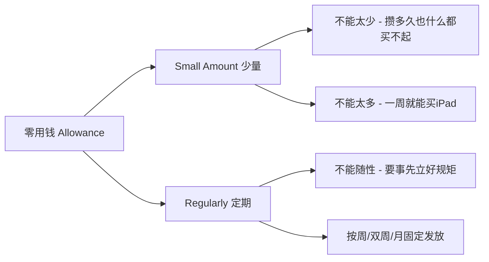

# 第05课：培养延迟满足能力，从零花钱开始

## 课程导入

> 给孩子零用钱的最大好处，就是可以培养他们的耐心。
> ——《反溺爱》

零花钱与耐心之间存在着密切的关系。本节课将从 **延迟满足能力** 的定义和重要性入手，深入剖析零花钱的本质，说明为什么零花钱是培养耐心的理想工具。

---

## 一、延迟满足能力：通往长期成功的基石

### 1.1 什么是延迟满足能力？

**延迟满足能力**（Delayed Gratification）是指一个人为了获得**更长远的、更有价值的回报**，而愿意**放弃眼前即时满足**的自我控制能力。

### 1.2 快时代更需要耐心

> [!quote] 现代社会的困境
> 西方人为现代社会起了个名字叫做 **Buy Now, Play Later World**（超前消费时代）。我们需要等待的事情越来越少，等待的时间也越来越短了。

| 场景 | 过去 | 现在 |
|------|------|------|
| 远距离出行 | 火车一天一夜 | 飞机两小时、高铁数小时 |
| 看电视 | 耐心等广告结束 | 会员去广告、倍速播放 |
| 异地恋 | 书信传情，等好几天 | 随时微信、视频通话 |

> [!warning] 核心矛盾
> 那些便捷的生活都有**一个前提**——**需要付费**。不是每个人都能首选飞机，不是人人都舍得充值会员。想要积累财富、享受便利，都需要**耐心**。

### 1.3 延迟满足能力的具体表现

| 场景 | 短期诱惑 | 长期目标 |
|------|----------|----------|
| 健身 | 躺平、吃垃圾食品 | 几个月后拥有好身材 |
| 刷牙 | 刷几十秒应付了事 | 刷够两分钟保护牙齿 |
| 寒假作业 | 先玩游戏再说 | 当日事当日毕，开学不慌张 |

> 根源都是缺乏自控力、缺乏对终极目标的坚持、缺乏延迟满足能力。

---

## 二、零花钱的本质：少量 + 定期

### 2.1 查字典：Allowance 的定义

> [!info] Allowance（零用钱）的英文释义
> **A small amount of money that a parent regularly gives to a child.**
> 父母定期给孩子的少量的钱。

两个关键信息：

### 2.2 类比：零花钱就像成人的薪水

如果在孩子想买东西时随手给一笔钱，那不是典型的零花钱。

- 孩子是家庭的"员工"——婚姻是两人合伙开公司，孩子是未来的主力员工
- 零花钱就像**薪水**
  - 薪水要**准时**发放
  - 薪水不会**低到让你瞧不上**，也不会**高到让你不再努力**
- 想要高价商品 → 需要**储蓄** → 需要**时间积累** → 需要**耐心**

> 谁更能跟**时间做朋友**，谁就赢了。

---

## 三、真实案例：书店里的成长时刻

> [!example] 关键案例：书店插曲
> 一位妈妈带着孩子逛书店，孩子看到一套精美的童书，希望妈妈买。

**案例经过：**

1. 孩子想买书，不是因为喜欢读，而是因为**朋友也买过**
2. 孩子已经在存钱买**硅胶涂鸦桌垫**，不舍得花自己的钱
3. 妈妈拒绝——孩子坐地上哭闹
4. 妈妈内心挣扎但坚持不妥协
5. 孩子最终决定用攒的钱买书
6. **就在付款前一刻**——孩子突然改变主意，决定还是先买自己更想要的桌垫

> [!success] 案例启示
> - 冲动消费连成年人都难以遏制，但正是因为有了"用自己的零花钱买"的规则，孩子才能更理性地思考
> - 当资源不足时，学会分清**轻重缓急**
> - 什么才是自己**真正想要**的

---

## 四、零花钱培养耐心的底层逻辑

专业的训练往往从**不去做最终要做的那件事**开始：

| 领域 | 不先做什么 | 先练什么 |
|------|-----------|----------|
| 声乐 | 直接K歌 | 练气息 |
| 足球 | 有球训练 | 练力量 |
| 耐心培养 | 空洞说教 | 存钱、做预算、靠时间沉淀 |

---

## 五、核心收获

> [!abstract] 本节课要点
> 1. **延迟满足能力**是孩子未来成功的关键素质，在快时代中尤为珍贵
> 2. **零花钱的本质**：少量（small amount）+ 定期（regularly）
> 3. 零花钱通过人为设定规律的金钱发放机制，自然培养孩子**与时间做朋友**的能力
> 4. 让孩子用**自己的钱办自己的事**，才能触发真正的理性决策

[[../reference/核心框架|核心框架]] 中提到，财务教育的起点就是让孩子建立"资源有限，需做选择"的认知。零花钱正是实现这一认知的**最小成本工具**。

---

## 复习自测

1. 零花钱的两个基本属性是什么？
2. 为什么快时代反而更需要培养延迟满足能力？
3. 书店案例中，孩子最终为什么没有买那套书？这个过程锻炼了孩子什么能力？
4. 为什么说零花钱培养耐心比"说教"更有效？