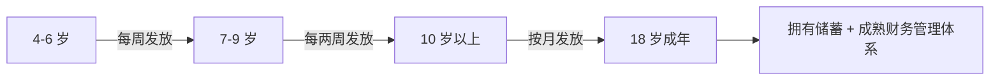

# 第06课：零用钱的正确使用方法（上）

> 本节课系统讲解零花钱**发放**的三个实操维度：**何时发、发多少、怎么发**。注意事项将在下一课继续。

---

## 一、发放周期：随年龄增长逐渐延长

> [!tip] 核心原则
> 为了逐渐培养孩子的**耐心**，发放周期应随年龄增长从短变长。



| 年龄 | 发放频率 | 说明 |
|------|----------|------|
| 4-6岁 | 每周一次 | 已有基本数学概念即可开始 |
| 7-9岁 | 每两周一次 | 逐渐拉长等待周期 |
| 10岁以上 | 每月一次 | 模拟成人薪资周期 |
| 18岁 | 停止发放 | 期待已建立体系 |

> [!note]
> 年龄界限不必太严格，可根据孩子实际情况灵活调整。

---

## 二、发放金额：三份分配法 + 额度设定

### 2.1 零花钱必须分成三份

零花钱**不是**单纯让孩子花掉的，而应该分成三份、各有用途：

| 分类 | 英文 | 建议比例 | 用途 |
|------|------|----------|------|
| 消费 | Spending | 7（其中需要4 + 想要3） | 日常开销 |
| 储蓄 | Saving | 2 | 积累购买大件 |
| 捐献 | Sharing | 1 | 慈善公益 |

> [!info] 后续细化
> 第08课 [[0008-needs-vs-wants]] 将进一步把这 7 份消费细分为 **4（需要）+ 3（想要）**，构成完整的 **4:3:2:1 法则**。

### 2.2 捐献部分为什么重要？

- 一个人的力量有限，社会支持体系时刻在发挥作用（汶川地震、新冠疫情捐款）
- 那些处于弱势地位的人，与经济条件好的人之间存在**直接或间接的联系**
- 认识到这一点，孩子才能建立**同理心**和**社会责任感**，这也是财商教育的深层价值

### 2.3 金额设定的两个参考方案

**方案一：按年龄设定**（美国做法）

| 年龄| 每周额度（年龄倍数法）|
|------|---------------------|
| | 2倍 | 3倍 | 4倍 |
| 4岁 | 8元 | 12元| 16元|
|5岁|10元|15元|20元|
|8岁|16元|24元|32元|
|10岁|20元|30元|40元|

> [!warning]
> - 太少没用：攒半年也什么都买不起（像某些信用卡积分）
> - 太多不合适：一周的零花钱就能买 Set 设备，那就不是零花钱了
> - 孩子应总感觉**钱不够随便花"，要省着花、计算着花

**方案二：根据用途倒推**

1. 先想清楚零花钱要覆盖哪些消费项目（零食？运动用品？课外书？）
2. 估算所需的钱数
3. 按期发放

> [!tip] 作者建议
> 两个方案**结合**使用：一年一调，在孩子生日时开个"碰头会"商定下一年的零花钱数额，让孩子知道这个数值是怎么来的。

### 2.4 核心铁则

> [!danger] 绝不提前发放
> 如果孩子提前花完了，**一定不要提前发下一期**。否则就失去了培养延迟满足能力的意义。

---

## 三、发放形式：具体可感知的方式

### 3.1 现金依然是最好的教具

| 年龄段 | 建议形式 |
|--------|----------|
| 小学及以前 | 透明储蓄罐（现金）|
| 进入初中后 | 可办儿童储蓄卡，与爸妈账户关联 |

> 看到罐子里的钱增减，比抽象的电子数字对孩子的影响更大。

### 3.2 透明罐子系统

准备三个**透明**大塑料罐（装谷物早餐的容器很合适）：

```
┌─────────────┐  ┌─────────────┐  ┌─────────────┐
│   消费      │  │   储蓄      │  │   捐献      │
│  Spending   │  │  Saving     │  │  Sharing    │
└─────────────┘  └─────────────┘  └─────────────┘
```

### 3.3 四要点

1. **三个罐子**：分别贴上"储蓄""捐献""花费"标签
2. **意外收入归孩子**：过生日收到的红包等，由孩子自己决定存还是花，但家长要保持知情
3. **必须记账**：
   - 不会写字的孩子 → 口头告诉爸妈，由爸妈代记
   - 会写字的孩子 → 自己记账，**每月审查**
4. **记账出问题要处罚**：罚跑步、罚背课文等，但**不要在零花钱上克扣**
   - 零花钱是**工具**，不是惩罚手段

> [!important] 核心原则
> 零花钱是培养孩子成长的**工具**，不要没收他们成长的工具。

---

## 四、与前后课程的关联

- [[0005-delayed-gratification-allowance]] | 确立零花钱的两大属性（少量 + 定期）
- [[0007-allowance-howto-2]] | 继续学习零花钱的使用规则
- [[../reference/术语表|术语表]] | Allowance、Saving、Spending、Sharing

---

## 复习自测

1. 4-6岁、7-9岁、10岁以上分别建议按什么频率发放零花钱？
2. 零花钱的三份分配比例是什么？为什么要有捐献这一份？
3. 给孩子发零花钱，什么情况下可以使用电子支付，什么情况下应使用现金？
4. 如果孩子提前把零花钱花完了，应该怎么处理？
5. 为什么说"零花钱是工具，不是惩罚手段"？
</