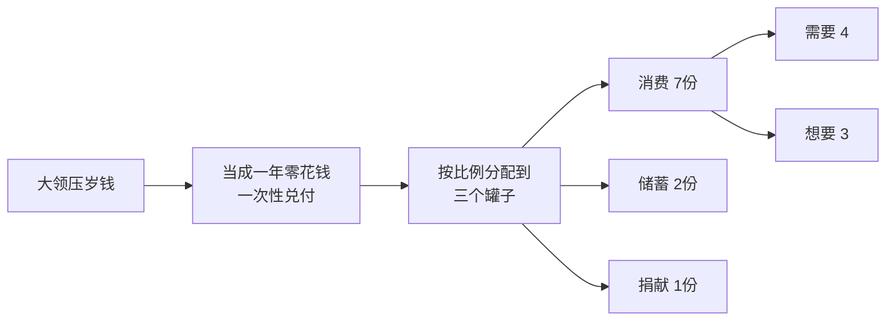

# 第10课：压岁钱该怎么用？

## 课程导入

> 压岁钱完全不是中国特色。日本人新年发 **Otoshidama**，美国人在圣诞节发 **Christmas Gift Money**。全世界的家长都在思考怎么让孩子的红包发挥最大效用。

从孩子角度看，压岁钱有三种看待方式。

---

## 二、三种视角及其处理方案

### 视角一：少量的不可持续的意外之财

**特征：** 金额很少

**处理方案：**
- 完全交给孩子随意处理
- 父母只要知道钱的去向即可
- 不去阻拦，不去影响

### 视角二：大量的不可持续的意外之财

> 对没有持续收入的孩子而言，加起来几千甚至一万块的压岁钱是一笔巨款。

**类比：** 如果你平时中了彩票凭空多了10万块，你会怎么处理？

**建议方案：** 把这笔钱看成是**一年的零花钱一次性提前兑付了**。

**怎么跟低龄孩子解释：**
- "爸爸如果每天给你一瓶牛奶，一个月30瓶对吧？"
- "那如果爸爸一下给你30瓶，你是不是也应该每天喝一瓶？"
- "压岁钱就是爷爷奶奶/姥姥姥爷/亲戚朋友一次性给了你一年的零花钱"
- "我们也应该按照原来的计划分配到罐子里"

**重要变化：** 可支配花销变成原来的**12倍**，孩子有资格也有必要学习**投资**了。

### 视角三：间隔期为一年的可持续的意料之中的财富

- 压岁钱一共发放12-18年
- 从一周一发到半月一发到一月一发，已经锻炼了延迟满足能力
- 现在让孩子把压岁钱看成**一年一发**的零花钱，锻炼往**十年之后**看

**训练价值：**
- 有规划的孩子与没有规划的孩子，成长速度不同
- 从以小时为单位感受时间，到以天、以周、以月、以年为单位看待时间

---

## 三、两个重要概念

### 3.1 投资的概念

> 投资是人类的基础能力。孩子每天学吃饭穿衣、读书识字、奔跑跳跃，这些都是投资。用钱生钱更是最朴素的投资形式。

**孩子可以投资的标的：**
- 教育保险
- 指数基金定投

**关键提醒：** 家长代替孩子做投资时，一定要**跟孩子讲清楚**只是代他们操作。否则孩子会觉得自己的财富支配权被剥夺，以后习惯性地放弃表达自己的机会。

> 我们终究还是需要自己的孩子有主见、爱思考。

### 3.2 复利的威力

**荷叶故事：**
> 池塘中的荷叶每天面积增大一倍。第九天铺满半个池塘——第十天覆盖整个池塘。

| 天数 | 面积 |
|------|------|
| 第9天 | 半个池塘 |
| 第10天 | 整个池塘 |

荷叶用了9天才铺满半个池塘，但铺满另外半个只用**1天**。

**复利计算表（压岁钱投资）：**

| 年份 | 累计金额（每年投入1万，年化10%） |
|------|--------------------------------|
| 第1年 | 1.0 万 |
| 第5年 | 约 6.7 万 |
| 第10年 | 约 18.5 万 |
| 第12年 | 约 25 万 |
| 第18年 | **约 50+ 万** |

> 如果孩子现在6岁以下，12年后他的大学费用已经可以自己承担了；18年后步入社会时，他已有第一桶金。

---

## 四、三种视角速查表

| 视角 | 特征 | 处理方式 | 教育机会 |
|------|------|---------|---------|
| 少量意外之财 | 金额小、不可持续 | 孩子自由支配，家长知情 | 培养自主决策意识 |
| 大量意外之财 | 金额大、不可持续 | 当成一年零花钱一次性兑付，按比例分配 | 预算分配能力 |
| 可持续财富 | 每年都有、可预期 | 制定十年以上投资规划 | 投资与复利教育 |

---

## 五、核心原则总结

> **要点回顾**
> 1. 压岁钱有三种看待方式，决定了三种不同的处理策略
> 2. 大量压岁钱 = 一年的零花钱一次性兑付，按 **4:3:2:1** 分配
> 3. 压岁钱是孩子学习**投资**的好机会（教育保险、指数基金）
> 4. **复利**的力量让坚持产生奇迹——18年持续投入可积累50万+
> 5. 家长代投需向孩子说明，保护孩子的支配权感知

**关联课程：**
- [[0006-allowance-howto-1]] | 零花钱的三份分配法
- [[0008-needs-vs-wants]] | 4:3:2:1 完整分配法则
- [[../reference/术语表|术语表]] | 复利、投资、教育保险、指数基金

---

## 复习自测

1. 压岁钱有哪三种看待方式？各自对应什么处理方案？
2. 如何向低龄孩子解释"压岁钱是一年的零花钱一次性兑付"？
3. 为什么说大量压岁钱是孩子学习投资的契机？
4. 荷叶故事说明了什么金融概念？
5. 按照年化10%、每年投入1万计算，18年后累计金额大约是多少？