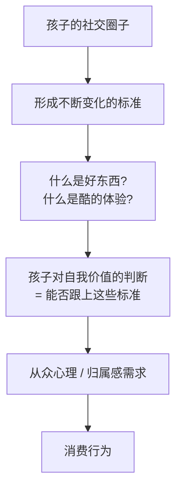
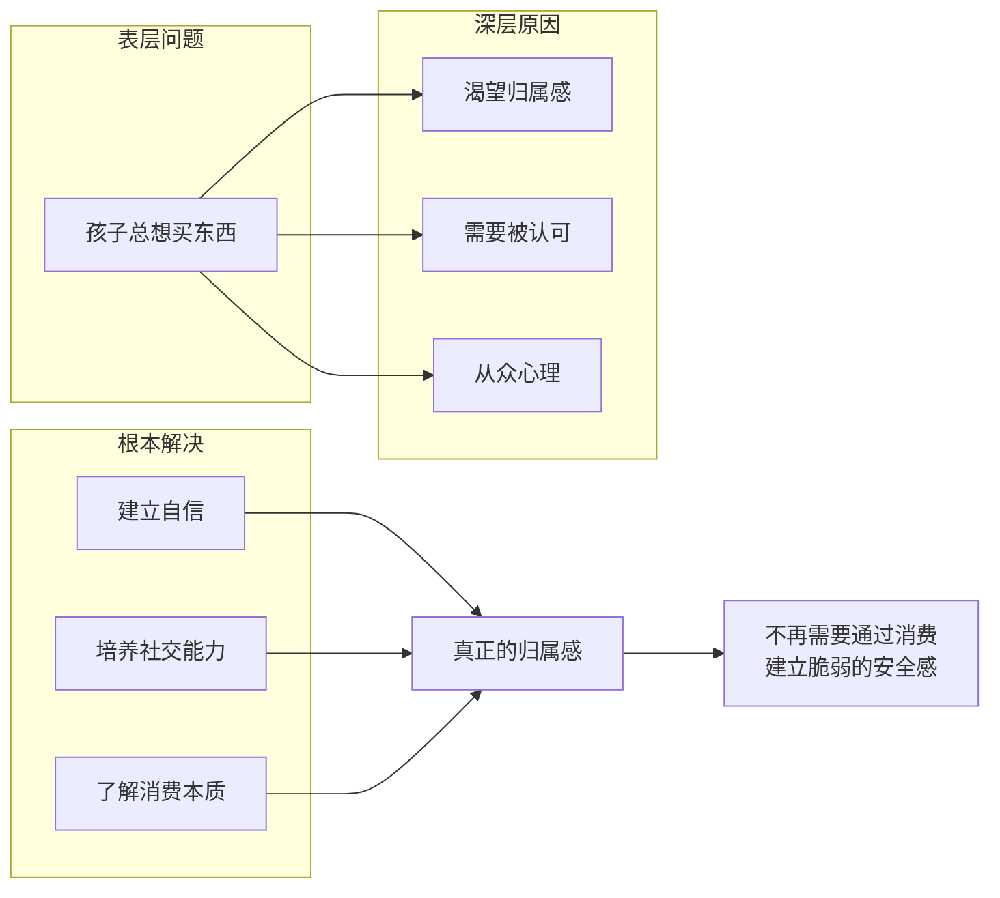

# 第11课：我们的孩子为什么总要买东西呢？

## 课程导入

> 家长经常抱怨：孩子喜欢消费、花钱不知道心疼、别人说什么东西好就回家要钱买、遭到劝说阻拦就觉得爸妈对自己不好。

**问题：** 为什么孩子像着了魔一样渴望拥有那些明明只流行一阵、没有也不影响生活的商品？

---

## 一、真相：渴望的不是商品，而是归属感

### 1.1 一个关于偷窃的故事

> 1998年，初一男生小岛，学习成绩优异，在家听话懂事。

- 同学都有随身听、互相交换磁带
- 父母不给钱买专辑，他只能用废旧英语磁带录广播歌曲
- 某天在音像店看到王菲新专辑，趁店员不在，**偷了一盒磁带**
- 之后又偷了很多次，直到被店员抓住
- 店员看他恐惧的眼神，心软放了他一马

> 对于青少年来说，他们并不是享受消费本身。消费、购买、甚至偷窃，都只是**一个方式**。他们需要的是通过这种方式**获得东西**——而他们真正渴望的不是磁带、运动鞋或电子设备。

### 1.2 经济尊严（Economic Dignity）理论

> 弗吉尼亚大学社会学教授 阿里森-皮尤（Allison Pugh）在《渴望与归属感》（Longing and Belonging）中提出了**经济尊严**概念。

**核心发现：**

- 孩子有一个自己的小圈子，里面形成不断变化的标准
- 孩子的自我价值判断 = 是否能跟上这些标准
- 真正渴望的是 **归属感（Belonging）**
- 拥有大家都认可的东西 = 感觉自己被接纳

---

## 二、真实的归属感不是通过消费获得的

### 2.1 关键认知

> 穿着风格相同、消费品味相似的人，不一定就是志同道合的人。真正的友谊与消费**没有直接关系**。

### 2.2 杰西-贝克尔的实验

> 新南威尔士大学精神病理学研究及教学小组的杰西-贝克尔（Jess Baker）招募7-12岁儿童演员进行实验。

**实验设计：**
- 让儿童演员以两种方式朗读哈利波特段落 + 认识新朋友时的自我介绍
  - 方式A：充满自信
  - 方式B：显得焦虑
- 录像给另外96名同龄孩子看，问他们愿不愿意和哪个小朋友交朋友

**三个重要发现：**

| 发现 | 原因 | 专家建议 |
|------|------|---------|
| 焦虑的孩子不受欢迎 | 不愿眼神交流，让别人觉得不可信 | 父母做表率，鼓励孩子说话时看着对方 |
| 焦虑的孩子显得"特殊" | 别人觉得"不是一类人" | 帮孩子找到志趣相投的朋友（俱乐部、兴趣班），了解孩子圈子中的流行 |
| 焦虑的人给人"冷冰冰"的感觉 | 被认为更保守、不愿结识新朋友 | 示范热情打招呼，表扬时微笑，鼓励赞美他人 |

---

## 三、财商角度的解决方案

### 3.1 核心思路

> 让孩子做一个诚恳、大方、热情的人，做一个慷慨、随和、细心的人。这些品格都能培养，而且都可以通过**财商教育**来帮忙。

### 3.2 三个具体方法

**方法一：角色扮演 - 观察服务行业**

- 带孩子观察各种服务场景：普通饭店 vs 高档酒店、不景气的老百货 vs 奢侈品专卖店
- 回家后让孩子表演他眼中的"普通服务"和"优质服务"
- 通过模仿和表演，孩子自然体会如何获得别人的认可和欢迎

**方法二：研究商品背后的公司**

- 带孩子一起了解流行商品的生产公司背景和历史
- 无论是零食、玩具、动画片还是运动用品，都有大量背景资料可查
- 好处：
  - 这是一个极好的谈资
  - 让孩子从根本上明白：这些东西的本质还是**用来获利的商品**

**方法三：设立社交基金**

| 做法 | 说明 |
|------|------|
| 将买这买那的钱转为社交基金 | 给朋友买好吃的、请客、精心准备生日礼物 |
| 鼓励孩子用零花钱完成"小恩小惠" | 用自己钱花在社交上更有意义 |
| 父母配比资助 | 孩子出100元，父母再加100元，放大社交投入 |

> 从成本上讲，这比孩子没完没了要钱买衣服、买电子设备**经济得多**，且实际效果更好。

---

## 四、课程核心模型

---

## 五、与前后课程的关联

- [[0008-needs-vs-wants]] | 需要与想要的区分
- [[0005-delayed-gratification-allowance]] | 延迟满足能力
- [[../reference/核心框架|核心框架]] | 财商教育与品格培养的关系
- [[../reference/术语表|术语表]] | 经济尊严, 归属感, 从众心理

---

## 复习自测

1. 小岛偷磁带的故事说明了什么问题？孩子真正渴望的是什么？
2. 什么是"经济尊严"？它如何影响孩子的消费行为？
3. 杰西-贝克尔的实验三个发现分别是什么？
4. 从财商角度，有哪些方法可以减少孩子的非理性购物冲动？
5. 社交基金的具体做法是怎样的？为什么比直接买衣服、电子设备更好？