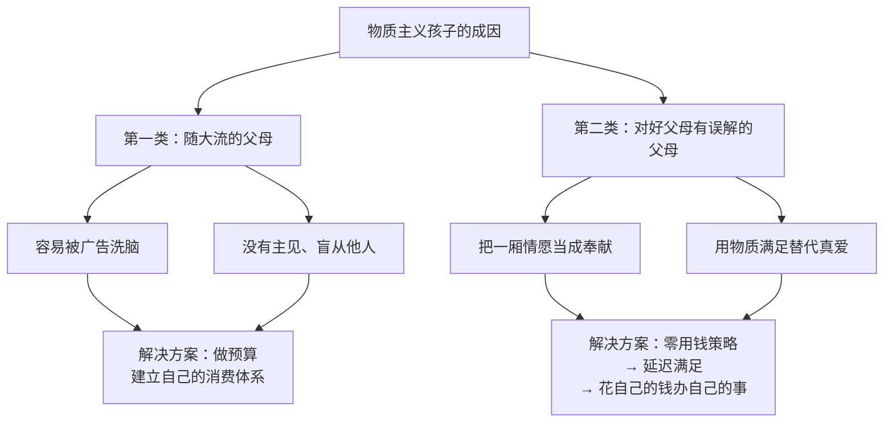
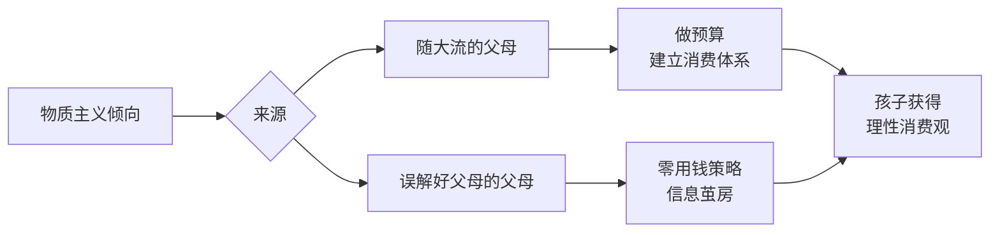

# 第12课：孩子过分追求物质享乐与父母有直接关系

> [!TIP] 核心命题
> 财商教育的重要思路就是**身体力行、言传身教**。孩子过分追求物质享乐，通常与父母有直接关系。家长得先用正确的理念武装自己，才能正面影响孩子。

---

## 一、物质主义的定义与危害

### 什么是物质主义

物质主义（Materialism）是片面夸大物质或物质利益功能的世界观，与享乐主义关系密切。它忽视甚至全盘否定精神文化和道德伦理的价值。

> [!WARNING]
> 物质主义本身并非十恶不赦，但对孩子的性格成长而言不值得提倡。**心智健康恰恰强调精神追求**，因为幸福是一种心理感受，物质只能提供帮助，不能提供保障。

### 物质主义对孩子的具体影响

| 方面 | 影响 |
|------|------|
| 社交能力 | 更看重物品而非人际关系，影响友谊建立 |
| 价值判断 | 倾向于用拥有物衡量自我价值 |
| 幸福感 | 追求物质满足的边际效用递减，难以获得深层满足 |

---

## 二、制造物质主义孩子的两类父母

### 第一类：随大流的父母

#### 容易被广告洗脑的父母

广告对儿童的商业影响已被研究证实：

> [!EXAMPLE] 关键研究：广告如何影响孩子的社交偏好
> 研究者将4-5岁小朋友分为两组：
> - **看了玩具战士广告**的孩子：仅 **36%** 选择和玩具玩耍，**35%** 选择性格好但没有玩具的朋友
> - **没看广告**的孩子：**70%** 选择和朋友在沙池玩耍，**70%** 选择性格好的玩伴
>
> **结论：商业广告对孩子的性格和社交能力的影响确实存在。**

今天的广告环境比二三十年前复杂得多：
- 传统电视广告 → 电梯广告、公交地铁广告、海报、网络广告、手机广告、朋友圈广告
- 明星代言、网红带货的吸引力难以阻挡

> [!TIP] 容易被种草本身就是低财商的表现
> 聪明人不是常在河边走还能不失鞋，而是**尽量少去河边走**。对于可跳过的广告坚决跳过，对无法回避的广告保持理性冷静。

#### 没有主见、盲从他人的父母

| 场景 | 问题 |
|------|------|
| 兴趣班 | 看到别人报什么就给孩子报什么 |
| 学习时间 | 听说别人学到11点就让自己的孩子也撑到11点 |
| 购物决策 | 看别人抢购什么自己也觉得应该买（"智商税"） |

> "股市割韭菜——跟大家一起追涨杀跌的人就是韭菜。收智商税——看别人抢购什么自己也跟着买的人所交的钱。"

#### 解决方案：做预算

做预算能强迫自己思考：
- 什么是家里**真正需要**的？
- 什么是只是**自己想要**的？

当心里有本账时，花钱才不会盲目。从心理层面建立过滤网——"有些东西好是好，可是我用不着，至少我现在不需要。"

### 第二类：对好父母有误解的父母

#### "中国式父母"的困境

> [!WARNING] 奉献 vs 一厢情愿
> 湖北缺蔬菜，山东捐赠蔬菜——这叫**奉献**（对方有需求）。
> 孩子不需要，家长拼命买——这叫**一厢情愿**，不是奉献。

中国式家长最常犯的错误：**错把一厢情愿当成奉献**。这种做法的后果：
1. 孩子养成攀比习惯
2. 孩子用"别人有我没有"来要挟父母
3. 孩子无法理解资源的有限性

#### 真正的"好父母"定义

> [!TIP] 真正的好父母
> 能够帮助孩子在**有限的资源**下，**无限发挥自己的乐观精神和奋斗能力**的人。即便生活不如期盼的那么富足，仍然拥抱生活，仍然乐观向上。

#### 解决方案

| 策略 | 具体做法 | 对应原理 |
|------|---------|---------|
| 零用钱策略 | 让孩子花自己的钱买自己的东西 | [[../reference/核心框架|核心框架]] — 最佳组合：自己的钱办自己的事 |
| 破除信息茧房 | 让孩子接触不同层次的人的生活，亲身感受 | 避免[[../reference/术语表|信息茧房效应]]导致的狭隘 |

---

## 三、破除信息茧房

> [!INFO] 信息茧房效应
> 人们在信息领域会习惯性地被自己的兴趣所引导，从而将自己的生活桎梏于像蚕茧一般的茧房中。

虽然孩子理论上可以通过网络看到五彩斑斓的世界，但由于信息茧房效应，他们反而可能变得更加狭隘。孩子们每天花大量精力关注喜欢的明星和商品，却不会花时间去体察不熟悉的真实生活。

**拥有正确财商认识的父母会：**
1. 减少对孩子的无条件物质滋养
2. 花更多精力破除孩子的"茧房"
3. 让孩子以更宽广的胸怀拥抱生活

---

## 四、课程总结

### 两类父母对比

| 类型 | 表现 | 核心问题 | 解决路径 |
|------|------|---------|---------|
| 随大流型 | 易受广告影响、盲从他人 | 没有自己的消费观和预算体系 | 从做预算开始，建立消费优先级 |
| 误解型 | 用物质满足表达爱、包办代替 | 混淆一厢情愿与奉献 | 用零用钱帮孩子学会延迟满足，带他接触真实世界 |

---

## 复习与自测

1. **物质主义倾向对孩子的性格成长有哪些具体危害？请从社交、价值观、幸福感三个角度列出。**

2. **请判断自己属于哪一类"制造物质主义孩子的父母"——随大流型还是误解型？具体体现在哪些行为上？**

3. **结合[[../reference/核心框架|核心框架]]，分析"孩子花父母的钱买玩具"属于四原则中的哪一组合？应该如何调整为最佳组合？**

4. **什么是信息茧房效应？它如何加剧孩子的物质主义倾向？家长应如何帮助孩子破茧？**

5. **实操练习：本周为家庭做一个月的预算计划，明确区分"需要"和"想要"。然后与孩子分享这个预算，让他理解家庭消费的优先级。**

---

## 关联课程

- 0011-why-kids-want-things|第11课：孩子为什么总要买东西？]] — 理解孩子消费行为的社会心理根源
- 0013-smart-consumption|第13课：教孩子看透消费陷阱，学会理性消费]] — 理性消费的具体培养方法
- [[../reference/核心框架|核心框架]] — 弗里德曼花钱四原则
- [[../reference/术语表|术语表]] — 物质主义、延迟满足等核心概念定义
- [[年龄沟通指南]] — 不同年龄段的财商教育方法