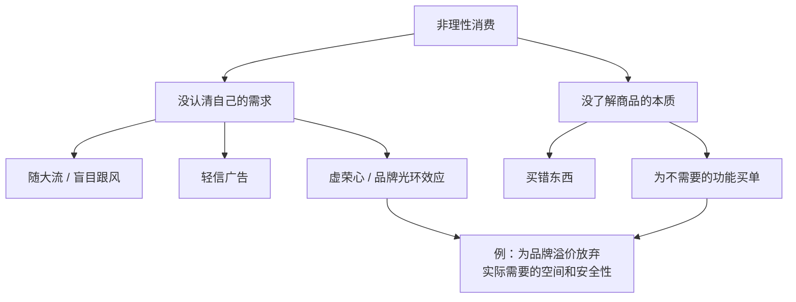
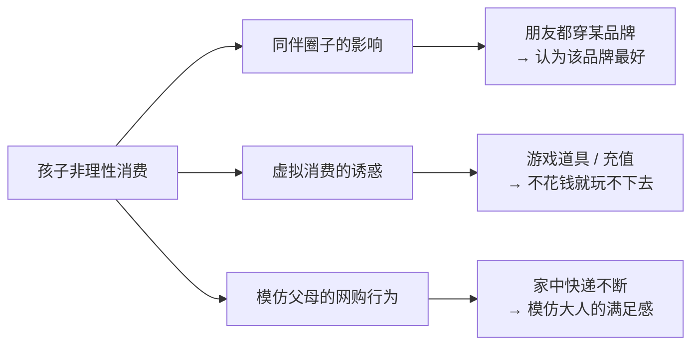
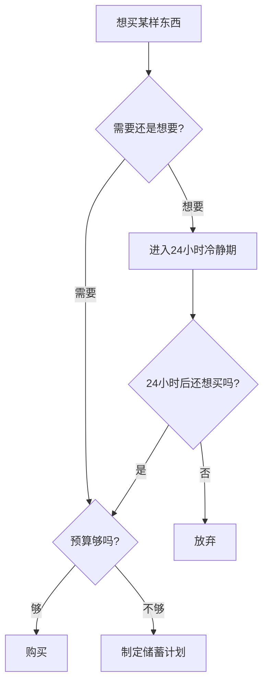

# 第13课：教孩子看透消费陷阱，学会理性消费

> [!TIP] 核心观点
> 物质主义与理性消费并非严格意义上的反义词。**理性消费者并不拒绝物质追求，而是有节制地进行消费**。这是一个需要经过刻苦训练并长期坚持才能达到的境界，但每前进一步都是巨大的收获。

---

## 一、什么是理性消费

### 理性消费的定义

| 角度 | 定义 | 一句话 |
|------|------|--------|
| 经济学定义 | 在消费能力允许的条件下，按照**效用最大化**原则进行消费 | 花最合适的钱，获得最大的满足 |
| 心理学定义 | 消费者根据自己的**学习和知觉**做出的合理购买决策 | 不被情绪和外界牵着走 |
| 通俗定义 | **认清自己的需求** + **了解商品的本质** | 知道自己要什么，也知道买的是什么 |

### 非理性消费的两个根源

> [!EXAMPLE] 品牌光环陷阱
> 某名牌汽车的核心价值只体现在有限的几个经典车型上。但由于长期的市场运作，消费者觉得**只要是这个品牌，买哪个车型都有面子**。原本需要大空间、安全性的消费者，却为了内饰、百公里加速等不需要的特点，放弃了同价位空间更大更安全的车——这就是一次不理性的消费。

---

## 二、孩子非理性消费的特殊原因

### 三大驱动因素

### 虚拟消费的新特点

案例：11岁的小光热衷手游消费，"不花钱基本就玩不下去，又没那么多时间。"

| 传统消费 | 虚拟/网络消费 |
|---------|-------------|
| 从家走到商场，冲动在路上慢慢降温 | 动动手指，钱就付出去了，没有冷静过程 |
| 消费金额直观（纸币） | 消费金额抽象（数字） |
| 买回来后容易"后悔" | 即时满足，后悔成本低 |

> [!WARNING] 网络消费门槛极低
> 过去消费要去商城，冲动可能在路上就降下来；现在动动手指钱就付出去了，**没有冷静过程**。这就导致更多人买来东西后发现其实用不上。

---

## 三、培养理性消费的实用策略

### 策略一：24小时冷静期

> [!TIP] 黄金法则
> 孩子嚷嚷要买东西时，最好的方案是给他**24小时**的时间，鼓励他思考、冷静之后再决定是否用自己的小金库下单。

这正是0005-delayed-gratification-allowance|延迟满足]]能力的实践延伸——让孩子学会在欲望和决策之间留出思考的空间。

### 策略二：合理制定规矩，逐步放权

心理学教授蒂姆·卡塞尔（Tim Kasser，《物质主义的高昂代价》作者）的教育方式：

| 年龄 | 规则 | 原则 |
|------|------|------|
| 10岁 | 每天可看30分钟无广告节目；看电影不影响隔天看电视 | 边界清晰，留有弹性 |
| 成长中 | 取消时间限制，放手让孩子自我管理 | 逐步放权，**在父母看得到的地方学习自我管理** |

> 懂得珍惜时间的人，在消费方面也相对理性。因为珍惜时间就是珍惜资源。

### 策略三：看透广告的本质

> [!QUOTE] 蒂姆·卡塞尔
> "Advertising is designed to sell pre-packaged individualities."
> （广告是被设计来销售**预先包装好的个性**的。）

广告经常告诉我们：购买某商品就能变得独一无二、彰显品味。但这很荒谬——**几乎所有商业广告都是面向百万千万用户的**。

> [!WARNING] 雷同的"品味"
> 想象你心目中"有品味的成功男性"形象——很可能开着玛莎拉蒂、穿着萨维尔街定制西装、戴着百达翡丽手表。我们对品位的理解其实**极其雷同**，而雷同恰恰是我们最初想通过高消费来回避的。

**单纯靠花钱很难彰显个性**，因为个性是找到最好的自己，而**只有创造才能最大程度上体现自己的价值**。

### 策略四：帮助孩子一起创造

| 年龄阶段 | 推荐活动 | 作用 |
|---------|---------|------|
| 低龄儿童 | 搭积木、做手工 | 见证自己的创造力，不必通过物质消费证明存在 |
| 大一点的孩子 | 探讨艺术（音乐、绘画、书法、电影） | 获得更高层面精神满足，变得更有自信、更有主见 |

> 为什么欧洲人好像没那么物质、没那么拜金？因为那是艺术氛围浓厚的地方。人们通过接触艺术获得精神满足，**更容易认清自己的需求**，从而成为更理性的消费者。

### 策略五：向孩子公开家庭财务状况

> [!INFO] 建议来自北京市青少年法律与心理资讯服务中心主任宗春山
> 家长应该把家里的财务状况向孩子公开，告知家庭消费计划。为什么有些家境不好的孩子还会偷家里的钱打赏主播？很可能父母从没告诉过孩子**每个月挣多少钱**，孩子体会不到家庭的难处。

---

## 四、理性消费的评估框架

---

## 五、课程总结

### 非理性消费的根源与对策

| 根源 | 表现 | 应对策略 |
|------|------|---------|
| 同伴影响 | 朋友穿什么就认为什么好 | 教孩子分析购买决策的根源 |
| 广告诱导 | 相信广告塑造的"个性" | 揭露广告本质——销售预先包装好的个性 |
| 虚拟消费 | 游戏充值、道具购买 | 24小时冷静期 + 了解游戏策划的套路 |
| 模仿父母 | 看到父母网购就想学 | 公开家庭财务状况，让孩子参与消费决策 |
| 没有主见 | 跟着感觉走，没想清楚要什么 | 创造活动，通过艺术和手工建立自我认知 |

---

## 复习与自测

1. **理性消费的两大核心是什么？请用自己的话复述。**

2. **判断以下场景是否属于理性消费，并说明理由：**
   - 小明花2000元买了一个名牌背包，因为他的三个好朋友都有这个牌子的包。
   - 小红用自己攒了三个月的零花钱，买了一双专业跑鞋，因为她参加了学校田径队。
   - 小刚在游戏里充值了500元买道具，因为是限时优惠，"错过就没有了"。

3. **重温0011-why-kids-want-things|第11课]]，结合本课内容，分析"孩子总要买东西"的背后是社交需求还是物质需求？家长应该如何回应？**

4. **实操练习：本周跟孩子一起分析一个广告（电视/网络/户外广告均可），让孩子回答：**
   - 这个广告想让我买什么？
   - 它用了什么方式来吸引我（名人、限时、优惠、情感等）？
   - 我真的需要这个产品吗？

5. **阅读温馨提示：** 正如0001-talk-about-money|第01课]]所说，谈钱如谈性，越早越安全。与其禁止孩子接触消费世界，不如教他识别陷阱。

---

## 关联课程

- 0012-materialism-and-parents|第12课：孩子过分追求物质享乐与父母有直接关系]] — 物质主义根源
- 0005-delayed-gratification-allowance|第05课：延迟满足与零花钱]] — 24小时冷静期的实践基础
- 0008-needs-vs-wants|第08课：需要与想要]] — 理性消费的核心区分能力
- [[../reference/核心框架|核心框架]] — 花自己的钱办自己的事，自然产生理性消费行为
- [[../reference/术语表|术语表]] — 理性消费、机会成本、消费陷阱等定义
- [[年龄沟通指南]] — 不同年龄段的理性消费教育方法