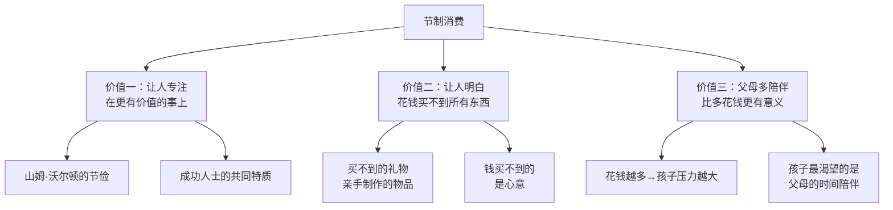
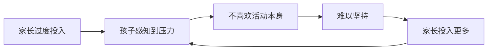

# 第14课：节制消费——很多东西是钱买不到的

> [!TIP] 核心命题
> 节制消费不是让大家过苦日子，而是让人**收心**——将精力专注在真正重要的事情上。只有把对我们来讲真正重要的事情做好了，我们才能最大程度地体现自己的价值。

---

## 一、重新理解"消费升级"

### 消费升级的真正含义

有些朋友误以为消费升级就是提高消费能力、增加购买数量。但**真正该有的消费升级**是：

| 错误的升级观 | 正确的升级观 |
|-------------|-------------|
| 买更多的东西 | 从追求低价升级为购买有品质的商品 |
| 提高消费频次 | 从基本生活必需品升级为精神文化消费 |
| 跟随流行趋势 | 放弃"买东西只追求低价"的习惯 |

### 中国的三次消费升级

```mermaid
flowchart LR
    A[第一次<br/>改革开放初期] -->|粮食消费下降<br/>轻工产品消费上升| B[第二次<br/>80年代末90年代初]
    B -->|老三件→新三件<br/>耐用消费品高档化| C[第三次<br/>现在]
    C -->|教育/娱乐/文化/交通<br/>医疗/住宅/旅游<br/>从物质上升到精神|
```

> 从历史角度看，消费升级的脉络本身就是**从物质上升到精神**的过程。

---

## 二、节制消费的三大价值



### 价值一：让人专注在更有价值的事情上

> [!EXAMPLE] 山姆·沃尔顿的节俭精神
> - 把Walmart的名字从"Walton Mart"缩减为"Walmart"——全球4000多家店，每家省一个字，就能节约一笔不小的费用
> - 要求高管出差只坐二等舱、住双人间，自己也不例外
> - 这个"抠门"的老头却为大学捐赠了数亿美元，设立了奖学金

一个人的精力是有限的。如果花太多精力追求物质消费，就没有精力发展事业了。

> 成功的人一定是在某些领域十分专注，而在其他方面降低要求。不为外物所累，才能**身处喧嚣乱世，还守得灵台清明**。

### 价值二：让人明白花钱买不到所有东西

> [!WARNING] 
> "手里有锤子，看啥都是钉子。"一个只会花钱的孩子，时间久了就会变得狭隘，甚至会相信有钱就有一切。我们有义务告诉孩子——**有些东西花钱能买到，但买不到最好的；还有些东西花钱反而买不到。**

#### 钱买不到的东西

| 用钱可以买到 | 但买不到最好的 |
|-------------|--------------|
| 生日礼物 | 亲手制作的礼物 |
| 蛋糕 | 老照片电子相册（心意） |
| 母亲的礼物 | 孩子用心的创作 |
| 表面的服务 | 真诚的心意 |

> 人和人的感情，就是一次次诚挚的心意培养起来的。越是重大的日子，越要用心庆祝，孩子就越能发挥创造力，顺便品尝**节制消费的甜头**。

### 价值三：父母陪伴比花钱更有意义

#### 花钱越多，孩子压力越大

> [!QUOTE] 特拉维斯·杜许（《反溺爱》提及的研究者）
> 供孩子参加运动的花费占家庭收入的比例**越高**，孩子越能察觉到来自父母的压力；他们越感受到这股压力，就**越不喜欢运动**，也越少有动机坚持下去。

| 过度物质投入的副作用 | 更健康的方式 |
|--------------------|-------------|
| 孩子感受到"父母的牺牲"而有压力 | 父母轻松一些，给孩子更多信心 |
| 孩子担心又要花父母一大笔钱 | 表现出对孩子的支持而非付出感 |
| 孩子为"对得起父母"而学习 | 孩子为兴趣而学习 |

> 很多孩子一听说父母要给他们掏钱补习，脸上就显露出担忧的神情。在这种压力之下，孩子**很难专注学习**，更不要说享受学习的过程了。

#### 孩子最渴望的是父母的时间

> [!INFO] 西方亲子教育的共识
> 全家人应该经常一起吃晚餐——有助于孩子获得更多营养、更高的学业成绩，以及较低的抽烟、喝酒、吸毒、打架等概率。即使只有一方父母能陪孩子吃晚餐，也能有同样的效果。

| 表达爱的方式 | 效果 |
|------------|------|
| 给孩子买很多东西 | 短期满足，长期可能增加压力 |
| 给孩子花时间陪伴 | 长期安全感，滋养心灵的根基 |
| 用金钱代替陪伴 | 孩子感受不到真正的关注 |
| 一起吃晚餐、聊天 | 孩子的人生观在餐桌上形成 |

**从财商教育的角度看**：就像我们给孩子的三个罐子一样，父母的时间也不能全拿去"赚"钱。陪伴家人，尤其是孩子，应该**事先就放在自己的精力分配预算当中**。

---

## 三、家长在"培养孩子"上的过度消费



### 恶性循环 vs 良性循环

| 恶性循环（过度消费） | 良性循环（适度陪伴） |
|--------------------|--------------------|
| 花很多钱报班 → 孩子有压力 | 花时间陪孩子探索兴趣 |
| 孩子害怕让父母失望 → 失去乐趣 | 孩子享受过程 → 自发坚持 |
| 效果不好 → 父母花更多钱 | 效果好 → 家庭氛围轻松 |
| 孩子感到愧疚 → 更加抗拒 | 孩子感恩 → 更愿意努力 |

---

## 四、课程总结

### 节制消费的三大理由

| 理由 | 核心观点 | 金句 |
|------|---------|------|
| 让人专注 | 精力有限，不为外物所累才能专注本业 | "不为外物所累，才能守得灵台清明" |
| 
| 钱买不到一切 | 心意、感情、创造力都是买不到的 | "手里有锤子，看啥都是钉子" |
| 陪伴胜于物质 | 孩子最渴望的是父母的时间，不是礼物 | "钱永远赚不完，但陪伴的机会在不断减少" |

### 给父母的行动清单

1. **减少不必要的消费** — 把精力从"看什么值得买"转移到真正重要的事情上
2. **用心创造礼物** — 在重大日子送给孩子买不到的东西（亲手做的、用心准备的）
3. **控制"培养投入"的度** — 不要让孩子感受到父母的不遗余力
4. **增加陪伴时间** — 固定家庭晚餐，把陪伴放入精力分配预算
5. **做好表率** — 参考[[../reference/核心框架|核心框架]]，让孩子看到父母也在实践节制消费

> 钱永远赚不完，每天工作24小时也没用。可是，**陪伴的机会是肯定在不断减少的**。孩子小的时候没有得到父母足够的陪伴，这就是永远都补不回来的了。

---

## 复习与自测

1. **真正的"消费升级"应该是指什么？请对比"错误的升级观"和"正确的升级观"之间的区别。**

2. **回想过往的消费经历，你是否有过"花钱买了但不快乐"或者"没花钱但很感动"的经历？这些经历如何印证了"钱买不到的东西"？**

3. **评估一下：你对孩子的投入中，金钱投入和时间投入的比例大致是多少？是否达到了健康的平衡？如果失衡，可以做哪些调整？**

4. **结合 [[../reference/核心框架|核心框架]] 和 0006-allowance-part1|第06课：零用钱使用方法（上）]]，分析：**
   - 父母为孩子报昂贵的兴趣班 → 属于四原则中的哪一组合？
   - 如何调整可以帮助孩子减轻压力最大化学习效果？

5. **实操练习：这个月为孩子做一件"用钱买不到的礼物"（老照片电子相册、手写信、手工制品等）。观察孩子的反应，并与日常买礼物的效果进行比较。**

---

## 关联课程

- 0012-materialism-and-parents|第12课：孩子过分追求物质享乐与父母有直接关系]] — 物质主义根源
- 0013-smart-consumption|第13课：教孩子看透消费陷阱，学会理性消费]] — 理性消费的具体方法
- 0006-allowance-part1|第06课：零用钱使用方法（上）]] — 零用钱与三个罐子
- [[../reference/核心框架|核心框架]] — 花谁的钱、办谁的事
- [[../reference/术语表|术语表]] — 理性消费、物质主义、延迟满足