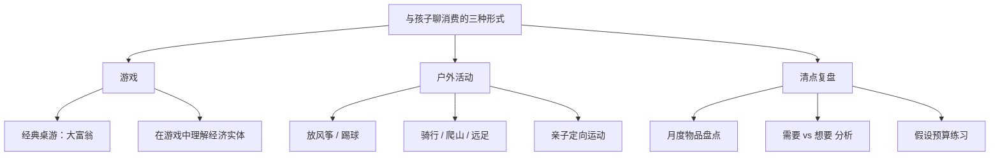
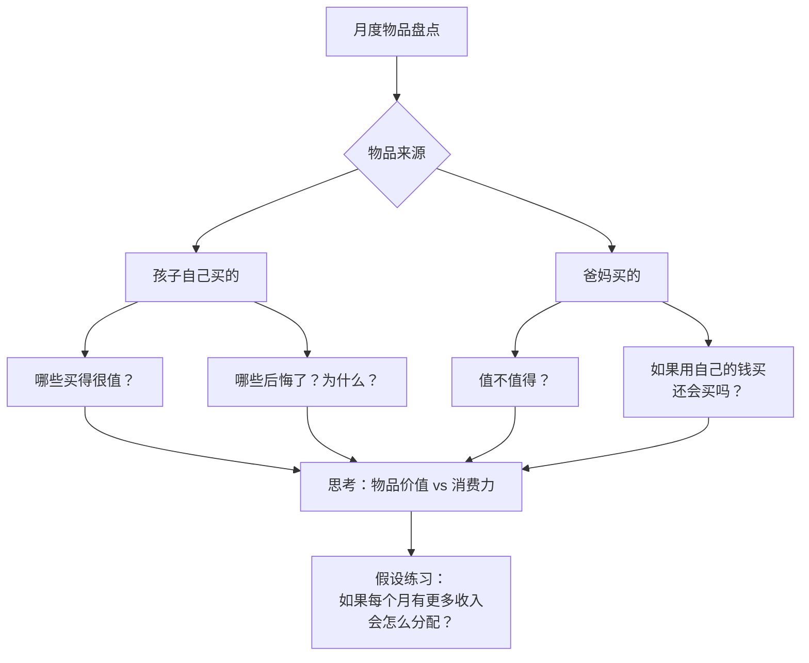

# 第15课：跟孩子聊聊我们对消费的理解

> [!TIP] 核心观点
> 消费的智慧从来都是**动态平衡的智慧**——我们既有"需要"也有"想要"，合理满足需要、适当追求想要才是上策。不要瞒着孩子，早点让他见识"刀刃"的样子才好。

---

## 一、理解"消费"这个概念

### Consume 的深层含义

| 英文 | 词义 | 语感 |
|------|------|------|
| Consume | 消费 | 中性 |
| Consume 的其它含义 | 消耗、大吃大喝、吞噬、烧毁 | **偏负面** |
| Consumerism | 消费主义（非为满足实际需要而消费） | 强烈负面 |

> 消费主义产生于资本主义初期，天然含有挥霍的意味。一旦在全社会蔓延，后果不堪设想。

### 消费的环境代价

> [!WARNING] 触目惊心的数据
> - 2020年2月9日，巴西科学家在南极西摩岛测得 **20.75°C** 气温——1880年以来南极气温首次突破零上20度
> - 南极年平均气温应为 **-25°C**
> - 对温度敏感的**磷虾数量锐减80%**，而磷虾是企鹅的主要食物
> - 冰层变薄，企鹅幼崽掉进冰窟丧命
> - 科学家预测 **2050年** 前全球各大城市将有沉没风险

**不节制消费的习惯，不但影响我们这个时代，更会影响未来孩子成人之后的世界。**

环保本质上就是一种充满善意的消费理念，环保的同义词从某种意义上来说就是**节约**。跟孩子讨论消费，可以从让孩子关注自然世界开始，让他们体会到节约的意义。

---

## 二、理解"惜物观"

### 日本的工匠精神——珍惜即用心

> [!EXAMPLE] 天妇罗之神：早已女哲哉
> 一位女学徒把一条鱼炸得不符合大师要求。大师一反平日的温文尔雅，大声质问：
>
> "你知道一条鱼在风浪里成长需要多久吗？不被天敌吃掉、不被天灾人祸搞掉，才能长成这条鱼。你知道一个老渔民要练过多少年手艺才能成功把这条鱼捕上来？有多少人拼了命让这条鱼以最新鲜的状态到达餐厅？你炸的这个失败的东西，对不起了多少人？"

这种对食物的理解充满了哲学的意味——**一种精确到秒的艺术，对食物充满了性灵上的尊重**。而这一切正是**节约精神的体现**：因为珍惜、因为节约，所以用心；因为用心，所以成就了匠人。

### 中国传统文化中的惜物观

> "一粥一饭，当思来之不易；一丝一缕，恒念物力维艰。"

珍惜一样东西，不仅仅是为了省钱。**我们所珍惜的事物，本身就是我们在这个世界上重要经历的见证：**
- 书法家钟爱的砚台
- 音乐家呵护的乐器
- 资本家爱不释手的烟斗

这些物件后来都成了文物——不是因为属于名人，而是因为那些名人**珍惜**这些物件。

> [!TIP]
> 我们拥有的物品当中，值得珍惜的东西变多了，我们其实会更开心。

---

## 三、跟孩子讨论消费的三种形式

### 形式一：做游戏——大富翁

大富翁是绝佳的家庭财商教具。棋盘上的花花绿绿的格子会让孩子充满好奇，家长可以借机介绍生活中的经济实体和经济现象。

| 孩子的疑问 | 家长可以解读的经济原理 |
|-----------|---------------------|
| "公园不是免费的吗？为什么买公园还能赚钱？" | 公园不赚游客的钱，但**赚商贩的钱**（人流量变现） |
| "自来水不是很便宜吗？为什么能赚钱？" | **客单价低但成本更低**，用户量巨大且稳定 → 好生意 |
| "为什么买飞机的赚不过开超市的？" | 向大孩子解释**长尾理论**——长尾市场总量 > 头部市场 |

> [!TIP] 玩大富翁的诀窍
> 1. 最好是**全家人一起玩**，否则孩子会感觉这是变相教育
> 2. 推荐**界面简单的版本**——重点不是玩具有多精致，而是容不容易上手

### 形式二：户外活动

户外活动带来的快乐丝毫不亚于消费，而且更加不可替代。

| 孩子年龄 | 推荐活动 | 隐性收获 |
|---------|---------|---------|
| 年幼 | 放风筝、湖边海边跑步、踢球 | 建立与自然的连接，减少对消费的依赖 |
| 大一点 | 骑自行车、爬山、远足 | 培养毅力和体能，理解运动本身就是快乐 |
| 全家人 | 定向运动（指南针+地图） | 锻炼体能 + 培养空间感 |

> 越是沉迷于消费的人，越容易变懒（精力都放在搜罗好物上了）。反过来也一样——**越是能够坚持户外活动的人，越没那么沉迷消费**。

### 形式三：清点复盘

> [!INFO] 月度复盘制度
> 每月与孩子复盘**这个月来的物品增减情况**，不管新增物品是孩子用零用钱买的，还是爸妈买的。

#### 复盘流程

#### 复盘的核心问题

| 物品来源 | 问题 | 目标 |
|---------|------|------|
| 孩子自己买的 | 哪些认为很值？哪些后悔了？为什么？ | 培养自我评估消费的能力 |
| 
| 爸妈买的 | 这些物品值不值得？如果用自己的钱还会买吗？ | 理解"别人的钱"和"自己的钱"的差别 |
| 假设练习 | 如果每月有更多固定收入，会怎么分配？ | 培养预算思维 |

> "孩子在他成长的前18年里，如果从来都没有对一个月有至少两三千元可供支配做过谨慎的思考，那么等他毕业之后拿到薪水的时候，就要从头摸索——**那个时候已经有点晚了**。"

---

## 四、三种形式对比总结

| 形式 | 适合年龄 | 核心收获 | 操作难度 |
|------|---------|---------|---------|
| 大富翁 | 5岁+ | 理解经济实体、商业逻辑 | 低（需全家参与） |
| 户外活动 | 全年龄 | 体验不花钱的快乐、亲近自然 | 中（需家长时间投入） |
| 月度复盘 | 7岁+ | 学会评估消费质量、建立预算思维 | 低（需持续坚持） |

---

## 复习与自测

1. **"消费"的英文consume还有哪些偏负面含义？这些含义给我们的理财启示是什么？**

2. **什么叫做"惜物观"？请用[[../reference/术语表|术语表]]中提到的概念，解释为什么珍惜物品本质上是一种节约精神的体现。**

3. **选择一种形式（游戏/户外/复盘），本周内与孩子一起实践一次，之后记录：**
   - 孩子的反应如何？
   - 孩子学到了什么？
   - 作为家长，你从中有哪些新的发现？

4. **实操练习：这个月底，与孩子一起完成一次彻底的物品盘点。让孩子按照"很值""还行""后悔了"三个档次对自己的消费品进行分类，并说出理由。**

5. **结合 0008-needs-vs-wants|第08课：需要与想要]]，分析孩子的月度消费中，"需要"和"想要"的比例。如果"想要"的比例过高，下一步可以和孩子一起做什么调整？**

---

## 关联课程

- 0013-smart-consumption|第13课：教孩子看透消费陷阱，学会理性消费]] — 理性消费的具体方法
- 0008-needs-vs-wants|第08课：需要与想要]] — 消费决策的核心区分能力
- 0004-teachable-moments|第04课：财商教育的好机会]] — 日常生活中的可教时刻
- [[../reference/核心框架|核心框架]] — 弗里德曼花钱四原则
- [[../reference/术语表|术语表]] — 消费、消费主义、理性消费等定义