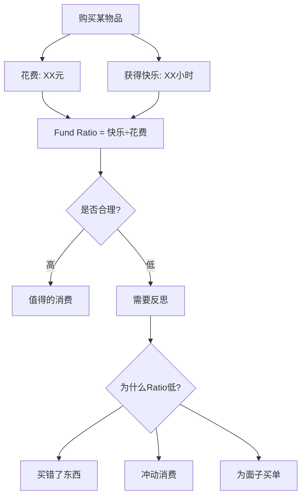
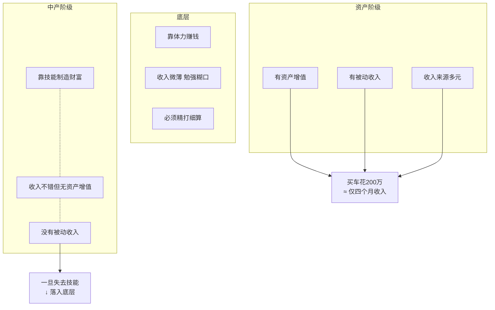
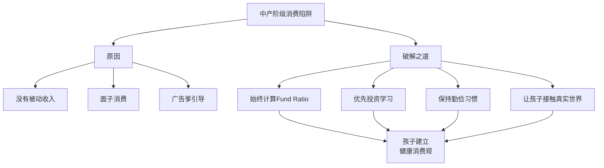

# 第16课：别掉进中产阶级父母的"消费陷阱"

> [!TIP] 核心命题
> 中产阶级父母最容易掉进的陷阱：**用消费来伪装身份**，结果牺牲了真正能让生活变好的东西——**本金**。记住花出去的每一块钱都要问：**这个钱的快乐产出比（Fund Ratio）高吗？**

---

## 一、Fund Ratio：快乐产出比

### 概念来源

Fund Ratio（趣味率/快乐产出比）来自《反溺爱》一书。它指的是：**花在孩子想要的物品上的每一块钱，能带来几个小时的快乐。**

| 概念 | 经济学类比 | 对孩子的意义 |
|------|-----------|-------------|
| Fund Ratio | 效用（Utility） | 最能感同身受的消费评估工具 |
| 计算方式 | 快乐小时数 ÷ 花费金额 | 每块钱买到了多少快乐 |
| 评估标准 | 效率 | 别人花1块买到1小时快乐，你花10块才买到1小时——就不够聪明 |

> [!QUOTE] The Opposite of Spoiled（《反溺爱》）
> Fun Ratio（趣味率）就是**效用**在孩子世界里的名字。它能帮孩子客观判断自己的消费行为是否合理。

### Fund Ratio 的实操应用

将 Fun Ratio 与 [[术语表|月度复盘]] 结合：

---

## 二、中产阶级消费陷阱是什么

### 阶层对比：为什么中产阶级最脆弱

| 阶层 | 收入来源 | 消费心态 | 能否存下本金 |
|------|---------|---------|------------|
| 底层 | 体力劳动 | 理性（必须精打细算） | 困难，但明白钱的份量 |
| 中产阶级 | 技能劳动 | 任性（最容掉入陷阱） | 很难，被动花光 |
| 资产阶级 | 资产增值+被动收入 | 随性（不影响大碍） | 容易 |

> [!WARNING] 中产阶级的命门
> 中产阶级与底层的差别在：前者能靠技能制造财富。但中产阶级与资产阶级的差别在于：**没有可靠的资产增值与被动收入来源**，仍然要不停劳动。一旦失去技能，就可能落入底层。

### 中产阶级消费陷阱的核心机制

**中产阶级发现自己怎么也存不下本金**——为了维持印象中体面生活，被动花光了每月收入。

> 资产阶级通过广告营销等各种手段，让你误以为：**只要你跟他们有同样的物品，你和你的孩子就能成为上层人士。**

| 消费场景 | 资产阶级 | 中产阶级 |
|---------|---------|---------|
| 买奔驰 | S级200万，手头6000万，资产年增值600万 | E级，一年积蓄做首付，背上3-5年贷款 |
| 购车影响 | 几乎不影响资产增值 | **丢掉了本金** |
| 纯情感 | "低调买S级" | "撑面子买E级" |
| Fund Ratio | 高（不影响大局） | **极低**（牺牲了本金） |

---

## 三、Fun Ratio 的三大消费原则

### 原则一：对己有用
> 商品本身无贵贱。对自己真正有用的东西，贵也是便宜；对自己没用的东西，一分钱也是多余。

### 原则二：学习投资是最高 Fund Ratio
> [!TIP]
> 给孩子的学习投资，即便贵也是值得。尤其是使其真正感兴趣的学习——学到的东西可以服务他的一生。虽然贵的也可能有水货，但便宜的很难有干货。

### 原则三：延迟满足分析
孩子喜欢不停地买玩具，买到后没玩几次就丢一边——因为这些玩具只是"想要"，真正的价值只体现在**得到的那一瞬间**。

| 孩子的感受 | 家长可以问的问题 | 引导方向 |
|-----------|-----------------|---------|
| 最快乐的是"得到"新玩具那一刻 | "你最快乐的时候是得到新玩具，还是每次跟它玩的时候？" | 帮助分清拥有快乐 vs 使用快乐 |
| 玩几次就腻了 | "如果买之前等24小时，会不会发现其实没那么想要？" | 建立冷静期习惯 |
| 看到别的孩子有就也想有 | "这个玩具是真正让你快乐，还是因为看到别人有才想要？" | 区分内在需求与外在比较 |

---

## 四、棘轮效应——为什么不能丧失吃苦的能力

### 棘轮效应的定义

> [!INFO] 棘轮效应（Ratchet Effect）
> 经济学家认为，人的消费习惯形成之后具有**不可逆性**——消费者易随收入提高而增加消费，但不易因收入降低而减少消费。

这正是司马光所说的：
> "由俭入奢易，由奢入俭难。"

### 棘轮效应对孩子的危害

| 危害 | 具体表现 | 典故对应 |
|------|---------|---------|
| 不食肉糜 | 孩子花钱大手惯了，形成不接地气的观念 | 晋惠帝"何不食肉糜" |
| 被社会孤立 | 被惯坏的孩子没有朋友——因为世界观不符合主流 | 普通人仍是世界的大多数 |
| 缺乏适应力 | 一旦遇到挫折收入降低，无法调适生活 | 由奢入俭难" |

### 大学生消费调查数据

> [!EXAMPLE] 中国新闻网调查（大学生样本）
> - **87.9%** 受访大学生确认当下依然需要勤俭节约
> - 77.3% 月消费在 **1000-2000元**
> - 11.2% 月消费在 2000-3000元
> - 9.3% 月消费在 1000元以下
> - 仅 **2.3%** 月消费超过 3000元
>
> 大学生认为勤俭节约的内涵：**不与人攀比、不随意浪费、不奢侈铺张。**

家长的围常常会让我们"眼见为实"，感觉身边很多父母都不惜代价为孩子提供优渥的物质保障。但事实上，**让孩子在无节制消费的蜜罐里泡大，仅仅是少数人的做法**。

---

## 五、综合建议：打破中产阶级消费陷阱

| 破解策略 | 具体做法 | 对应原理 |
|---------|---------|---------|
| 计算Fund Ratio | 每次消费前算"每块钱买多少小时快乐" | 效用最大化 |
| 优先投资学习 | 为孩子真正的兴趣买单，不计较性价比 | 学到的知识能服务一生 |
| 保持勤俭 | 全家践行节约，不因收入增加而随意升级消费 | 防棘轮效应 |
| 接触真实世界 | 带孩子做志愿者、科学考察，离开舒适区 | 防止不食肉糜 |
| 客观化消费决策 | 用数据分析代替感觉决策 | 成为[[../reference/核心框架| authoritative parents]]（具权威性力）|

---

## 课程总结（模块三回顾）

模块三"理性消费观"五课脉络：

| 课号 | 主题 | 核心线索 |
|-----|------|---------|
| [[0012-materialism-and-parents|第12课]] | 物质主义根源 | 两类父母导致的两类问题 |
| [[0013-smart-consumption|第13课]] | 理性消费 | 识别陷阱 + 四种策略 |
| [[0014-frugality|第14课]] | 节制消费的好处 | 专注 + 钱买不到 + 陪伴 |
| [[0015-consumption-values|第15课]] | 与孩子聊消费的方式 | 游戏 + 户外 + 复盘 |
| 第16课（本课） | 中产阶级陷阱 | Fund Ratio + 棘轮效应 |

---

## 复习与自测

1. **什么是 Fund Ratio？它为什么比单纯看"花多少钱"更有指导意义？**

2. **中产阶级消费陷阱的核心是什么？为什么底层和资产阶级反而不容易掉进这个陷阱？**

3. **为什么说"由俭入奢易，由奢入俭难"不仅是古训，更是经济学规律？请用自己的话解释棘轮效应。**

4. **假如你住在上海，家庭月收入5万元。以下哪些消费可能属于"中产阶级消费陷阱"？**
 - 为孩子报10万年费的私立学校
 - 每月固定为孩子的课外兴趣班花费3000元（孩子确实感兴趣）
 - 贷款40万买一辆宝马让"接送孩子有面子"
 - 每逢假期带孩子去欧美游学

5. **实操练习：本周带孩子一起计算3笔消费的Fund Ratio。记录以下信息：**
 - 物品名称和价格
 - 孩子总共玩了/用了多少小时
 - 每块钱买了多少小时的快乐
 - 这个Ratio合理吗？下次再遇到类似情况，怎样才能做得更好？

---

## 关联课程

- [[0012-materialism-and-parents|第12课：孩子过分追求物质享乐与父母有直接关系]] — 模块三起始篇
- 0013-smart-consumption|第13课：教孩子看透消费陷阱，学会理性消费]] — 理性消费培养
- 0014-frugality|第14课：节制消费]] — 节制消费的价值
- 0015-consumption-values|第15课：跟孩子聊聊我们对消费的理解]] — 消费沟通形式
- [[../reference/核心框架|核心框架]] — 弗里德曼花钱四原则
- [[../reference/术语表|术语表]] — Fund Ratio、棘轮效应、理性消费等定义
- [[年龄沟通指南]] — 不同年龄段的消费教育方法