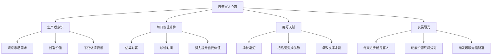

# 第17课：教孩子如何看待贫与富

## 课程导入

孩子从小就对"富"与"穷"有敏锐的感知。研究表明：

- 3岁的孩子就能区分富人与穷人的照片
- 一半的3岁幼儿认为富人与穷人不会成为朋友
- 6岁的孩子开始根据物品对他人进行评价

> [!warning] 关键认知
> 如果家长不主动引导，孩子的贫富观念一旦形成就很难改变。父母往往传递一种矛盾信息：既不想让孩子当势利眼，又暗示"我们必须有钱，否则会被看扁"。

## 核心观点一：知足与感恩

> [!quote] 戴尔·卡内基
> Success is getting what you want. Happiness is wanting what you get.
> 成功是得到你想要的，幸福是想要你所得到的。

**知足 = 感恩我们已经拥有的。**

### 感恩的力量

未经指导的孩子往往：

- 只盯着别人拥有的东西
- 忽略别人可能欠缺的方面
- 陷入盲目比较的陷阱

**成熟感恩的孩子能够：**

| 对比维度 | 不懂感恩的孩子 | 懂得感恩的孩子 |
|---------|--------------|--------------|
| 看待富人家孩子 | 羡慕对方的物质条件 | 意识到对方可能缺少父母陪伴 |
| 看待自己家境 | 自卑、不满 | 感恩已有的条件，珍惜所拥有的 |
| 应对方式 | 抱怨、消极 | 积极努力，设定自己的目标 |

> [!example] 真实案例
> 讲师的一位学生家庭条件不好，但从不自卑。他感谢父母尽力提供学习机会，专注于把英语学好，最终获得希望之星演讲赛大学组省赛一等奖。

## 核心观点二：真正的富有在于心态

> [!quote] 创业者丹尼尔·艾利
> 富人是富在心态上，而非财富的数量上。富人也可能变穷，穷人也可以致富。

### 判断一个人是否真正富有的两个标准：

1. **从心态上**：一个相互恩爱的五口之家，哪怕共享一片面包，也是富人
2. **从享受能力上**：真正的富人必须有能力享受自己的财富

> [!tip] 给父母的沟通技巧
> 对低龄孩子可以这样讨论：
> - "如果你有20个玩具，会比5个玩具更开心吗？"
> - "但每天要把每个玩具都玩一遍，会不会很辛苦？"
> - "玩具到一定数量后，再多也不能带来更多快乐了"
> - "观察身边有没有有钱却不开心的小朋友，和条件一般却很开心的小伙伴"

## 核心观点三：培养富人心态的四个方法



### 方法详细说明

#### 1. 培养生产者意识

现在的孩子太习惯做消费者，眼界局限。家长应该：

- 鼓励孩子观察周围的需求（如很多朋友爱吃披萨）
- 引导孩子动手生产（和孩子一起做披萨分给朋友）
- 鼓励孩子参加比赛、展示才能，而不是孤芳自赏
- 让孩子理解：**一个人的财富往往与他能为社会创造的价值成正比**

#### 2. 提醒孩子的每日价值

| 概念 | 计算方式 | 教育意义 |
|------|---------|---------|
| 大学生平均月薪 | 5000元 | 约30元/小时 |
| 购物决策 | 商品价格 ÷ 时薪 | 帮孩子理解消费的"时间成本" |
| 更高收入 | 更努力 + 珍惜时间 | 富人往往比穷人更珍惜时间 |

#### 3. 用好自己的天赋

未来不再需要"全能"，人工智能将取代大量基础工作。家长应该：

- 孩子伶牙俐齿 → 学演讲、参加社交
- 孩子精于计算 → 研究编程、探索理科
- **原则**：扬长避短，把热爱变成优势

> [!important] 教育理念升级
> 不要只把特长培养当作兴趣培养。未来人们只需要极致发挥自己的优势与才能。

#### 4. 用发展的眼光看问题

类比学校的逻辑讲给孩子：

- 老师不会因你基础弱而放弃你——每天进步就是好学生
- 老师不会因你基础好而偏爱你——荒废时间就会暗淡
- **在财富上同理**：每天成长、不断提高自我价值的人，就是富人

## 课程总结

```
一句话总结：
不应通过外表和财富数量判断一个人是否富有，而应综合观察。
要让孩子成为拥有富人心态的人——感恩、创造、珍惜、发展。
```

## 复习与自测

1. 你的孩子是否曾因家境不如别人而表现出自卑？你是如何回应的？
2. 请用孩子能理解的语言，设计一段关于"知足"的对话框架。
3. 如果要让孩子明白"生产者"的概念，你可以从生活中的哪个场景入手？
4. 回顾本周，你是否创造过让孩子"扬长避短"的机会？具体是什么？
5. 请和孩子一起估算他未来可能的"时薪"，并讨论一个他想要的商品需要工作多久。

---

**参考阅读：** [[../reference/核心框架|核心框架]] | [[../reference/术语表|术语表]] | [[0018-cross-class-social]] | [[0019-tradeoffs]]