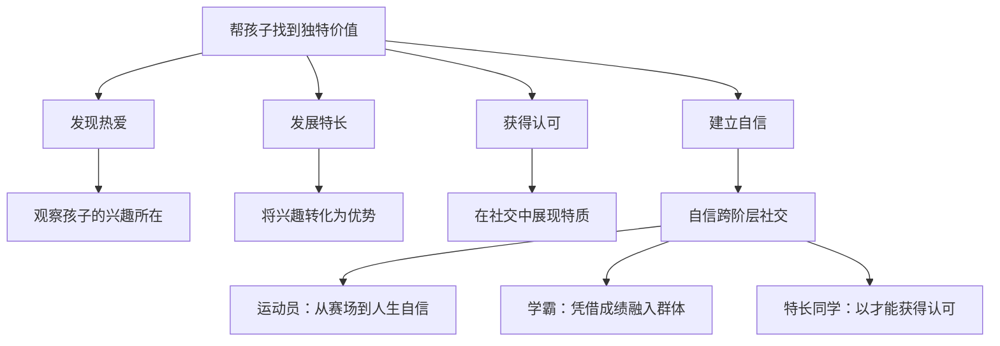
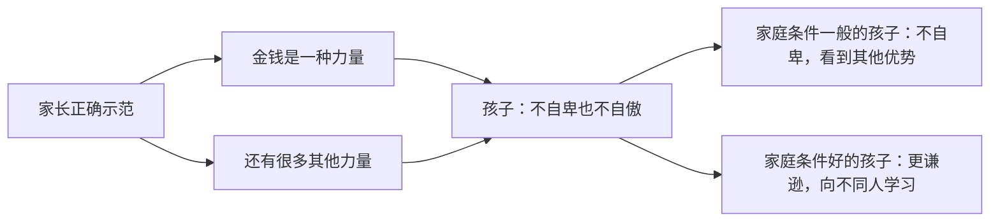

# 第18课：教孩子不卑不亢地跨阶层社交

## 课程导入

> [!faq] 有趣的现象
> 绝大部分人对自己所处阶层的评价，都比实际所处的阶位要低——大家总觉得自己不够好。

在成年人世界里，跨阶层社交很难；但对孩子而言，心思单纯，交到不同阶层的朋友反而更容易，且好处极多。

## 核心观点一：财富是流动的

### 科斯定律

> [!quote] 经济学视角
> 一项有价值的资源，不论一开始产权归谁，最后都会流动到最善于利用它、能最大化其价值的人手里。

**能力者拥有更多资源，始终是社会的常态。** 财富与一个人的努力、运气、环境、家庭出身等多种因素相关。

### 父母应真诚地分析自己

> [!example] 教育专栏作家清懒君的故事
> 小学五年级时，父亲在饭桌上说："我这辈子才华和努力都够，赚不到钱的原因就是个性太强、处事不圆滑。"
>
> 这句话中的营养：
>
> 1. 向孩子确认每个人都有缺点，父亲找到了自己的缺点
> 2. 每个人都有致富机会，生活是可以改变的
> 3. 性格难改，所以要尽早提醒孩子

清懒君后来上大学开始研究心理学书籍，重视提升情商。他认为：**如果父亲没有坦诚面对自己，而怪家庭怪社会，他可能就会活在偏执的怪圈中，变得又穷又骄傲。**

## 核心观点二：做一个具有独特价值的人

### 美国平民文化的启示

美国人追求个体性，本质是为了找到人与人之间的**平等**：

- 无论总统还是平民，吃同样的快餐、穿一样的牛仔裤
- 尊重每个个体的独一无二
- 财力有限的家庭也能培养出自信的孩子

> [!important] 关键认知
> **不卑不亢的社交** 与 **又穷又骄傲的自我** 是天然的对立。

### 如何帮孩子建立自信

### 青春期的身份危机

青春期的孩子开始变得敏感自卑，原因：

- 开始质疑童年时期的热爱
- 顾不上确认自己的独特之处在哪里
- 感到来自优秀同学的压力
- 对家境变得敏感

> [!tip] 解方
> 财商教育越早越好——让孩子从小理性看待财富不均、知道财富是流动的、知道自己通过努力可以获得更多财富。

## 核心观点三：不要用金钱溺爱孩子

### 世界上除了金钱还有其他力量

| 力量类型 | 代表人物 | 核心品质 |
|---------|---------|---------|
| 机智幽默 | 诸多名人 | 智慧 |
| 勇敢正义 | 岳飞 | 爱国、勇气 |
| 乐观豁达 | 鲁迅（也曾穷困） | 坚韧 |
| 忍辱负重 | 历史人物 | 毅力 |

> [!warning] 对家长的提醒
> 孩子对家庭的认同感，恰恰**不**是来自钱，而是来自优良品质。一个有正义感、有梦想的孩子，才是有力量的孩子。

### 家长的自查清单

- 在孩子与小朋友产生纠纷时，是否做到就事论事、不偏袒？
- 在陪孩子看影视剧或社会新闻时，是否客观指出违背道德的行为？
- 是否对拜金主义行为表示过默许或附和？

## 课程总结

要做到不卑不亢的跨阶层社交，核心是让孩子：

1. **放下**对自己家境和别人家境的过度关注
2. **将注意力**放在自身特质和别人的长处上
3. 明白交朋友本质是**资源互换**——但老同学的情谊是最能突破阶层的

> [!quote] 中国的老话
> 结交须胜己，似我不如无。然而只有同窗多年的情谊，才是最能突破阶层的历久弥坚的情谊。

## 复习与自测

1. 你是如何向孩子解释"为什么有些人家比我们有钱"的？是否做到了真诚剖析？
2. 孩子目前最独特的"价值"是什么？你打算如何帮他将这种价值显化出来？
3. 你家是否在用金钱代替其他力量表达爱意？请列出3种非金钱的表达爱的方式。
4. 回想最近一次孩子与别人的社交场景，你是否观察到Ta表现出了不卑不亢或相反的态度？
5. 和孩子一起讨论：除了钱，还有哪些东西能让人"有力量"？

---

**参考阅读：** [[0017-wealth-and-poverty]] | [[0019-tradeoffs]] | [[../reference/核心框架|核心框架]] | [[../reference/术语表|术语表]]