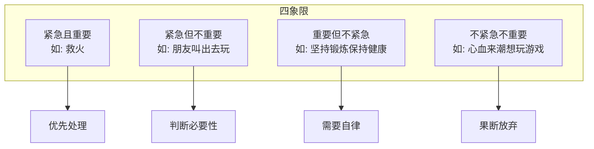
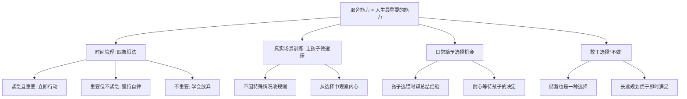

# 第19课：让孩子学会如何取舍

## 课程导入

> [!note] 核心命题
> 取舍能力，也就是选择能力，是人生最重要的能力。

虽然智商卓绝的人也会选错，情商高超的人也会站错队，但**多数成功的商人都能在绝大多数情况下做出正确的选择**。其根本在于：**取舍能力就是财商能力。**

> [!quote] 《反溺爱》
> 任何人都没办法做所有他想做的事，也沒办法拥有所有他想要的东西。问题关键在于：多少钱才够？

## 核心观点一：时间管理是取舍能力的基础

### 四象限管理法

### 四种事务详细分析

| 象限 | 定义 | 举例 | 应对策略 |
|------|------|------|---------|
| 紧急且重要 | 需要立即处理 | 救火、紧急任务 | **立即做** |
| 紧急但不重要 | 有时间压力但价值不高 | 朋友突然叫出去玩 | **判断后再做** |
| 重要但不紧急 | 长期价值高但没有即时反馈 | 锻炼、健康、学习 | **坚持做**（需要自律） |
| 不紧急不重要 | 既无价值也无压力 | 想玩游戏的念头、刷微信 | **不做** |

> [!tip] 家长须知
> 我们不仅选择做还是不做一件事，还要选择先做什么、后做什么。谁做好时间管理，谁的取舍能力就更强。

## 核心观点二：在真实场景中训练取舍

### 典型案例：10岁小明的放学后时间

小明周一到周五的常规任务：

```mermaid
gantt
    title 小明放学后的时间安排（6点-10点）
    dateFormat HH:mm
    axisFormat %H:%M

    section 任务
    家庭作业（1.5小时）       :a1, 18:00, 1.5h
    练钢琴（0.5小时）         :a2, after a1, 30m
    跑步（0.5小时）           :a3, after a2, 30m
    收拾房间（0.5小时）       :a4, after a3, 30m
    动画片（0.5小时）        :a5, after a4, 30m
    晚饭及收拾碗筷（0.5小时） :a6, after a5, 30m
```

如果小明想多看一场球赛直播，必须做选择题：

- 压缩作业时间？→ 观察：是否平时效率太低？
- 不练钢琴？→ 观察：是否对钢琴失去兴趣？
- 停止跑步或草草收拾房间？
- 放弃看动画片？→ 观察：是否真的爱看那部动画片？

> [!important] 家长的黃金法则
> **不要因"特殊情况"而轻易改变约定。** 因为：
> - 今晚有比赛，明晚有晚会，后天要月考……
> - 要打破规矩，理由永远不缺
> - **尽量减少允许例外的次数**

### 观察孩子的选择，读懂他的内心

每次需要取舍时，这正是探究孩子内心真实想法的窗口：

| 孩子的选择 | 可能的背后原因 |
|-----------|---------------|
| 压缩作业时间 | 作业难度是否合适？平时效率是否太低？|
| 放弃练琴 | 是否对练琴失去兴趣或感到挫败？|
| 放弃动画片 | 动画片可能只是放松方式，并非真爱 |

## 核心观点三：在日常生活中提供选择机会

### 不同年龄阶段的选择权

| 年龄 | 可以给的选择 |
|-----|------------|
| 1岁以上 | 穿哪件衣服、玩什么玩具 |
| 学龄前 | 周末去哪里玩、安排简单活动 |
| 小学 | 作业顺序安排、兴趣班选择 |
| 中学 | 文理科选择、时间分配 |

> [!warning] 家长的角色
> 家长的作用**不是**替孩子做选择，而是在孩子选错时帮他总结经验、一起处理后果。

### 给孩子选择时的正确做法

1. **给孩子反应时间**——孩子的反应速度与成人不同
2. **耐心等待**——表示尊重孩子的兴趣和选择
3. **适当重复选项**——低龄孩子注意力持续时间短，可能会忘记自己正在做什么

## 核心观点四：选择不做也是一种选择

### 金融市场给我们的启示

很多股民财商有待提高——他们觉得钱放在银行不买这买那就是亏了。

> [!tip] 重要理念
> **选择不做这个题，也是一种重要能力。**

| 场景 | 冲动选择的后果 | 最佳策略 |
|-----|--------------|---------|
| 旅游景点 | 买回毫无用处的纪念品 | 不买任何东西 |
| 孩子想买鞋或衣服 | 消耗预算 | 省下钱未来买自行车 |
| 股票投资 | 频繁操作亏损 | 不操作 |

### 文理科选择的案例分析

从财商教育的角度看：

> [!quote] 长远眼光
> 眼光应该放长远。越是重大的选择，越应放在一个更大的周期框架里考虑。

| 考虑因素 | 旧思维 | 新思维 |
|---------|--------|--------|
| 学科选择 | 木桶理论：补齐短板 | 放大优势，科技可弥补缺点 |
| 就业前景 | 哪个方向好就业 | 个人特质（兴趣、能力、价值观） |
| 时代特征 | 需要全能人才 | 人工智能接管基础工作 |

> [!important] 时代的变化
> 世界正在变成一个可以纵容人类用一生追求兴趣的新世界。人们应及时更新思想，用更长远的眼光做出眼前的重要取舍。

## 课程总结

## 复习与自测

1. 请用四象限法帮孩子分析他今天的任务，让他自己分类并排定优先级。
2. 本周是否出现了"特殊情况"可以破例的机会？你是如何处理的？
3. 孩子最近一次需要取舍的场景是什么？你从中学到了什么？
4. 你是否有过替孩子做选择的经历？尝试写下来，思考是否可以让他自己做决定？
5. 和孩子讨论：在生活中，"选择不做"比"选择做"更难的情况有哪些？

---

**参考阅读：** [[0017-wealth-and-poverty]] | [[0018-cross-class-social]] | [[../reference/核心框架|核心框架]] | [[../reference/术语表|术语表]]