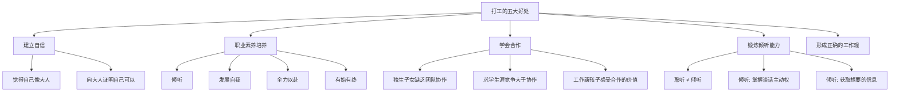
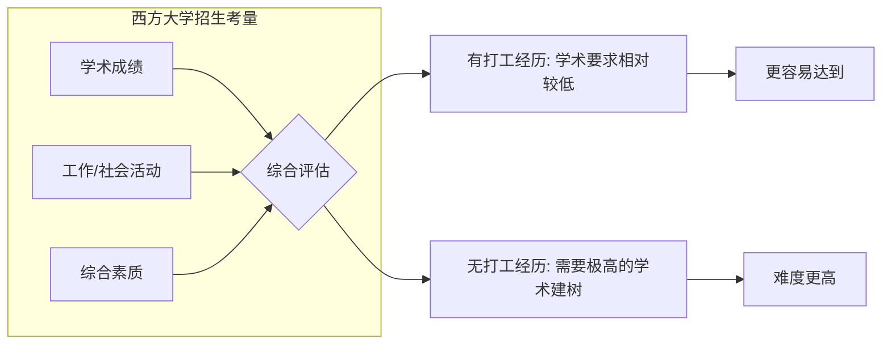
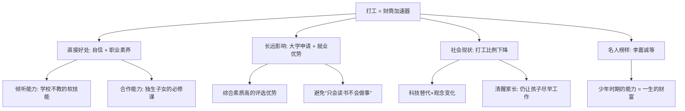

# 第20课：打工是提高孩子财商的加速器

## 课程导入

> [!important] 核心认知
> 工作是提高一个人财商的加速器。如果想让孩子成长得更快，一定不要错过打工这个教育方式。

这是财商教育的第五个模块——那些看起与金钱无关，但对孩子的财商影响同样重要的话题。

打工是中国家长最容易忽视的领域：

- 中国家长认为孩子的第一要务是学习
- 社会似乎没有给孩子提供工作机会
- 绝大多数中国人在大学毕业前几乎从未工作过

## 核心观点一：打工的直接好处

### 倾听 vs. 聆听

| 类型 | 英文 | 定义 | 场景 |
|-----|------|------|------|
| 聆听 | Listen to | 老老实实坐着听课 | 学校课堂 |
| 倾听 | Listen for | 掌握主动权，提取关键信息 | 合作工作 |

> [!tip] 关键差异
> 孩子在家里是乖宝宝、在学校是好学生，但很少有机会培养**倾听**能力。通过团队协作完成工作，能最直接有效地锻炼倾听能力。

## 核心观点二：打工的长远影响

### 职业素养的培养

《反溺爱》提到，孩子可以在打工中学到的职业素养包括：

1. 倾听
2. 发展自我
3. 与別人合作
4. 全力以赴
5. 有始有终地做好一件事

### 戴夫‧拉姆奇的观点

> [!quote] 美国财务咨询师戴夫‧拉姆奇
> 让孩子从小接触工作，这样孩子才能对那些拒绝工作的人失去尊重。
>
> 我们希望自己的女儿（儿子）未来能遇到対的人，而不是懒惰的人。
> 孩子会停止和不受工作的人结交——因为有一天你还会有孙子，你希望孙子有勤劳的父母。

## 核心观点三：为什么现在很少人打工

### 从"祝贺成为劳动力"到"孩子无用论"

普林斯顿大学社会学家维维安娜‧泽利泽指出：

> 社会已从庆祝孩子诞生是未来的劳动力，演变成信奉孩子无用论。

**科技带来的变化：**
| 过去的必要技能 | 现在被替代的方式 |
|-------------|----------------|
| 拼音+五笔打字 | 语音输入 |
| 看地图 | 导航 |
| 很多生活技能 | 社会便利性 |

### 打工比例的下降

| 年份 | 16-19岁青少年打工比例（美国） |
|-----|---------------------------|
| 198-1998年 | ~45%（持续约半世纪） |
| 2013年 | ~20%（历史最低） |

### 不打工的代价

> [!warning] 核心观点
> 在学术上达到较高水平所花的努力，远超过做一个"学术过关、处事有一套"之人所需花费的精力。后者本就是在社会上生存该培养的能力。

## 核心观点四：名人的少年打工经历

### 李嘉诚的启示

| 年龄 | 工作 | 学到的能力 |
|-----|------|-----------|
| 14岁 | 中南钟表公司（泡茶扫地小学徒） | 察言观色、见机行事 |
| 17岁 | 五金制造厂/塑胶带公司推销员 | 推销能力、倾听能力 |

> [!note] 核心启示
> 推销员靠的不是学识，而是**察言观色和倾听的能力**——这种能力恰恰是在少年时期培養出来的。

我们的孩子不需要像少年李嘉诚那样肩负养家糊口的责任，但**为了让孩子获得倾听、协作等方面的能力，应该鼓励孩子打工，为他们创造打工机会。**

## 课程总结

## 复习与自测

1. 你的孩子目前是否有任何形式的"工作"经历？如果没有，原因是什么？
2. 倾听和聆听的区别是什么？你的孩子更擅长哪一种？
3. 请思考：在不影响学习的前提下，如何为你的孩子安排打工时间预算？
4. 和孩子一起讨论李嘉诚的故事，问问他：你觉得从小学徒到推销员，李嘉诚学到了什么？
5. 如果孩子打工赚到第一份工资，你打算如何引导他管理这笔钱？

---

**参考阅读：** [[0021-types-of-jobs]] | [[0022-volunteering]] | [[../reference/核心框架|核心框架]] | [[../reference/术语表|术语表]]