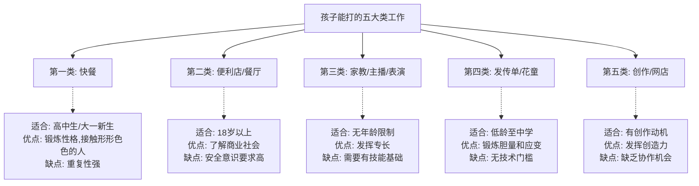
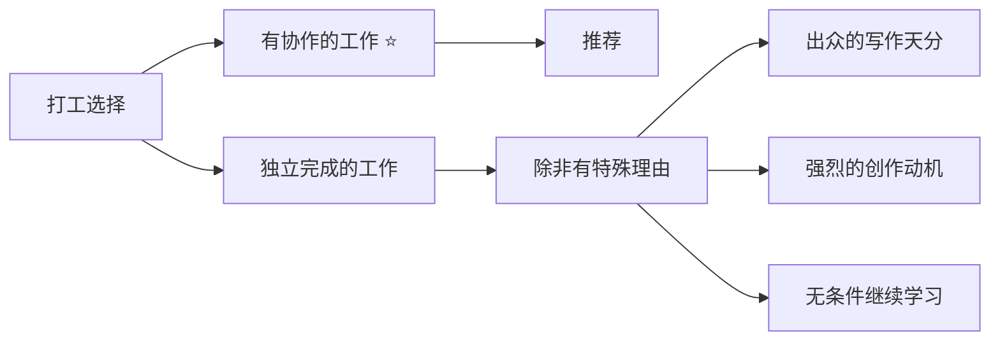

# 第21课：其实有很多种工可以打

## 课程导入

> [!fag] 很多家长的困惑
> 现在就业这么困难，连海归博士都不好找工作，一个孩子能干什么？

这课来开拓眼界——孩子可以打的工作，真的有很多。

## 五大类工作选择

## 第一类：快餐三剑客（麦当劳、肯德基、星巴克）

| 适合年龄 | 工作内容 | 培养能力 | 注意点 |
|---------|---------|---------|-------|
| 高中生/高三毕业生/大一新生 | 收拾餐盘、清扫、收银 | 不怕脏不怕累、服务意识 | 重复性强，适合短期参与 |

**锻炼价值：**
- 让孩子知道品牌是靠员工不怕脏不怕苦打造出来的
- 收银台工作——一遍遍向不同顾客介绍产品，微笑面对各种心态的客人

## 第二类：便利店和餐厅服务员

| 类型 | 适合年龄 | 优点 | 缺点 |
|-----|---------|------|------|
| 便利店 | 18岁以上 | 了解商品价格、进货渠道、消费行为习惯 | 比较独立，协作机会少 |
| 餐厅服务员 | 18岁以上 | 高级餐厅可接触更高层次的人、了解用餐礼仪 | 面对的人较复杂，需安全意识 |

> [!tip] 便利店 = 社会学调查窗口
> 便利店能了解：什么年纪的人喜欢买什么产品？喜欢搭配购买什么产品？对社会感到好奇的孩子在这里兼职大概率不会无聊。

### 真实案例：一个高中毕业女生的打工故事

| 阶段 | 经历 | 学到的教训 |
|-----|------|-----------|
| 第一阶段 | 麦当劳面试碰壁，被要求推广活动 | "社会上的第一课：不想招兼职可以直接拒绝，为什么要利用我？" |
| 第二阶段 | 文具店打工，月薪1800→2000 | 被顾客批评、被老板娘误会、被老板娘的婆婆数落 |
| 第三阶段 | 变成多面手 | 骑电瓶车送货、推销、收纳整理、忍委屈 |

**她在打工中学到的：**

1. 付出和回报不一定总能成正比
2. 选择常常大于努力
3. 学会为自己争取利益
4. 综合评价一个人（老板娘的婆婆的不满来自不了解她）

> [!quote] 她的感悟
> "她拥有了很多个第一次——第一次当销售员、收银员、送货员，第一次骑着电动车上路，第一次一个人走访很多的企业，以及第一次住在陌生人的家里。"

## 第三类：家教、主播、乐队和表演类

| 年龄 | 工作形态 | 锻炼能力 |
|-----|---------|---------|
| 无年龄限制 | 家教（即使小学生也可以） | 教学能力、总结能力 |
| 无年龄限制 | 主播 | 表达能力、临场反应 |
| 无年龄限制 | 乐队（主唱/键盘/吉他/鼓手） | 团队配合、克服紧张 |

> [!warning] 关于"耽误学习"的担忧
> 兴趣不但是最好的老师，也是最好的监督者。成绩优异的人中，只有很小的比例是靠不计成本的时间投入和机械重复达到的。学习不是靠努力驱动，而是靠**效率驱动**。

## 第四类：发传单和花童

### 发传单

**适合年龄：** 低龄至中学

**锻炼价值：**
- 放下身段，不怕被粗鲁拒绝
- 突破心理防线→性格发生积极变化
- 理解：別人接传单可能是好奇或善意；拒绝可能只是因为没兴趣

### 花童

**适合场景：** 婚礼或各种宴会

**锻炼价值：**
- 初次离开父母，配合別人的节奏
- 观察別人的情绪和意图

> [!tip] 去哪里找机会？
> 爸妈可以主动带孩子到婚庆公司或公关公司去看看。

## 关键提醒：优先选择需要协作的工作

## 各年龄段打工推荐汇总

| 年龄阶段 | 推荐工作 | 核心锻炼目标 |
|---------|---------|------------|
| 小学低龄 | 发传单、花童 | 胆量、应变能力 |
| 小学高龄 | 花童、简单家教（辅导低年级） | 责任感 |
| 初中 | 家教、发传单 | 表达能力、自信 |
| 高中 | 快餐、便利店、餐厅 | 职业素养、协作能力 |
| 大学新生 | 各类兼职、专业相关实习 | 专业能力、职业规划 |

## 课程总结

> [!important] 一句话核心
> **适合孩子的工作种类非常多，关键在于：**
> 1. 从小学阶段就可以开始考虑
> 2. 优先选择需要协作的工作
> 3. 让孩子找到真正热爱的事情和真正该认同的东西（学习）
> 4. 学习是靠效率驱动，而不是靠时间驱动

## 复习与自测

1. 根据你孩子的年龄和兴趣，从五类工作中选出最适合的一类，并说明理由。
2. 和孩子一起讨论：他更愿意选择协作性强的工作还是独立完成的工作？为什么？
3. 如果你孩子对发传单或做花童表示抗拒，你打算如何帮他克服心理障碍？
4. 回想你小时候是否有过打工经历？那段经历对你人生的影响是什么？
5. 请和孩子一起制定一个"暑假打工计划"，包括希冀的工作类型、每周时间安排和预期目标。

---

**参考阅读：** [[0020-part-time-jobs]] | [[0022-volunteering]] | [[../reference/核心框架|核心框架]] | [[../reference/术语表|术语表]]