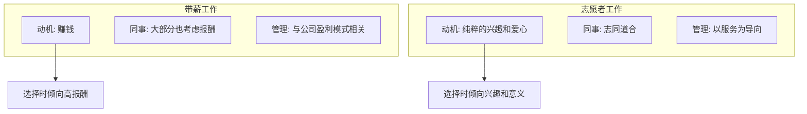
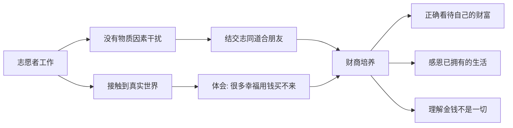

# 第22课：孩子做义工的利与弊

## 课程导入

> [!question] 核心问题
> 带薪工作和志愿者工作有什么区别？为什么要让孩子参与没有报酬的志愿者工作？

相同点：通过协作锻炼学习以外的综合能力。

不同点：**志愿者工作不给钱**（只覆盖基本工作成本），因此更容易结交志同道合的朋友。

### 动机对比



## 核心观点一：做义工的好处

### 五大好处

| 好处 | 说明 |
|-----|------|
| 结交志同道合的朋友 | 没有物质因素干扰，更容易找到同好 |
| 变相的捐献 | 与之前讲的零用钱管理有所对应 |
| 身心健康 | 因为世界需要并认可自己的价值而感到幸福 |
| 免费技能培训 | 看重意愿和品质，技能由组织教会你 |
| 了解生活的艰辛 | 以最真实、最能接受的方式 |

> [!example] 讲师亲身经历
> 2004年，讲师在读书期间担任杭州第七届艺术节志愿者，承担柏林交响乐团的翻译陪同工作。
>
> **收获：**
> - 锻炼翻译实战能力
> - 近距离观察世界顶级交响乐团的工作状态和精神面貌
> - 免費观看了一场精彩现场表演

### 另一个角度的好处：财商培养

通过志愿者工作，孩子能：

1. 接触到没有利益遮盖的真实世界
2. 体会同伴之间真诚互助、救助对象真诚感恩
3. 深刻理解**很多幸福是用钱买不来的**
4. 看到许多需要帮助的人，**感恩自己已拥有的生活**

> [!note] 00后的公益意识
> 根据00后画像报告：
> - 15.%的受访00后希望未来投身公益帮扶他人
> - 00后的家庭条件普遍较好，参与公益的动力更单纯、积极性更高

## 核心观点二：申请做义工的条件

### 中国青年志愿者申请条件

1. **年满14周岁**（初中生即可申请）
2. 具有奉献精神
3. 具备与所参加项目相适应的基本素质
4. 根据自身愿望和条件选择服务项目，从事一定时间的志愿服务
5. 遵纪守法

> [!tip] 申请渠道
> 学生可以在学校团组织（团委）了解注册成为志愿者的相关信息，以及各个时期适合的志愿者项目。

## 核心观点三：做义工的三大注意（避坑指南）

### 注意一：不要让做义工流于形式

> [!warning] 错误动机
> 有些家长带孩子参加志愿者活动，只是为了让孩子简历上有不同色彩。这样的动机会**严重干扰项目的选择**，导致难以获得真正的价值。

### 注意二：避免"好心办坏事的"无效义工

《反溺爱》中提到的故事：

>一群私立寄宿学校的学生在非洲做志E愿者，每天垒的砖墙质量很差，当地人不得不每晚把砖全部拿下来重新垒回去，这样第二天早上小志愿者们才不会发现他们犯的错。

> [!important] 反思
> **如果把这些盲目的志愿者花在这趟亻旅行的钱，拿来雇佣当地合格的建筑工人，提供的帮助反而会更多。**

### 注意三：四个必问的问题

在决定让孩子做义工前，家长必须想清楚：

```mermaid
graph TD
    A[选择志愿项目前的四个问题] --> Q1[项目的领导者是谁?]
    A --> Q2[是否用到或培养孩子的技能?]
    A --> Q3[是否能结交新朋友?]
    A --> Q4[是否符合孩子的兴趣?]

    Q1 --> R1[真正懂行的人领导才值得考虑]
    Q2 --> R2[否]则不值得花时间]
    Q3 --> R3[不要和熟悉的朋友一起去]
    Q3 --> R4[否则变成'特殊的春游秋游']
    Q4 --> R5[否则难以获得真正价值]
```

## 回归财商视角



## 课程总结

**做义工对财商的独特价值：**
- 财商是认识、管理和创造财富的能力
- 志愿者工作让孩子接触到没有利益遮盖的真实世界
- 孩子更深刻地体会到**很多幸福是用钱买不来的道里**
- 感恩于已拥有的生活，正确看待自己的财富

**核心三原则：**
1. 不要流于形式
2. 确保项目有价值（而非"无效义工"）
3. 不和熟悉的朋友一起参加（否则变成"特殊春游"）

## 复习与自测

1. 带薪工作和志愿者工作最本质的区别是什么？你如何向孩子解释这种区别？
2. 根据你孩子的年龄和兴趣，你觉得什么类型的志愿活动最适合他（她）？
3. 回想一下你是否有过"做好事但效果不好"的经历？这件事能给孩子什么启发？
4. 你认为孩子身边有哪些需要帮助的群体？请列出3个潜在的服务方向。
5. 和孩子一起讨论：如果做义工没有报酬，你从中获得的"回报"是什么？

---

**参考阅读：** [[0020-part-time-jobs]] | [[0021-types-of-jobs]] | [[0023-camp-and-travel]] | [[../reference/核心框架|核心框架]] | [[../reference/术语表|术语表]]