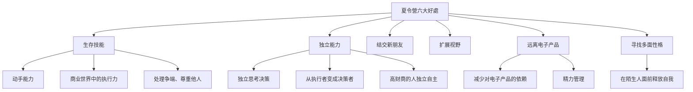
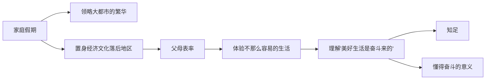
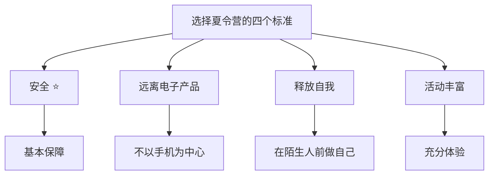

# 第23課：參加夏令營和度假的真正意義

## 课程导入

除了志愿者工作，还有哪些财商培养形式？这課来讨论**夏令營**和**家庭度假**两个方案。

## 核心观点一：夏令營的六大好处

### 好处详细分析

| 好处 | 描述 | 财商关联 |
|------|------|---------|
| 生存技能 | 动手改造世界、学习社会身份、尊重他人、处理争端 | 执行力是商业世界的关键能力 |
| 独立能力 | 独立思考决策并付诸行动（不只是自己穿衣吃饭） | 高财商的人有自已的认知体系 |
| 结交新朋友 | 没有学校的竞争和压力，释放天性 | |
 | 扩展视野 | 接触校园以外的真实世界 | 看到更广阔世界有助于寻找人生目标 |
 | 远离电子产品 | 精力不被浪费，重新观察世界 | 善干观察是赚钱的基础 |
   | 寻找多面性格 | 在陌生人面前尝试不一样的自己 | 成长的潜在可能性 |

### 关于电子产品的深入探讨

> [!warning] 不容忽视的问题
> 孩子迷恋电子产品本身就是精力的浪费。沉迷电子游戏或虚拟社交，让孩子失去观察世界的机会。

**一个懂傳得赚钱的人 = 一個善于观察的人**

> 孩子连观察的机会都被电子产品剥夺，还怎談赚钱？

### "蒙面歌王"效应與《奇迹男孩》的启示

孩子往往从幼儿园就开始形成自我设定。父母、老师、同学的综合评价，变成了他自已的评价。

但：

> [!tip] 夏令营的独特价值
> 夏令營通常半个月到一个月。孩子在全是陌生人的环境中，可以大胆尝试身上各种可能性——就像《蒙面歌王》中戴上面具的老歌手，就像《奇迹男孩》中万圣节戴上面具后变了一个人的奥吉。被压抑很久的性格侧面，得到了释放。

## 核心观点二：家庭度假的財商教育意义

### 旅行 ≠ 放松享受

> [!quote] 两点确定一条直线
> 现在生活条件优越的人，以前过著远不如今天的日子——除了经济原因，还有科技原因和其他历史因素。知道美好生活来之不易的人，才最懂得知足、懂得奋斗的意义。

### 旅行中的財商教育机会

当父母带孩子去偏远山区体验几天"辛苦"生活時：

| 孩子的反应 | 父母可以借机讲解 |
|-----------|----------------|
| 为什么这里和我们家不一样？ | 金钱的力量——**发展需要资金** |
| 为什么他们这么辛苦？ | 時間的力量——**发展需要时间** |

> 地区如此，一个人的一生也是如此。

### "打"卡"现象的警示

> [!warning] 旅行的异化
> "打卡"让纯粹的旅行变成完成别人施加给自己的任务。

| | 传统旅行 | 打卡旅行 |
|--|---------|---------|
目标 | 领略风土人情、参观特色建筑、走访博物馆大学 | 到网红餐厅、热门景点打卡
心态 | 随缘、开放 | 任务驱动、焦虑
结果 | 开眼界、发现世界 | 开胃（饮食变成主要目的）

> [!important] 核心原则
> 决心通通過度假培养孩子财商的父母，**必须在每次出发前确立此行的目的**，不要为了打卡浪费宝贵时间。

## 夏令营选择的参考标准

在选择夏令营时，参考以下标准筛选合适的项目：

1. **安全性** —— 第一要考虑的
2. **能否让孩子远离电子产品** —— 纪律要求+更有吸引力的活动
3. **能否在陌生人面前释放自我** —— 鼓励孩子尝试不一样的自己
4. **活动是否丰富多样** —— 给孩子充分的体验机会

## 课程总结

**夏令营的六大好处 → 核心指向：体验式学习**
**家庭度假的核心 → 拓宽视野 + 财商教育**

| | 夏令营 | 家庭度假 |
|--|-------|---------|
| 社交 | 结交新朋友 | 亲子互动 |
| 独立 | 独立生活 | 有父母陪伴 |
| 体验 | 生存技能、多种活动 | 体验不同文化层次 |
| 财商关联 | 观察能力、执行力 | 金钱与时间的力量 |

## 复习与自测

1. 根据你孩子的年龄和性格，六大夏令营好处中哪几个对他最重要？为什么？
2. 你的孩子是否过度依赖电子产品？如果夏令营能帮他减少这种依赖，你愿意尝试吗？
3. 上次全家旅行中，你是否掉入了"打卡"陷阱？下次旅行你打算如何规划？
4. 你是否考虑过带孩子去体验"不那么容易的生活"？如果有，具体打算去那里？
5. 和孩子一起讨论：旅行中你最期待的是什么？你觉得什么才是"值得"的旅行？

---

**参考阅读：** [[0022-volunteering]] | [[0024-future-of-financial-literacy]] | [[../reference/核心框架|核心框架]] | [[../reference/术语表|术语表]]