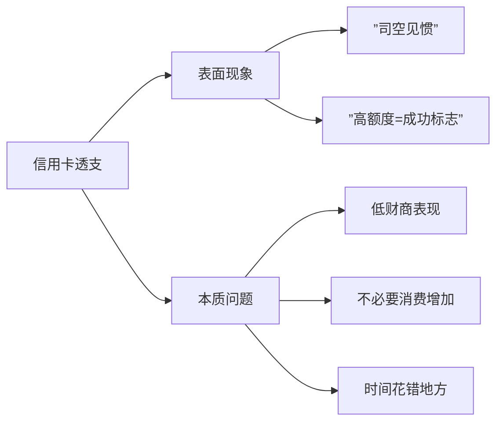
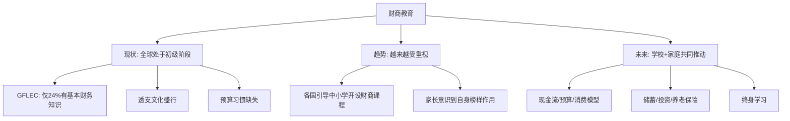
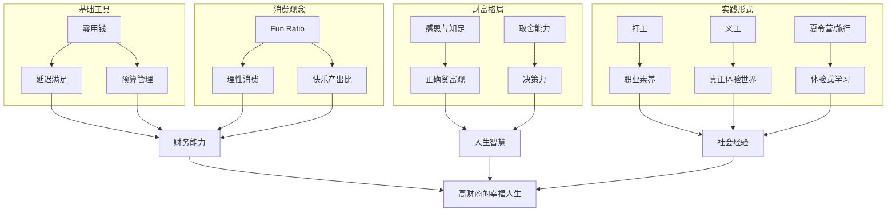

# 第24课：财商教育的现状和未来

## 课程导入

这是财商培养课程的最后一课。回顾整门课程：

```mermaid
mindmap
  根((反溺爱财商课))
    模块一: 与孩子谈钱
      请与孩子谈钱
      零用钱管理
      延迟满足
    模块二: 预算与储蓄
      预算制定
      储蓄习惯
      目标设定
    模块三: 理性消费
      消费观建立
      Fun Ratio
      消费决策
    模块四: 贫富与取舍
      贫富观 [[0017-wealth-and-poverty]]
      跨阶层社交 [[0018-cross-class-social]]
      取舍智慧 [[0019-tradeoffs]]
    模块五: 多种形式
      打工 [[0020-part-time-jobs]] [[0021-types-of-jobs]]
      义工 [[0022-volunteering]]
      夏令营与旅行 [[0023-camp-and-travel]]
```

> [!quote] 信念
> 财商高的孩子，更容易幸福。

## 核心观点一：全球财商教育现状

### GFLEC 调查数据（美国80后/90后）

> [!info] 美国华盛顿大学商学院
> 自2011年成立全球财商教育中心（GFLEC），专门研究世界各国的财商教育发展状况和政策制定。

| 指标 | 数据 | 解读 |
|------|------|------|
| 具备基本财务知识 | 24% | 超七成年轻人财务知识不足 |
| 达到优秀标准 | 8% | 极少数人真正懂财务 |
| 对财务状况不满 | 34% | 超过三分之一不满意 |
| 对财务状况绝望 | 18% | 接近两成感到绝望 |
| 拿不出2000美元应急 | 约50% | 半数年轻人手头没有一个月工资的储蓄 |
| 有退休账户 | 36% | 不到四成有养老意识 |
| 寻求过专业财务建议 | 27% | 大多数人"拍脑袋过日子" |
| 寻求过负债管理帮助 | 12% | 极少数人管理债务 |

> [!warning] 警示
> 连美国的财商普及率都这么低，中国的形势也不会乐观。**一代年轻人输给了他们的父母。**

### 中国养老保险数据对比

| 指标 | 数据 |
|------|------|
| 城镇职工基本养老保险参保人数 | 4.18亿 |
| 15-59岁劳动人口 | 8.97亿 |
| 60岁以上老龄人口 | 2.49亿（17.9%） |
| 养老保险覆盖率 | 约46.7% |

> [!faq] 思考
> 你对自己的养老保险了解有多少？是否有必要让读高中、大学的孩子也早点了解养老保险？

## 核心观点二：三个值得警惕的趋势

### 趋势一：信用卡透支额度不断上升



> [!tip] 信用卡的本质
> 信用卡本该是帮我们省去带现金、在账户上留一笔钱的麻烦。与其花时间研究信用卡活动省钱，**远不如把时间拿去提升自己或用于工作，能创造的财富只会更多。**

#### 买车案例

| 冲动购买 | 理性方案 |
|---------|---------|
| 工作没几年就贷款买车 | 先攒钱 |
| 做几年车奴 | 攒钱过程中发现需求可能变化 |
| 发现并非真正需要的车 | 发现公共交通足够便利 |
| 卖车也不划算 | 或发现收入增长，可轻松全款购买 |

> [!important] 核心原则
> 越是大宗的消费，越应该沉着考虑，不应该提前透支消费力。

### 趋势二：年轻人不如长辈会做预算

| 方式 | 特点 | 效果 |
|------|------|------|
| 不做预算 | 花钱没数 | 最差 |
| 记账 | 记录已发生的消费 | 好一些，但仍难免浪费 |
| 做预算 | 有计划、有条理 | 最好 |

### 趋势三：学校重"赚钱能力"，轻"管钱能力"

> [!quote] 早期的观点
> 父母是孩子最好的财商老师——这一点即使未来学校教育有所改观也不会变。

但学校的确应该做得更好：

- 中小学应增设经济金融类课程
- 教孩子了解现金流、账单、预算、消费模型分析
- 教孩子更深刻地了解储蓄和投资（不应只是成年人的知识）
- 建立应急资金、设定投资计划、了解养老保险等概念应从初中开始培养

> [!note] 已有基础
> 初中生已经在学世界地理和国际政治，为什么不能更早地了解身边真实而残酷的金融世界？

## 核心观点三：捐赠习惯的培养

（回顾贯穿课程的重要理念）

| 捐赠的益处 | 说明 |
|------------|------|
| 身心健康 | 世界需要并认可自己的价值 |
| 幸福感 | 帮助他人带来的满足感 |
| 财富观 | 理解金钱不只是为自己服务 |

## 课程总结与展望



### 三个关键认知

1. **财商教育是一个终身课题**——不只适用于孩子，也适用于家长自己
2. **父母是孩子最好的财商老师**——陪伴和引导比学校更有效
3. **学核应做得更好**——人格培养和性格塑造需家校配合完成

> [!quote] 富利波士顿金融公司 2003年调查
> 不到半数的家长认为，他们能够给孩子在金钱管理上做好榜样。

这恰恰说明：**我们和孩子一起成长，一起提升财商，是每个人都需要的终身课题。**

## 全课程知识体系总览



## 复习与自测

1. 读完本书全部24课，你觉得自己在哪个方面改变最大？
2. 针对"信用卡透支"和"做预算"两个趋势，你目前的状况如何？你有什么改变计划？
3. 你是否希望在孩子的学校里推动财商教育？你打算如何开始？
4. 你认为自己给孩子在金钱管理上做的榜样打几分？可以如何改进？
5. 列出你在生活中准备开始实践的三件最重要的事（从本课程中获得的启发）。

---

**参考阅读：** [[0017-wealth-and-poverty]] | [[0018-cross-class-social]] | [[0019-tradeoffs]] | [[0020-part-time-jobs]] | [[0021-types-of-jobs]] | [[0022-volunteering]] | [[0023-camp-and-travel]] | [[../reference/核心框架|核心框架]] | [[../reference/术语表|术语表]]