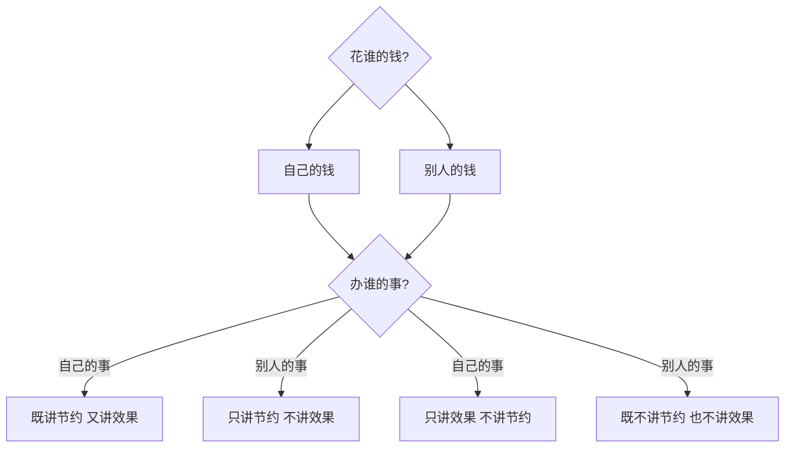

# 核心框架：弗里德曼花钱四原则

> 提出者：米尔顿·弗里德曼（Milton Friedman），诺贝尔经济学奖得主

这四个原则是理解财商教育的底层逻辑。它揭示了 **所有权与受益权** 如何决定一个人的消费行为。

## 四原则一览

| 组合 | 花谁的钱 | 办谁的事 | 行为特征 |
|------|---------|---------|---------|
| 最佳 | 自己的钱 | 自己的事 | 既讲节约，又讲效果 |
| 次优 | 自己的钱 | 别人的事 | 只讲节约，不讲效果 |
| 次优 | 别人的钱 | 自己的事 | 只讲效果，不讲节约 |
| 最差 | 别人的钱 | 别人的事 | 既不讲节约，也不讲效果 |

## 在家庭中的应用

### 孩子的视角

对于孩子来说，**家长的钱 = 别人的钱**。这意味着：

- 当孩子花父母的钱做自己不喜欢的事（如被强迫上不感兴趣的兴趣班） → **最差组合** → 孩子既不会珍惜也不会投入
- 当孩子花自己的零花钱买自己想要的东西 → **最佳组合** → 孩子自然学会精打细算

### 应用原则

> [!TIP] 核心应用
> 家长应该创造机会，让孩子在合适的年龄和场合，**花自己的钱办自己的事**。只有这样的实践才能真正提高财商。

### 具体场景

| 场景 | 属于哪一组合 | 建议调整 |
|------|------------|---------|
| 孩子用父母的钱买玩具 | 别人的钱 + 自己的事 = 只讲效果不讲节约 | 改为孩子用自己的零花钱买 |
| 孩子被逼上补习班 | 别人的钱 + 别人的事 = 最差组合 | 让孩子参与选择，或自己承担部分费用 |
| 孩子用自己攒的钱买书 | 自己的钱 + 自己的事 = 最佳组合 | 不要干涉，让他自己决策 |

## 与延迟满足的关系

当孩子花自己的钱办自己的事时，会自然产生以下行为：

1. **比较价格** — 钱是自己的，会主动寻找性价比
2. **延迟决策** — 犹豫是否值得买，给自己思考时间
3. **目标储蓄** — 为想要的大件物品制定储蓄计划
4. **后悔反思** — 花错钱后自己承担后果，下次更谨慎

> [!WARNING]
> 如果家长总是为孩子买单（花家长的钱办孩子的事），孩子就永远处于"最差组合"中，既不会节约也不会在意效果。

## 在其他课程的引用

- [[../lessons/0001-talk-about-money|第01课：请与孩子谈钱]] — 四原则的首次提出
- [[../lessons/0005-delayed-gratification-allowance|第05课：延迟满足与零花钱]] — 最佳组合的实践
- [[../lessons/0019-tradeoffs|第19课：取舍智慧]] — 机会成本与四原则的关系