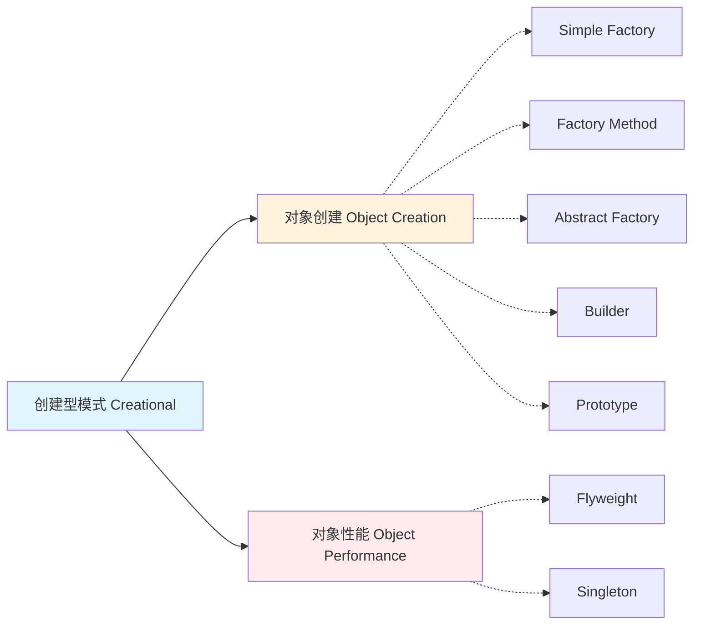
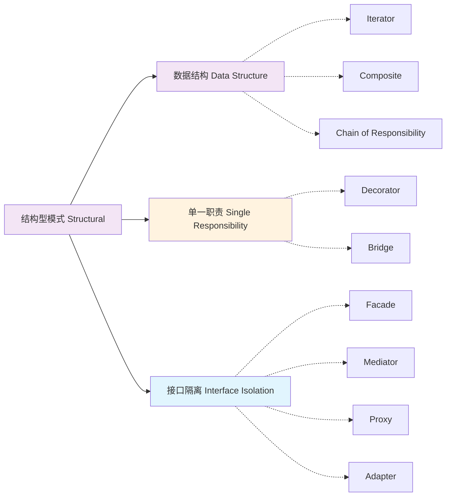
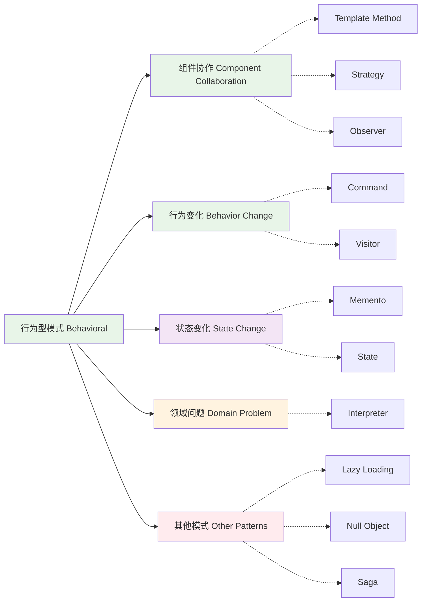

## 分类说明  
  
### 传统GoF分类  
- **创建型模式**: 关注对象的创建过程  
- **结构型模式**: 关注对象和类的组合  
- **行为型模式**: 关注对象间的交互和职责分配  
  
### 本项目分类  
- **对象创建**: 对应GoF创建型模式，专注于对象实例化  
- **对象性能**: 性能优化相关的模式  
- **组件协作**: 对象间协作和通信模式  
- **数据结构**: 数据组织和遍历模式  
- **单一职责**: 职责分离和功能扩展模式  
- **接口隔离**: 接口设计和适配模式  
- **行为变化**: 行为动态变化模式  
- **状态变化**: 状态管理和转换模式  
- **领域问题**: 特定领域应用模式  
- **其他模式**: 扩展和实用模式

##  对象创建  
### Simple Factory  

**构造函数的弊端**  
OOP是以对象为中心的，对象从哪里来呢？最简单的方式就是利用new+构造函数：
```java
public class Student {
    private String name;
    private Integer age;
    private Integer height;
    // 省略getter、setter

    public Student(String name, Integer age, Integer height) {
    	// ...
    }
}
```
存在问题，不同调用者构造对象，有的需要name，age，有的需要name height

构造对象传参就需要两个方法，或者一个方法但需要其他都填null，且使用两个方法还有个问题就是传参签名相同没法区分调用哪一个

```java
public class Student {
    private String name;
    private Integer age;
    private Integer height;

    // 省略全参构造...
    
    public static Student createStudent(String name, Integer age) {
        return new Student(name, age, null);
    }

    public static Student createPlayer(String name, Integer height) {
        return new Student(name, null, height);
    }
}
```


可以通过创建多个静态方法来实现不同目的，参数一样，可以通过方法名的变化来区分


```java

```


### Factory Method  
### Abstract Factory
### Builder(1)  
### Builder(2)  
### Builder(3)  
### Prototype  
### 小结  
## 对象性能  
### Flyweight  
### Singleton  
### 小结  
  
## 组件协作  

 ### - Template Method  
### Strategy  
### Observer  
### 小结  
##  数据结构  
### Iterator  
### Composite  
### Chain of Responsibility(1)  
### Chain of Responsibility(2)  
### Chain of Responsibility(3)  
### 小结  
## - 单一职责  
### Decorator  
### Bridge  
### 小结  
## - 接口隔离  
### Facade  
### Mediator  
### Proxy  
### Adapter  
### 小结  
## 行为变化  
### Command  
### Visitor（1）  
### Visitor（2）  
### 小结  
## - 状态变化  
### Memento  
### State  
### 小结  
## 领域问题  
### Interpreter  
## 其他模式  
### Lazy Loading  
### Null Object  
### Saga