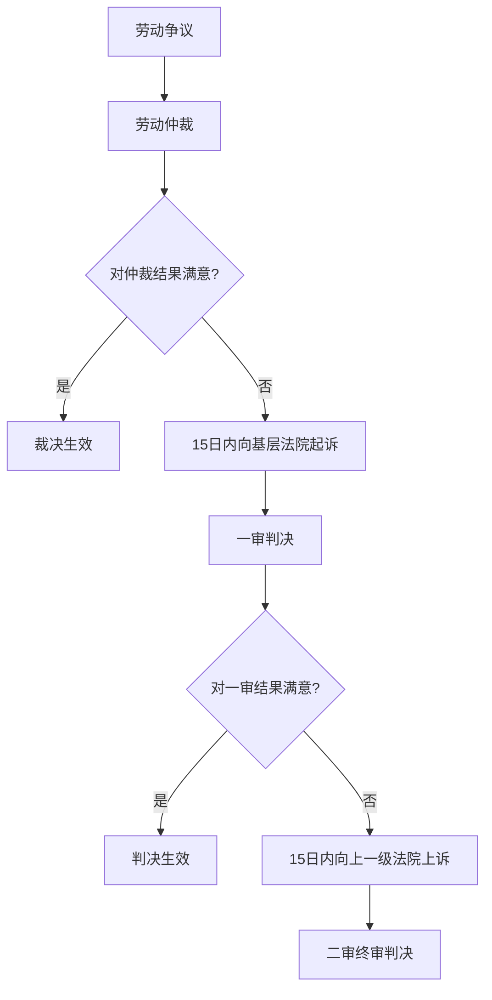

# 第58课：一审与二审——对仲裁结果不满意，要继续起诉或上诉吗？

## 本节导读

如果你对劳动仲裁的裁决结果不满意，法律给你提供了继续维权的路径。本课详解从仲裁到一审、从一审到二审的时限、管辖和流程，帮助你准确把握每个环节的时间窗口。

## 从仲裁到一审

### 起诉时限：15天

对仲裁裁决结果不服，必须在收到仲裁裁决书之日起**15日内**向法院提起诉讼。超过15天，裁决书生效，将丧失起诉权利。

### 特殊情形：一裁终局

**一裁终局**适用于：追索劳动报酬、工伤医疗费、经济补偿或赔偿金（金额不超过当地月最低工资标准12个月），以及工时、休假、社保等争议。

| 主体 | 救济途径 | 时限 |
|------|----------|------|
| 劳动者 | 向基层法院起诉 | 收到裁决书15日内 |
| 用人单位 | 向中级法院申请撤销裁决 | 收到裁决书30日内 |

> [!WARNING] 一裁终局
> 一裁终局是"对单位终局、对劳动者不终局"——劳动者仍然可以起诉，但用人单位只能申请撤销裁决，不能直接起诉。

### 管辖法院

应向**用人单位所在地**或**劳动合同履行地**的**基层人民法院**提起诉讼。

**两地起诉的处理**：如果双方就同一仲裁裁决分别向不同法院起诉，后受理的法院应将案件移送给先受理的法院合并处理。

## 从一审到二审

### 上诉时限：15天

对一审判决不服的，可在**判决书送达之日起15日内**提起上诉。

### 上诉流程

上诉状**通过一审法院向上一级法院提出**。如果直接向二审法院上诉，二审法院会在5日内将上诉状移交给一审法院。

### 二审效力

二审判决裁定一经送达，即产生**最终法律效力**，不得再上诉。对二审结果仍不服的，只能申请再审（是否启动由法院审查决定）。

## 流程总览

## 核心要点

- 对仲裁不服，**15日内**向用人单位所在地或劳动合同履行地的基层法院起诉
- 一裁终局案件：劳动者仍可起诉，单位只能申请撤销
- 对一审不服，**15日内**通过一审法院向上一级法院上诉
- 二审为终审，之后只能申请再审

## 关联课程

- [[0057-zhong-cai-tiao-jie|第57课：仲裁调解]]
- [[0059-cai-chan-bao-quan|第59课：财产保全]]