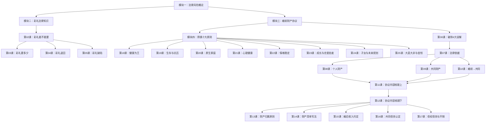

# 课程地图

## 学习路径

## 模块说明

### 模块一：婚前法律风险概论（第01课）
课程导入。了解为什么需要学习婚前法律知识，建立法律保护意识。

### 模块二：彩礼法律知识（第02-05课）
彩礼的法律定性和实操指南。回答彩礼能否要、要多少、怎么要、什么情况要退回等核心问题。

### 模块三：婚前财产协议（第06-17课）
本课程最核心的模块。从破除误解开始，逐步深入到法律依据、财产分类，最后逐条讲解婚前财产协议模板。

### 模块四：选择伴侣的十大原则（第18-25课）
从法律和现实经验出发，提供选择人生伴侣的10个判断维度，帮助识别"良配"与"陷阱"。

## 学习顺序建议

1. 初学者：按课号顺序学习（01 → 02 → ... → 25）
2. 时间有限者：先学模块三（06-17课，最核心的法律工具）
3. 着重择偶者：先学模块四（18-25课），再回头学法律工具