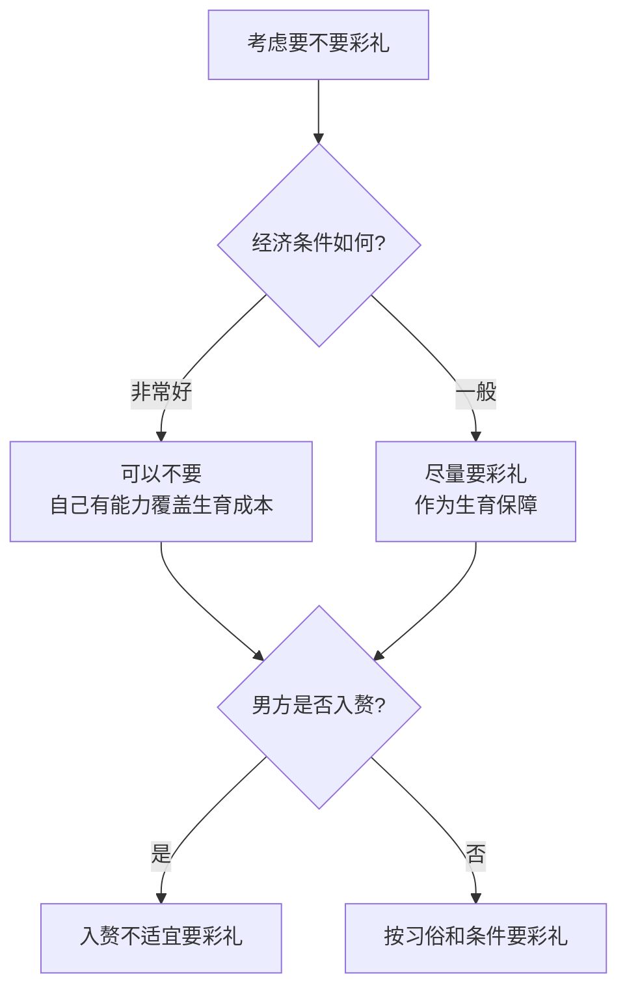

# 第02课：彩礼到底能不能要

## 课程导言

网络上有很多律师同行在普法视频中说：民法典生效之后就不能再要彩礼了，嫁女儿又不是卖女儿，民法典明确规定禁止借婚姻索取财物，所以要彩礼是违法的。

> [!WARNING] 这是严重的误读！
> 这种言论一方面是不懂装懂、哗众取宠，另一方面是不负责任、误人子弟。

## 民法典到底怎么规定

### 禁止借婚姻索取财物 ≠ 禁止彩礼

民法典第1042条规定："禁止借婚姻索取财物。"但这句话**并不是民法典新增的内容**，以前的婚姻法里一直都有。

如何理解"禁止借婚姻索取财物"？

- 如果你主要是奔着钱去的，实际上不打算跟对方结婚，或者不打算长久稳定地跟对方过日子——这叫借婚姻索取财物，违法
- 假借结婚之名，行索取财物之实——违法
- 父母强迫女儿嫁人，从而借机敛财——违法

> [!NOTE] 关键区分
> 以结婚为目的，奔着结婚过日子去，为了达成婚姻而要求对方按照习俗给彩礼——这不叫借婚姻索取财物。目的是结婚过日子，所以正常要彩礼，不应该被判定为违法行为。

### 实践中的证明

如果要彩礼违法，那为什么现在结婚该要彩礼照样要、该给照样得给？你见过哪家因为要彩礼被刑拘、被罚款、坐牢了？没有。这反向证明了要彩礼不违法。

## 彩礼的本质：女性生育成本的补偿机制

> [!EXAMPLE] 龙飞律师的核心观点
> 彩礼在某种程度上，是对于女方**生育成本**，以及对女方对家庭、子女、老人的照顾，以及协助丈夫等等投入更多时间和精力情况下的一种**补偿机制**。

### 生育对女性身体的伤害

生过孩子的女人尤其能体会这些身体上的变化：

| 身体伤害 | 心理变化 |
|---------|---------|
| 孕吐、失眠、脱发 | 多疑 |
| 长斑、腰酸、便秘 | 敏感 |
| 长痔疮、十级阵痛 | 易怒 |
| 腹直肌分离、松弛 | 阴郁 |
| 内脏下垂、漏尿 | 焦躁 |
| 乳腺炎、乳头皲裂 | 丧失信心 |
| 胀奶、孕期糖尿病 | 对夫妻生活提不起兴趣 |
| 妊娠高血压 | |

> [!NOTE] 真实案例
> SHE的Ella说过自己稍微一激动就尿裤子。汤唯在和雷佳音演对手戏时也总是忍不住跑厕所。这些是很多母亲或多或少都会经历的。

### 生育对女性职业的影响

- 生完孩子后，大部分的育儿工作落到母亲身上
- 半夜孩子一哭，一定是妈妈第一个醒来
- 这些时间和精力的付出，必然导致社会生存能力下降——说白了就是**挣钱的能力下降了**
- 回到职场后，还能拿跟以前一样的工资待遇吗？重点项目的轮得到你吗？

### 生育期间的财务风险

> [!DANGER] 最现实的困境
> 怀孕过程特别考验夫妻感情。直播间有无数的案例显示：怀孕过程中男方出轨导致感情破裂，女方不得不带着七八个月大的肚子，独自面临生产和哺乳。分手后还愿意主动支付这些费用的人毕竟是少数。

如果手上有一笔彩礼，至少能保证女方可以保障生产和哺乳这段零收入时期的生存问题。

## 四种情况的分析

### 情况一：经济条件非常好
如果你自己财务上完全能够覆盖生孩子养孩子所有的开销，甚至养两三个孩子都不成问题，那你可以随意，不要彩礼也是你的权利。

**案例**：直播间一个姐妹，手上有七八百万的存款，每年收租金有二三十万，自己特别喜欢小孩。她完全不需要考虑彩礼问题。

### 情况二：经济条件一般
如果你本人不是特别能挣钱，不是特别有资本有老底，建议在结婚前实实在在要一笔彩礼，作为生儿育女时女性牺牲的一种经济补偿和保障措施。

### 情况三：男方入赘
如果男方实际上随女方生活，生孩子也随女方姓，说白了男方是入赘的，那要不要彩礼还有那么重要吗？人家来你们家，你还问人家要彩礼，合适吗？

### 情况四：其他情况
结合双方当地习俗、各自经济条件，合情合理合法地要彩礼。

## 本课小结

> [!TIP] 龙飞律师态度总结
> 1. 要彩礼**不违法**
> 2. 彩礼是对女方生儿育女做出牺牲的**补偿**
> 3. 经济条件好的女孩子，要不要彩礼**自己定**
> 4. 经济条件一般的女孩子，还是**尽量踏踏实实要一笔彩礼**
> 5. 如果男方是入赘，**没有必要让人家出彩礼**

---
**下一课**：[[lessons/0003-cai-li-duo-shao-he-shi|第03课：彩礼要多少合适]]
**上一课**：[[lessons/0001-fa-lv-feng-xian-gai-shu|第01课：婚前法律风险概述]]