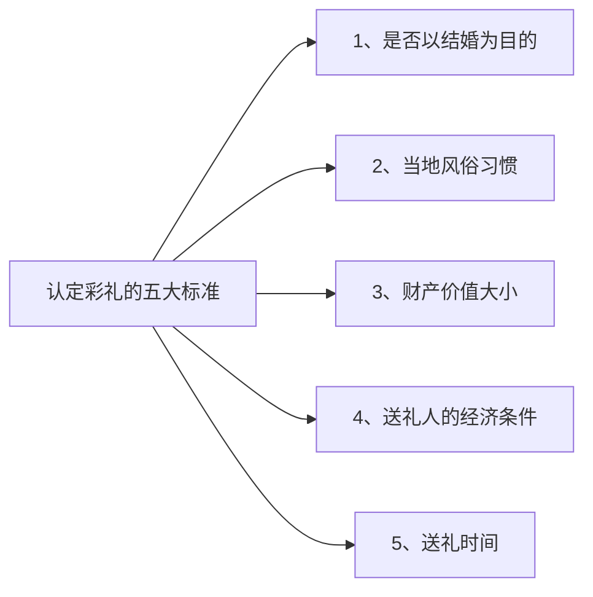

# 第04课：彩礼什么情况下需要退回

## 什么是彩礼

**彩礼**：以结婚为目的送给对方的礼物和钱财。

民法典并没有明确规定什么东西属于彩礼，实践中大家普遍达成的共识是：彩礼是以结婚为目的送给对方的礼物和钱财。

### 彩礼的表现形式

- 定亲当天的现金（如八万八、十八万八等）
- 金银首饰（金耳环、金戒指、金项链——三金/五金）
- 买衣服的钱、认门钱、谢恩钱、改口钱、奶水钱等
- 古代彩礼包含金银玉器、衣衫布匹，甚至有大雁（如《知否》中的"下聘之礼"）

> [!WARNING] 口红、衣服、普通包包不容易被认定为彩礼
> 一般恋爱中送的普通礼物（一支口红、一件衣服、一个包包）很难被认定为彩礼，但如果价值巨大（比如20万的包包），则有可能被认定为是以结婚为目的的赠与。

## 彩礼认定的五大标准

由于法律没有明确规定，法官的自由裁量权很大，综合以下五点来判断：

### 标准一：是否以结婚为目的
这是最主要的认定标准。看双方是否已表达结婚意愿、见过家长、商量婚礼、拍婚纱照等，聊天记录可以证明。

### 标准二：风俗习惯
地方越小，彩礼风俗越明显；地方越大，彩礼风俗反而不明显。各地彩礼数额差距很大。

### 标准三：财产价值大小
价值越大，越容易被认定为以结婚为条件的赠与（即彩礼）。

### 标准四：送礼人的经济条件
- 亿万富翁送几万的包包 → 可能不被认定为彩礼
- 普通人用三年工资买一辆车 → 更容易被认定为彩礼
- 既要看**绝对值**（价钱高低），也要看**相对值**（相对送礼人的身家）

### 标准五：送礼时间
送礼时间越接近订婚或结婚，越容易被认定为彩礼。

## 三种法定退回情形

> [!NOTE] 民法典婚姻编司法解释的规定
> 以下三种情况下可以要求退还彩礼：

### 情形一：没有办结婚证
双方没有领取结婚证，彩礼应当退还。

### 情形二：领了结婚证但没有共同生活
徒有夫妻之名，没有夫妻之实。

### 情形三：婚前给付导致给付人生活困难
生活困难指：男方送了彩礼后，靠自己的收入没有办法维持当地的基本生活水平。需要双方离婚时才能主张。

> [!WARNING] 法律不管是谁提的分手
> 法律上不会管谁提的分手，也不看是谁的原因导致没有结成婚。法律就看结果——是不是分手了，是不是没结成婚。
>
> **哪怕是因为男方出轨、嫖娼、脚踏两条船导致分手的，也不影响人家要求退彩礼。**

## 特殊情况与法官的自由裁量权

### 情况一：没有领证但已共同生活
如果双方没有领证但已共同生活，甚至有了孩子或有过打胎流产的经历，法官会综合考虑：
- 共同生活的时间长短
- 彩礼的数额
- 彩礼的花费用途
- 是否用于养育子女或流产手术
- 当地的风俗习惯

> [!TIP] 见过判例：一分不退、退一部分、全退的都有
> 法官会根据具体情况酌情裁判。所以花钱一定要有记录，别到时候彩礼已经花到手术费、养孩子、产后支出了，自己却证明不了。

### 情况二：已登记共同生活但时间很短
刚结婚一两个月就要离婚的，法官依然可以酌情返还彩礼——可能不会100%，但可以返还很大一部分。

> [!NOTE] 没有明确的时间安全期
> 法律没有规定共同生活多长时间彩礼就不用退了。法官会根据结婚的具体情况、婚后各自对家庭的贡献、有没有共同孕育子女、彩礼的使用情况等综合判断。

## 实务中的诉讼技巧

> [!TIP] 给女孩子的提醒
> - **花钱留住证据**：彩礼花在手术费、养孩子、产后支出上，一定要留记录
> - **彩礼单独存放**：不要混入婚后共同财产，否则说不清楚
> - **聊天记录保留**：证明双方以结婚为目的的聊天记录，在认定彩礼时很关键

## 本课小结

- 彩礼的认定：看是否以结婚为目的、风俗习惯、价值大小、送礼人条件、送礼时间
- 三种法定退回情形：未领证、领证未共同生活、给付导致生活困难
- 即使领证共同生活，时间过短也可能酌情退回
- 即使对方有过错导致分手，也不影响退彩礼请求
- 花钱要留记录，保护自己的权益

---
**下一课**：[[lessons/0005-cai-li-que-xian|第05课：彩礼还有哪些"缺陷"]]
**上一课**：[[lessons/0003-cai-li-duo-shao-he-shi|第03课：彩礼要多少合适]]