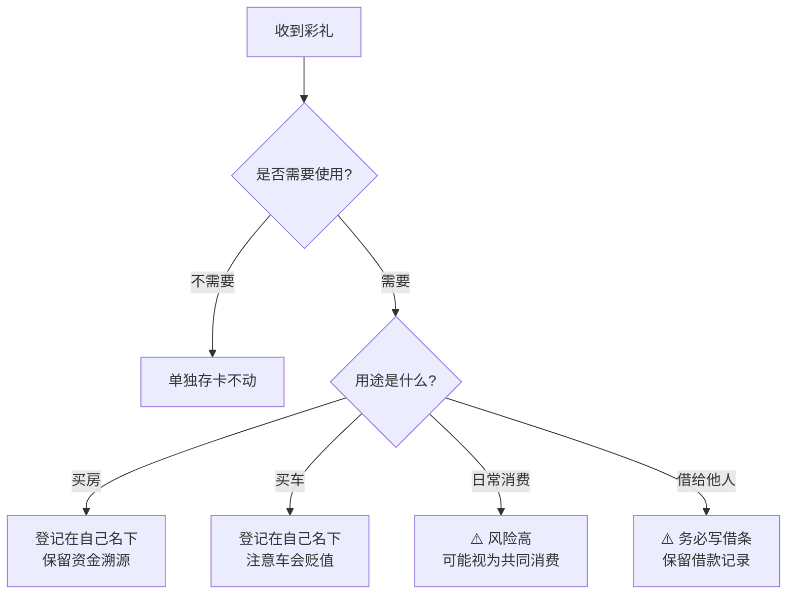

# 第05课：彩礼还有哪些"缺陷"

## 课程导言

彩礼虽然到了你手上，但它并不是高枕无忧的。如果处理不当，彩礼可能会变成夫妻共同财产，甚至变成夫妻共同债务。这节课就来揭示彩礼的"缺陷"和防范方法。

## 缺陷一：彩礼与婚后财产混同风险

> [!WARNING] 最大的风险：混同
> 如果你把彩礼的钱和婚后的工资、存款放在同一个账户里，一旦发生离婚纠纷，你就很难证明哪部分是彩礼、哪部分是婚后共同财产。

**法律规定**：如果钱混在一起无法区分，法官可能会将账户内的全部资金认定为夫妻共同财产。

**防范方法**：
- 单独开一张新银行卡存放彩礼
- 婚后不再往这张卡里存钱
- 保持资金的"纯净性"，可以随时证明这笔钱是你的婚前个人财产

## 缺陷二：被借走的债务风险

### 第一种情况：彩礼被丈夫借走
丈夫以各种理由（创业、投资、还债等）向你借彩礼钱，如果你把钱转给了他，这笔钱的性质就变得复杂了：
- 如果没有任何借条或书面约定，可能被视为自愿赠与
- 即使有借条，如果无法证明这笔钱的来源是你的婚前个人财产（彩礼），也可能被认定为夫妻共同财产的分割

### 第二种情况：彩礼变成夫妻共同债务
如果你把彩礼拿出来用于家庭共同开销（买房、装修、买车等），这部分资金就可能转化为夫妻共同投入，离婚时对方可能要求分割由此产生的增值收益。

## 缺陷三：彩礼的"贬值"风险

> [!TIP] 彩礼的使用策略
> 如果一定要动用彩礼，记住以下原则：
> - **买房 > 买车**：房子更容易保值增值，车子一落地就贬值
> - **登记在自己一人名下**：用彩礼购买的东西，登记在自己名下，保留转账记录，可以证明是彩礼转化而来的个人财产
> - **不要用于日常消费**：彩礼是"保命钱"，不是生活费

## 如何隔离保护彩礼——完整策略

> [!EXAMPLE] 彩礼保护五步法
>
> **第一步：新卡存放**
> 领证前，用自己名义开一张新银行卡，将彩礼单独存入。
>
> **第二步：保持纯净**>
> 婚后不再往这张卡里存任何钱，也不取出（或取出时保留完整记录）。>
> **第三步：分开放置**>
> 如果同时有彩礼和嫁妆，分别放在两张不同的卡里。>
> **第四步：溯源清晰**>
> 如果一定要用彩礼购买东西：
> - 使用转账方式支付（留下记录）
> - 购买物品登记在自己一人名下
> - 金额与彩礼金额能对应上
> - 保存好所有交易凭证，形成完整的资金流向证据链>
> **第五步：彩礼和嫁妆分开使用**
> > 用嫁妆买房（保值），用彩礼买车（贬值）。将来就算对方要求返还彩礼，也不会涉及你用嫁妆买的东西。

## 彩礼的使用红线

> [!DANGER] 这些做法会让彩礼变成共同财产
> 1. 把彩礼转入婚后共同使用的银行账户
> 2. 用彩礼支付家庭日常开销
> 3. 用彩礼装修对方名下的房产
> 4. 将彩礼借给丈夫或婆家没有书面凭证
> 5. 领证后才收到彩礼

## 本课小结

- 彩礼与婚后财产**混同**是最常见的风险
- 彩礼被借走没有凭证可能变成"肉包子打狗"
- 彩礼用于共同生活支出可能转化为共同财产
- **单独存卡、保持纯净、资金溯源**是保护彩礼的三大法宝
- 彩礼和嫁妆要分开存放、分开使用

## 自我测试

1. 彩礼的最佳存放方式是什么？
2. 用彩礼买房和买车，哪种更保值？
3. 为什么要保持彩礼卡的"纯净性"？

---
**下一课**：[[lessons/0006-hun-qian-xie-yi-wu-jie|第06课：对婚前协议的4个误解]]
**上一课**：[[lessons/0004-cai-li-tui-hui|第04课：彩礼什么情况下需要退回]]