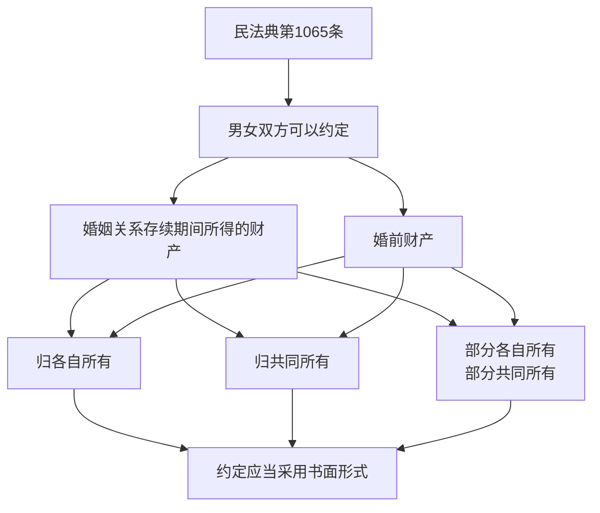

# 第07课：婚前财产协议的法律依据

## 课程导言

一个合法的婚前财产协议，背后必须要有法律上的支撑和依据。这节课我们找到民法典中关于婚前财产协议和夫妻财产约定书的核心法条，并深入解读其含义。

## 婚前协议与夫妻财产约定书的关系

> [!NOTE] 名称不同，本质一样
> - 婚前财产协议
> - 夫妻财产约定书
> - 婚姻财产协议
> - 夫妻财产分割协议
>
> 这些名称本质上是**同宗同源，没有区别**。就看你啥时候签：
> - 没领证之前签 → 叫**婚前财产协议**
> - 已领证之后签 → 叫**夫妻财产约定书**
> - 不管婚前婚后 → 直接叫**婚姻财产协议**也可以

协议也好，约定书也好，都没有影响。但如果只写单方面的承诺、声明书（只有一个人签字），就容易引发争议。

## 核心法条：民法典第1065条

> [!QUOTE] 民法典第1065条原文
> 男女双方可以约定婚姻关系存续期间所得的财产以及婚前财产归各自所有、共同所有或者部分各自所有、部分共同所有。约定应当采用书面形式。没有约定或者约定不明确的，适用本法第1062条、第1063条的规定。

### 法条解读

#### 1. 法律先做出"默认规定"

民法典第1062条规定了哪些是夫妻共同财产，第1063条规定了哪些是个人财产。这是法律给所有人的"默认设置"。

#### 2. 但法律尊重你们自己的意愿

> [!TIP] 意思自治原则
> **你们自己的意愿排在法律之前。**
>
> 虽然法律规定婚前财产是你个人的，但如果你自己心甘情愿、白纸黑字愿意把它变成夫妻共有的，法律允许。
>
> 虽然法律规定婚后工资奖金收入归两口子，但如果你不愿意全部归两口子，只要白纸黑字写下来，你们就能自己做主。

#### 3. 必须是书面形式

> [!WARNING] 口头约定不算！
> 口头的不算，实际生活中的AA制也不算。
>
> 好多姐妹说："我自打结婚就没有花过对方一分钱，我们经济上从来都是各花各的，凭什么他离婚的时候还得分我的存款？"
>
> 原因就是——法律规定必须用书面的文字写下来才算。

## 协议的两个方向

### 方向一：把个人财产约定为共同财产

把你婚前的个人财产，约定成归夫妻双方共同所有。

**举例**：你婚前有一套全款房，愿意签协议约定为夫妻共同财产。

### 方向二：把共同财产约定为个人财产

把婚后本应属于夫妻双方的财产，约定成各自所有——你的归你，我的归我。

**举例**：你婚后月入一万，可以约定其中3000元归自己，7000元归共同的。

### 可以混合约定

> [!NOTE] 灵活组合
> 以上两个方向可以自由组合。
>
> 比如你婚前有两套房，把一套约定归自己、另一套约定归夫妻共有。
>
> 或者婚后工资，部分归自己、部分归共同。

## 协议的界限：不要把"约定"写成"赠予"

> [!DANGER] 常见误区
> 千万不可以在婚前协议里把**对方**婚前的财产约定成归**你**个人所有。
>
> 案例：李女士签了协议，男方把婚前一套房约定给李女士。但因为没办过户，离婚时男方反悔，行使了**任意撤销权**，李女士拿不到房子。

**为什么？**

民法典第1065条只规定了你可以约定：
- 婚前财产归各自所有
- 婚前财产归共同所有
- 部分各自所有、部分共同所有

但它**从来没有规定过**可以把对方的婚前财产约定为你个人单独所有。把男方婚前财产约定归女方个人所有，本质上是**赠予**，不是"约定"。

### 赠予的风险：任意撤销权

> [!WARNING] 赠予的任意撤销权
> 只要是赠予，赠与人在财产**过户之前**可以随时反悔、撤销。
>
> 民法典司法解释明确规定：婚前或婚后，约定把一方所有的房产赠与给另外一方，在房产变更过户登记之前，赠予方如果撤销赠予，另一方再想请求办理过户、履行赠予合同，是实现不了的。

### 如何对抗任意撤销权

> [!TIP] 两个办法
> 1. **直接办过户**：并且白纸黑字写下来，这个房产归你个人所有，不作为夫妻共同财产
> 2. **去公证处公证**：公证要把这套房赠予给你，作为你的个人财产
>
> 只要没办公证，或者没实际过户到你名下，光是写一个协议都是没有用的。

> [!NOTE] 龙飞律师的公平建议
> 我不鼓励女孩子婚前问男方要房产，因为男方也承担着婚姻破裂、资产损失的风险。公平的做法是：**婚前财产归各自所有**。

## 协议的公信力

- **口头约定** → 无效
- **实际AA制** → 无效
- **书面协议** → 有效（但受限于内容是"约定"还是"赠予"）
- **书面协议+公证** → 更强的公信力
- **书面协议+过户** → 完成产权转移，不可撤销

## 本课小结

- 婚前协议的法律依据是**民法典第1065条**
- 约定应采用**书面形式**，口头和实际AA制均无效
- 两个方向：个人→共同 或 共同→个人
- 区别于"赠予"：把对方的财产约定归你个人 = 赠予，赠予在过户前可随时撤销
- 公证或过户可以对抗任意撤销权

---
**下一课**：[[lessons/0008-ge-ren-cai-chan|第08课：哪些财产是你的个人财产]]
**上一课**：[[lessons/0006-hun-qian-xie-yi-wu-jie|第06课：对婚前协议的4个误解]]