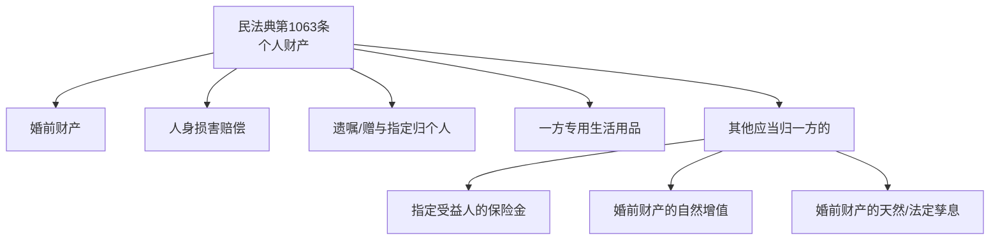
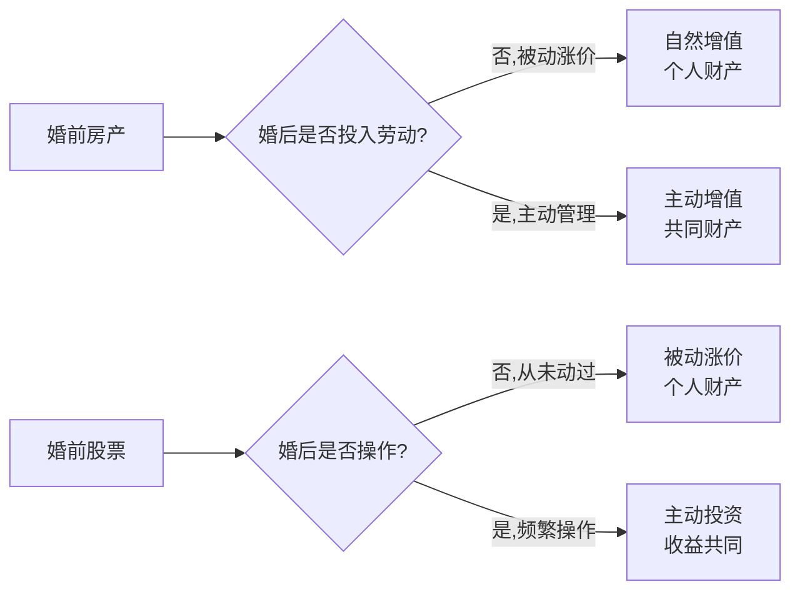

# 第08课：哪些财产是你的个人财产

## 课程导言

当我们心里非常清楚，什么东西本来就是我的（个人财产），什么东西是双方的（共同财产），在签订协议的时候才有底气。这节课我们先搞清楚：哪些财产在法律规定上是属于你的个人财产。

## 法律依据：民法典第1063条

> [!QUOTE] 民法典第1063条
> 下列财产为夫妻一方的个人财产：
> 1. 一方的婚前财产
> 2. 一方因受到人身损害获得的赔偿或者补偿
> 3. 遗嘱或者赠与合同中确定只归一方的财产
> 4. 一方专用的生活用品
> 5. 其他应当归一方的财产

## 第一类：婚前财产

> [!TIP] 婚前 = 领证之前
> 这里要特别注意：**婚前指的是领取结婚证之前**，而不是指办理结婚酒席之前。
>
> 这也就是龙飞律师为什么建议大家**先办酒席、后领结婚证**的原因——办酒席时收的彩礼、嫁妆、礼金，全是你领证前的个人财产。

### 常见误区

> [!WARNING] "结婚超过八年就变共同财产"——这个规定早就废止了！
> 以前老一辈人总以为结婚超过八年，婚前的财产就会转变成夫妻共同财产。这个规定**早就废止了**。
>
> 现在的规定干脆利索：只要是你婚前的财产，哪怕你结婚30年、50年，那都是你个人的财产。

### 婚前全款买房

- 只需在领取结婚证**之前**把全款交了、合同签了就可以
- **不需要**等房产证办下来再领证
- 以**支付全款的时间**为准，不是以房产证办理时间为准

### 先办婚礼再领证的好处

| 时间顺序 | 彩礼 | 嫁妆 | 礼金 |
|---------|------|------|------|
| **先办婚礼，后领证** | 婚前个人财产 | 婚前个人财产 | 婚前个人财产 |
| **先领证，后办婚礼** | 大概率推定为共同财产 | 大概率推定为共同财产 | 礼金大概率是共同财产 |

> [!NOTE] 如果先领证后办婚礼
> 如果先领证，后办婚礼，彩礼、嫁妆、礼金是在领证之后到手的，大概率会被推定为夫妻共同财产。如果你能拿出证据证明其中哪些是彩礼（8万）、哪些是嫁妆（6万），法官有可能把彩礼和嫁妆认定为女方个人财产，但礼金大概率被认定为夫妻共同财产。

## 第二类：人身损害赔偿

一方因受到身体损害获得的赔偿或补偿，属于个人财产。

**举例**：
- 被车撞了获得的赔偿款
- 工伤获得的赔偿款
- 得了重大疾病，保险公司赔付的保险金

> [!NOTE] 核心逻辑
> 人家以牺牲身体健康为代价换回来的钱，就是人家的个人财产。哪怕是结婚之后换回来的，也是个人财产。离婚时对方要求分割工伤赔款？铁定分不了。

## 第三类：遗嘱或赠与指定归个人的财产

> [!WARNING] 必须写清楚！
> 如果父母去世前立下遗嘱，必须**白纸黑字写清楚**：
> - "遗产由你一个人单独继承"
> - "归你个人单独所有，与你的配偶无关"
>
> 如果兄弟姊妹要送你一辆车、一套房，也必须写清楚：
> - "这个是单独送给你一个人的"
> - "与你的配偶没有关系"

只有达到这样的法律安排，才能保证父母遗留下来的财产归你一个人。

## 第四类：一方专用的生活用品

- **肯定算的**：牙刷、假牙、假发、衣服、鞋袜、裤衩子
- **不一定算的**（由法官裁量）：手机、电脑、金戒指、金项链、金耳环、钻石戒指、手表、名牌包包

> [!DANGER] 想通过购买金饰"转移财产"？想得美！
> 有些人以为要离婚了，赶紧买八个金戒指、十个金镯子、二十个金耳环，以为这些变成"生活用品"就不用分割了。
>
> 法官会衡量：
> - 你们的收入水平和资产状况
> - 购买金饰首饰是否在合理范围之内
> - 购买的时间节点（是否在起诉离婚或分居之后）
>
> 如果明明已经感情不和、分居或起诉离婚了，再买这些东西，**有可能被认定是故意恶意转移夫妻共同财产**——分割时对方还可以要求多分。

## 第五类：其他应当归一方的财产

### 指定受益人的保险金

如果你父母为自己投了一份终身寿险，约定你去世后由你作为受益人来收取保险金——这笔保险金是以你父母的生命终结为代价换取的赔偿金，在法律上会被认定为你的个人财产，与你的配偶无关。

> [!TIP] 注意：拿到赔偿金要**单独打在一张新卡里**，不要跟婚后的其他存款放在一起用。

### 婚前财产在婚后产生的孳息

- 母鸡生的蛋、母牛生的小牛 → 因为鸡和牛是你的，蛋和小牛也是你的
- 桃树/芒果树结的果实 → 因为树是你的，果子也是你的
- 银行存款的利息 → 因为本金是你的，利息也是你的

### 婚前财产的自然增值

> [!TIP] 自然增值 vs 主动增值

**自然增值（个人财产）**：
- 你婚前全款花80万买了一套房，周边开了地铁、商场、学校，房子涨到了380万
- 多出来的300万是因为你没有为这个涨价付出过时间、精力和劳动
- 只是婚前做了这个决定，运气好，随着市场环境变化被动涨价了
- 这300万**归你一个人**，跟配偶没关系

**主动增值（共同财产）**：
- 同样这套80万的房，周围房价都没涨
- 但你老公恰好是学设计的，精心设计包装后卖到了120万
- 这个增值是因为**投入了劳动**，所以涨价部分**跟配偶有关系**

**股票的例子**：
- 婚前花100万买的股票，婚后从未操作过 → 涨到200万，全是你的个人财产
- 婚后频繁操作（抛售、换股、增仓、减持）→ 婚后炒股赚的100万，变成夫妻共同财产

### 租金的归属

> [!TIP] 关键看是否投入劳动

**个人财产（被动收租）**：
- 婚前就把房子委托给中介或管理公司
- 婚后不需要自己找租户、签合同、维修
- 租金大概率被认定为个人财产

**共同财产（主动管理）**：
- 婚后还要自己找租户、签合同
- 租户有问题要自己去修马桶、下水道、换灯泡
- 租金被认定为夫妻共同财产

## 本课小结

民法典第1063条规定的五类个人财产：
1. **婚前财产**：领证前拥有的，永远是你的（先办婚礼后领证最有利）
2. **人身损害赔偿**：工伤、车祸等赔偿款
3. **遗嘱/赠与指定归个人**：必须书面写清楚
4. **一方专用生活用品**：但不包括恶意购买的奢侈品
5. **其他**：指定受益人的保险金、婚前财产的孳息、自然增值、被动租金

---
**下一课**：[[lessons/0009-fu-qi-gong-tong-cai-chan|第09课：哪些财产是夫妻共同财产]]
**上一课**：[[lessons/0007-hun-qian-xie-yi-fa-lv-yi-ju|第07课：婚前财产协议的法律依据]]