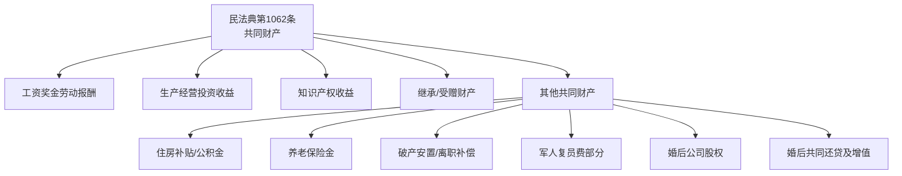

# 第09课：哪些财产是夫妻共同财产

## 课程导言

按照我国民法典第1062条的规定，只要领取了合法的结婚证，从此之后，有些财产就不再是你一个人的了——它们属于夫妻共同财产。

## 法律依据：民法典第1062条

> [!QUOTE] 民法典第1062条
> 夫妻在婚姻关系存续期间所得的下列财产，为夫妻的共同财产，归夫妻共同所有：
> 1. 工资、奖金、劳务报酬
> 2. 生产、经营、投资的收益
> 3. 知识产权的收益
> 4. 继承或者受赠的财产（但本法第1063条第三项规定的除外）
> 5. 其他应当归共同所有的财产



## 第一类：工资、奖金、劳务报酬

只要你领了结婚证，你的工资、奖金和劳动报酬都变成两口子共同的。不管谁挣得多、谁挣得少。

## 第二类：生产、经营、投资的收益

### 婚前财产换房的投资属性

> [!WARNING] 关键区分：消费性购房 vs 投资性购房

**案例**：男方婚前有60万存款和一套房，婚后为了照顾生病的父母，把婚前房子卖了，加上存款全款买了一套新房，登记在自己一人名下。所有资金来源都是婚前个人财产。

**结论**：这套房是男方的**个人财产**，因为：
1. 婚前那套房没有贷款（婚后没有为这套房还过一分钱）
2. 婚前存款和婚后存款**没有混在一起放**
3. 婚前房子卖了的房款**单独放在一张卡里**
4. 购买新房用的全部款项都来自婚前财产变卖或婚前存款
5. 登记在他一人名下
6. **买房的目的是照顾父母，不是投资增值**

> [!TIP] 但如果买房是为了投资增值……
> 如果男方买这套房是为了投资增值，那么婚后买房的行为应算作**婚后的投资行为**，将来这套房增值了、涨价了，就变成了夫妻共同财产（注意：**只是增值涨价部分**变成共同财产，本钱还是人家的）。

**总结**：
- 拿婚前财产去**投资** → 投资收益、增值涨价部分 → 归两口子共同所有
- 婚前房产卖了**再买一套房**（非投资目的） → 仍属个人财产，增值也归个人

## 第三类：知识产权的收益

- 你会写书 → 卖书得到的经济收益
- 你会画画、写毛笔字 → 卖出的收益
- 你是科学家有发明有专利 → 创造发明得到的经济收益

这些都属于夫妻共同财产。

## 第四类：继承或受赠的财产

> [!WARNING] 如果没有遗嘱指定给你个人……
> 如果你的父母去世之前**没有立下遗嘱**明确遗产由你个人单独继承、与你配偶无关，那么你从父母那里继承得到的财产，就属于夫妻共同财产。
>
> 如果你的兄弟姊妹送你一辆车、送你公司的股权，只要**没有明确的书面证据**证明是送你一个人的，那都是归两口子的。

**如何避免**：详见[[lessons/0008-ge-ren-cai-chan|第08课：哪些财产是你的个人财产]]中关于"遗嘱或赠与指定归个人"的说明。

## 第五类：其他应当归共同所有的财产

### 住房补贴、住房公积金

婚后实际取得或者应当取得的住房补贴、住房公积金——属于夫妻共同财产。

### 养老保险金

婚后实际取得或者应当取得的养老保险金——属于夫妻共同财产。

### 破产安置补偿、离职补偿

这些都属于夫妻共同财产。

### 军人复员费、自主择业费

这种一次性费用也有一部分属于夫妻共同的。

**计算公式**：

```
可分割的金额 = 复员费总额 ÷ (70 - 入伍年龄) × 结婚年限 ÷ 2
```

**举例**：
- 入伍20岁，人均寿命70岁，时间差50年
- 复员费共100万 → 每年划下来2万元（100万÷50年）
- 结婚10年 → 10年×2万 = 20万
- 你只能分到20万的一半 = **10万**

### 公司股权归属

> [!NOTE] 婚后注册的公司
> - 结婚之后，他注册了一家公司，他自己占股100%
> - 虽然工商登记上没有你的名字
> - 但因为是用你们共同的财产去经营的
> - **实际上你也是他背后的股东**：这个股权有50%是归你的
>
> 如果你们夫妻俩注册公司，写他占90%、你占10%，只要没有签其他书面协议约定比例，离婚时照样是**一半对一半**分割。

### 婚前按揭房婚后共同还贷

> [!TIPS] 核心规则
> 男方婚前付首付买了一套房，登记在男方名下。结婚之后一直在还贷款——**不管是男方自己在还，还是女方和男方一起还，还是女方帮他还**，婚后还贷的部分以及相应的增值涨价部分，都是夫妻共同财产。

**离婚时怎么分？**

```
你能分到的 = (婚后共同还贷总额 ÷ 2) × (1 + 房价涨幅比例)
```

**举例**：
- 结婚10年，共同还贷20万
- 房价不涨 → 你能分到10万
- 房价涨了30% → 你能分到13万（10万 × 1.3）

> [!NOTE] 注意：全国各地房贷政策不一样（先息后本、先本后息等），计算会有出入，但大体的计算逻辑是一样的。

### 换房时的保护策略

> [!DANGER] 特殊风险场景
> 如果你婚前按揭买了一套房，婚后还了10年贷款（共还了50万），还剩下50万贷款。现在你想换房，买家愿意先拿出50万首付款。你们拿着这50万去还银行贷款解除抵押——但这50万到底算不算夫妻共同还贷的部分？
>
> **现行法律没有明确规定**，不同法官可能会有不同判定。

**保护策略**：

> [!TIP] 如果婚姻不太稳定，又想换房，最好的做法：
> 1. 直接找亲戚朋友、父母借50万
> 2. 以你自己的名义借
> 3. 以你自己的名义还款进去
> 4. 把银行的尾款结清后解除抵押
>
> 这样，这50万就不能算作夫妻婚后共同还款的部分了，这50万对应的增值涨价部分也就不用分割了——能更周全地保护你的经济利益。

## 本课小结

民法典第1062条规定的五类共同财产：
1. **工资奖金劳动报酬**：婚后收入归双方
2. **生产经营投资收益**：包括投资性购房的增值
3. **知识产权收益**：写书、绘画、专利等收入
4. **继承/受赠**（无遗嘱指定归个人）：父母遗产也是共同的
5. **其他**：公积金、养老金、退役费、股权、婚后共同还贷等

**关键提醒**：
- 婚前财产换房时要注意区分"消费"还是"投资"
- 婚前按揭房的婚后还贷部分及增值，对方有权分一半
- 婚姻不稳定时换房，尽量用个人借款先还清贷款

---
**上一课**：[[lessons/0008-ge-ren-cai-chan|第08课：哪些财产是你的个人财产]]
**补充阅读**：[[lessons/0010-qian-cai-chan-bian-gong-tong|第10课：婚前财产何时变为共同财产]]