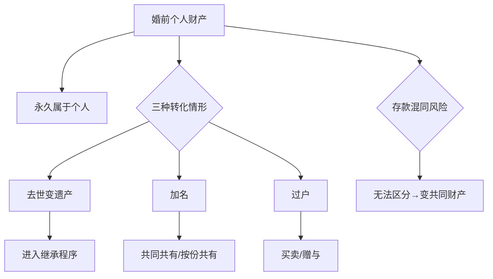

# 第10课：什么情况下婚前财产会变成共同财产

## 基本原则：婚前财产永远属于个人

很多人有一个根深蒂固的误解——认为结婚时间长了，婚前财产就会自动变成夫妻共同财产。这个想法在法律上是**完全不成立的**。

> [!TIP]
> **《民法典》第1063条**明确规定，一方的婚前财产为夫妻一方的个人财产。这条规定**没有时间限制**——不管你结婚10年、20年还是50年，只要不发生法定转化情形，你的婚前财产永远是你自己的。

## 三种转化情形

虽然婚前财产原则上永远属于个人，但在以下三种情形下，它会发生性质转变：

### 情形一：去世变遗产

这是最容易被忽视的情形。当夫妻一方去世时，其婚前财产会变成**遗产**，进入继承程序。

- 如果去世一方没有立遗嘱，按照法定继承，配偶是第一顺序继承人之一
- 也就是说，你婚前的那套房子，如果你去世了，你的配偶有权继承其中一部分
- 但注意：这不是"活着的转化"，而是"去世后的转化"

> [!NOTE]
> 如果你希望自己的婚前财产在自己去世后按自己的意愿分配，**遗嘱**是最好的工具。遗嘱可以指定继承人，避免法定继承带来的纠纷。

### 情形二：加名

这是**最主动、最明确**的转化方式——你主动在房产证上加上对方的名字。

加名分为两种方式：

| 方式 | 含义 | 法律后果 |
|------|------|----------|
| **共同共有** | 不加比例，两人共同拥有 | 离婚时一般各占50% |
| **按份共有** | 写明各自份额比例 | 按约定比例分割，加名即确定了比例 |

#### 按份共有的"坑"

> [!WARNING]
> 按份共有的比例一旦确定，离婚时**直接按该比例分割**，不会因为"对方贡献少"而调整。所以加名前一定要想清楚比例。

**真实案例**：
一对情侣准备结婚，男方有一套全款房，价值不菲。女方说："不加名我就不结婚。"男方为了表诚意，去房管局加名。房管局问："你们是按份共有还是共同共有？"两人说按份共有。又问："各占多少？"男方想，既然要表诚意，就写"男方1%，女方99%"。结果还没等到办婚礼，两人闹掰了，女方直接把男方**扫地出门**——房子99%是女方的，男方只占1%。

这就是典型的"诚意加名反被坑"的案例。

### 情形三：过户给对方

过户和加名不同，加名是保留自己的名字再增加对方的名字，而过户是**把自己的那一份完全转移给对方**。

两种常见情形：

1. **买卖过户**：把婚前房产"卖"给配偶（可能只是走个形式）
2. **赠与过户**：直接把婚前房产赠送给配偶

> [!WARNING]
> 无论是买卖还是赠与，一旦完成过户登记，这套房子的性质就**彻底变了**——从你的婚前个人财产变成了对方的个人财产或你们的共同财产（取决于过户时的约定）。

## 存款混同的风险

存款是最容易出问题的。虽然法律上你的婚前存款属于个人财产，但在实际操作中很容易发生**混同**：

- 婚前存款和婚后收入存在同一张卡里
- 取钱、存钱频繁，已经分不清哪些是婚前存的、哪些是婚后存的
- 一旦无法区分，法院很可能认定为夫妻共同财产

> [!TIP]
> **保护婚前存款的方法**：
> 1. 将婚前存款单独放在一张银行卡里，婚后不动用这张卡
> 2. 或者用婚前财产协议明确约定存款归属
> 3. 更稳妥的做法：与[[0011-xie-yi-zhu-nei-rong-1|婚前财产协议]]配合使用

## 总结

> [!EXAMPLE]
> **一句话记住**：婚前财产永远是你的，除非你死了（变遗产）、你加了名、或你过了户。

## 延伸阅读

- 下一课：[[0011-xie-yi-zhu-nei-rong-1|第11课：婚前财产协议主要内容梳理（上）]]
- 相关课程：[[0008-ge-ren-cai-chan|第08课：哪些财产是你的个人财产]]
- 相关课程：[[0009-fu-qi-gong-tong-cai-chan|第09课：哪些财产是夫妻共同财产]]

## 自我测试

1. 结婚20年后，婚前买的房子会自动变成夫妻共同财产吗？
2. 加名时"共同共有"和"按份共有"有什么区别？
3. 如何避免婚前存款与婚后收入混同？