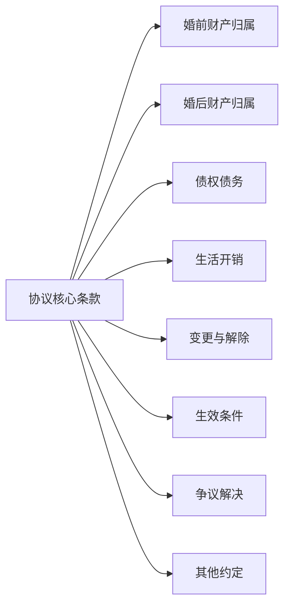
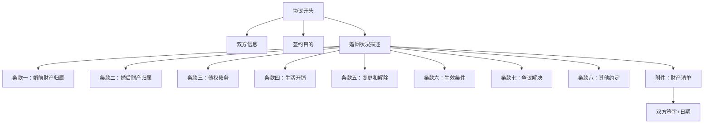

# 第12课：婚前财产协议主要内容梳理（下）

## 协议的核心条款结构

一份完整、规范的婚前财产协议，通常包含以下**八大核心条款**：

下面逐条讲解。

## 条款一：婚前财产归属

这是协议最重要的条款之一。约定双方在结婚登记日之前已经取得的财产归谁所有。

**标准写法**：

> 双方确认，截至本协议签署之日（或结婚登记之日），双方各自名下的财产（详见财产清单）归各自所有，不作为夫妻共同财产。

> [!NOTE]
> 如果双方不签协议，按照《民法典》的规定，婚前财产本来就是个人财产。但签协议写这一条的意义在于：**明确列举、避免争议**。尤其是当财产形式复杂（如公司股权、期权等）时，明确归属非常重要。

## 条款二：婚后财产归属

约定结婚后双方取得的财产归谁所有。这是协议中最核心、也最需要仔细斟酌的部分。

**常见写法**：

> 双方婚后各自取得的工资、奖金、劳务报酬、生产经营收益、知识产权收益等，归各自所有。

> 双方婚后购置的用于家庭共同生活的房产、车辆，归双方共同所有。

> [!TIP]
> 婚后财产归属是谈判的**重点和难点**。建议在签署前双方充分沟通，找到彼此都能接受的平衡点。详细的约定模式可以参见[[0015-mo-ban-hun-hou-shou-ru|第15课：模板讲解——婚后收入怎么约定]]。

## 条款三：债权债务

约定婚前和婚后发生的债权债务由谁承担。这个条款的核心目的是**隔离债务风险**，避免一方的债务连累另一方。

**标准写法**：

> 双方确认，截至本协议签署之日，各方名下如有债务，由各方自行承担，与另一方无关。

> 双方婚后如需对外举债，须经双方书面同意；未经书面同意的一方不承担偿还责任。

> [!WARNING]
> 债务条款非常重要！如果你或你的伴侣有创业计划、投资计划，或者任何一方有潜在的债务风险，这个条款就是你的**护身符**。关于夫妻共同债务的详细认定标准，参见[[0016-mo-ban-gong-tong-zai-wu|第16课：模板讲解——夫妻共同债务怎么认定]]。

## 条款四：生活开销

约定婚后家庭的日常开销如何分担。这是一个很"接地气"的条款，直接影响婚姻生活质量。

**常见做法**：

- **AA制**：所有开销对半分
- **共同账户**：每月各自存入一定金额到共同账户，家庭开销从共同账户支出
- **按比例分担**：按收入比例分摊家庭开销

> [!TIP]
> 建议不要只约定"日常开销"，还要明确：
> - **子女教育费用**谁承担、怎么分担
> - **老人赡养费用**谁承担、怎么分担
> - **大额支出**（如装修、买车）谁承担、怎么分担

详细内容参见[[0017-mo-ban-zhai-quan-sheng-huo|第17课：模板讲解——债权债务与生活开销]]。

## 条款五：协议的变更和解除

约定双方以后如果想修改协议或解除协议，需要什么条件。

**标准写法**：

> 本协议经双方协商一致，可以以书面形式变更或解除。任何一方不得单方变更或解除本协议。

## 条款六：协议的生效条件

婚前协议是附生效条件的合同——**结婚**就是那个条件。

**标准写法**：

> 本协议自甲、乙双方在婚姻登记机关办理结婚登记之日起生效。如双方未办理结婚登记，本协议不生效。

> [!NOTE]
> 这意味着：如果双方最后没结婚，这份协议就是一张废纸。这也符合婚前协议的本质——它是为婚姻服务的。

## 条款七：争议解决

约定如果协议内容发生争议，通过什么方式解决。

**标准写法**：

> 因履行本协议发生的争议，双方应协商解决；协商不成的，任何一方均可向本协议签署地人民法院提起诉讼。

> [!TIP]
> 争议解决条款看似是"套话"，但实际很重要。建议明确约定**管辖法院**（通常约定协议签署地或被告住所地法院），避免日后打官司时还要争论"去哪打"。

## 条款八：其他约定

主要写一些杂项条款，包括：

- 协议的份数和保管
- 通知送达地址
- 协议的解释原则
- 未尽事宜的处理方式

## 整体结构一览

## 延伸阅读

- 上一课：[[0011-xie-yi-zhu-nei-rong-1|第11课：婚前财产协议主要内容梳理（上）]]
- 下一课：[[0013-mo-ban-cai-chan-gui-shu|第13课：模板讲解——婚前财产归属原则]]
- 相关课程：[[0016-mo-ban-gong-tong-zai-wu|第16课：夫妻共同债务怎么认定]]

## 自我测试

1. 一份完整的婚前财产协议至少应包含哪些核心条款？
2. 婚前协议的生效条件是什么？如果没结婚，协议有效吗？
3. 为什么债务条款在婚前协议中很重要？