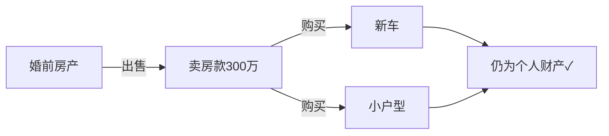

# 第13课：模板讲解——婚前财产归属原则

## 概述

本课进入协议模板的逐条讲解阶段。我们将拆解婚前财产协议中关于**财产归属原则**的几个核心条款，理解每一条的法律含义和实际作用。

## 条款一：婚前房产各自所有

**模板原文**：

> 双方婚前各自名下已有的房产，包括但不限于住宅、商铺、写字楼等，均归各自所有。一方享有对其名下房产完整的占有、使用、收益和处分的权利，另一方不得干涉。

**解读**：

这一条明确了两件事：

1. **完整所有权**：一方对自己的婚前房产拥有100%的权利——可以自己住、可以出租收租金、可以卖掉、可以抵押贷款，不需要征得对方同意
2. **配合义务**：另一方有配合办理相关手续的义务，但注意，这里的配合义务**不包括**在不情愿的情况下签字

### 关于抵押签字的"配合义务"

> [!WARNING]
> **重要提示**：如果一方要拿婚前房产去银行抵押贷款，银行通常要求配偶签字同意。但协议中的"配合义务"并不意味着你必须无条件同意——如果你觉得这笔贷款风险太大，完全可以拒绝签字。拒绝签字的后果只是对方贷不到款，你**不需要承担任何法律责任**。

## 条款二：婚前财产处分收益归个人

**模板原文**：

> 一方婚前财产所产生的租金、分红、自然增值、溢价收益、出售款等一切收益，均归该方个人所有，不作为夫妻共同财产。

**解读**：

这是对[[0010-qian-cai-chan-bian-gong-tong|第10课]]内容的延伸。按照法律规定，婚前财产在婚后的**自然增值**（如房价上涨）仍属于个人财产，但**主动收益**（如租金、经营收益）可能被认定为共同财产。这个条款的作用就是**明确约定所有收益都归个人**，避免争议。

**具体包括**：

| 收益类型 | 说明 | 举例 |
|----------|------|------|
| 租金 | 婚前房产出租所得 | 每月房租5000元 |
| 分红 | 婚前持有的公司股权分红 | 年底分红10万元 |
| 溢价 | 财产出售时的差价收益 | 房子买时200万，卖时300万 |
| 出售款 | 财产出售的全部价款 | 卖房所得300万 |

## 条款三：婚前财产投资的公司权益归个人

**模板原文**：

> 一方婚前以个人财产投资设立或持有的公司股权、合伙企业份额等，该等权益及由此产生的股东权利、股权分红、股权增值等，均归该方个人所有。

**解读**：

这一条对**创业者、企业主**特别重要。它保障了：

- **股东权利**：投票权、决策权、知情权等，不受婚姻状况影响
- **股权分红**：公司赚的钱分给股东的部分，归持股方个人
- **股权增值**：公司估值上涨带来的股权价值增加，归持股方个人

> [!NOTE]
> 如果不签这一条，根据《民法典》的规定，婚后的股权分红可能被认定为夫妻共同财产。创业者的配偶在离婚时可以主张分割分红收益和股权增值部分。

## 条款四：婚前财产变换形式不改变性质

**模板原文**：

> 一方婚前财产在本协议生效后无论形式如何变换（包括但不限于出售、置换、投资、赠与等方式转化为现金、其他动产、不动产、有价证券等），该财产的权属性质不变，仍为该方个人财产。

**解读**：

这是整个协议中**最容易被忽视但最重要的条款之一**。

**场景示例**：

> 女方婚前有一套价值300万的房子。婚后她把房子卖了，得款300万。然后她用这300万买了一辆新车和一套小户型。
>
> 如果没有这个条款：男方可以说"卖房的钱已经在账上混同了，新车和后来的小户型是婚后买的，属于共同财产"。
>
> 有了这个条款：新车和小户型仍然是女方个人财产，因为"形式变换不改变性质"。

> [!TIP]
> 这一条的核心逻辑是：**财产的来源决定其性质，而不是形式**。只要能够证明钱是从婚前财产来的，无论它变成了什么形态，都还是个人财产。

### 为何创业者尤其需要这一条

创业者面临一个特殊的风险：**公司上市**。

假设一方婚前持有一家公司的股份，婚后公司上市了，股份价值翻了100倍。如果没有协议约定：

- 配偶可以主张：上市后的增值部分属于"婚后收益"，要求分割
- 在实际案例中，法院有可能支持这种主张
- 这会导致企业控制权不稳定，甚至影响上市进程

有了这一条+条款三，公司在婚后的所有增值、分红、上市收益，都明确归持股方个人所有。

> [!WARNING]
> 如果没有婚前协议，创业者一旦离婚，公司股权可能被分割、控制权可能旁落、公司治理结构可能崩溃。对于计划融资或上市的公司来说，创始人的婚姻状况是投资人和券商重点关注的风险点。

## 延伸阅读

- 上一课：[[0012-xie-yi-zhu-nei-rong-2|第12课：婚前财产协议主要内容梳理（下）]]
- 下一课：[[0014-mo-ban-cai-chan-qing-dan|第14课：模板讲解——婚前财产清单怎么写]]
- 相关课程：[[0011-xie-yi-zhu-nei-rong-1|第11课：婚前财产协议主要内容梳理（上）]]

## 自我测试

1. 条款一中，配偶对另一方婚前房产的抵押贷款有什么义务？能不能拒绝签字？
2. "形式变换不改变性质"是什么意思？请用自己的话解释。
3. 为什么创业者尤其需要在婚前协议中约定公司权益归属？