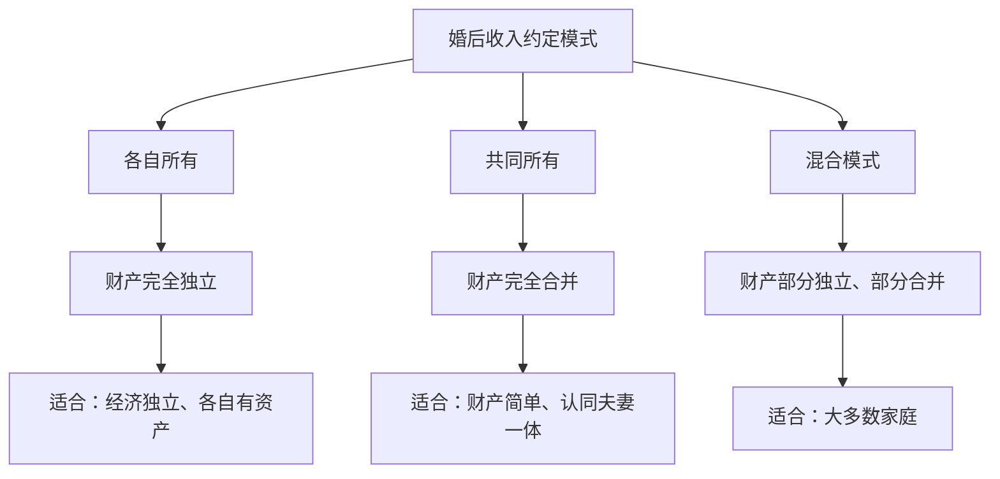

# 第15课：模板讲解——婚后收入怎么约定

## 婚后收入的三种约定模式

婚后收入如何约定，是整个婚前财产协议中**最核心、分歧最大**的部分。不同的伴侣适合不同的模式。

### 模式一：各自所有

**模板原文**：

> 双方婚后各自取得的下列财产归各自所有：
> （1）工资、奖金、劳务报酬；
> （2）生产、经营、投资的收益；
> （3）知识产权的收益；
> （4）继承或受赠的财产；
> （5）其他一切合法收入。

**特点**：经济上完全独立，各管各的钱。

**适用人群**：
- 双方经济都独立，各自有稳定的高收入
- 婚后不想因为钱的问题产生矛盾
- 一方或双方有创业、投资计划，需要保持资产独立

> [!NOTE]
> 选择"各自所有"模式时，建议同时约定**家庭共同开销**如何分担（参见[[0017-mo-ban-zhai-quan-sheng-huo|第17课]]），否则可能出现"你的钱是你的，但家里的开销要我出"的矛盾。

### 模式二：共同所有

**模板原文**：

> 双方婚后取得的全部财产，包括但不限于工资、奖金、投资收益、继承受赠财产等，均为夫妻共同财产，由双方共同所有。

**特点**：财产完全合并，不分你我。

**适用人群**：
- 双方感情很好，认同"你的就是我的"
- 财产结构简单，没有太多投资或公司股权
- 一方在家庭中承担更多家庭责任（如全职妈妈/爸爸）

> [!WARNING]
> "共同所有"模式看似浪漫，但存在风险：如果一方婚后发生大额债务，另一方名下的共同财产可能被用来还债。如果选择这个模式，建议同时做好债务隔离约定。

### 模式三：混合模式（最推荐）

**模板原文**：

> 1. 双方婚后各自的工资、奖金、劳务报酬归各自所有。
> 2. 双方婚后购置的用于家庭共同生活的房产、车辆、家具家电等，归双方共同所有。
> 3. 双方各自名下的存款、理财产品，归各自所有。
> 4. 双方为家庭共同生活而支出的费用，从双方共同建立的"家庭共同账户"中支出。

**特点**：兼顾独立与分享，灵活性最高。

**适用人群**：大多数家庭。

> [!TIP]
> **混合模式的核心思路**：个人赚的钱归个人（保持经济独立），但共同生活需要的大件支出（房子、车子）由双方共同所有。这既保护了个人的财产权，又体现了家庭的共同体属性。

## 共同账户的约定

如果选择混合模式或各自所有模式，建议建立**家庭共同账户**来处理家庭共同开销。

**模板原文**：

> 双方应于结婚登记之日起30日内，以双方名义开立一个联名银行账户，作为家庭共同账户。
>
> 每月5日前，双方各自向该账户存入人民币XXXX元（或：双方各自将月收入的30%存入该账户）。
>
> 该账户资金用于以下家庭共同支出：
> （1）房屋租金或月供；
> （2）物业费、水电燃气费等；
> （3）日常饮食、生活用品；
> （4）子女教育费用；
> （5）其他经双方同意的家庭支出。

> [!EXAMPLE]
> **实际操作例子**：
> 小王和小李每月各自往共同账户存5000元。每月1万元用于家庭开销。剩下的钱各管各的，互不干涉。这样既有共同的家庭生活质量，又有各自的经济自由。

## 投资所得的归属约定

婚后用婚前财产或婚后个人收入进行投资，投资收益归谁？

**模板原文**：

> 一方以个人财产进行投资（包括但不限于购买股票、基金、理财产品、房产等）所产生的收益，归该方个人所有。

> [!NOTE]
> 如果不做约定，按照《民法典》的规定，婚后的投资所得收益属于夫妻共同财产。这个条款的作用就是**排除法定规则**，让投资收益归投资方个人所有。

## 继承和受赠财产的归属约定

继承和受赠财产是一个比较特殊的情况。

**模板原文**：

> 婚姻关系存续期间，一方通过继承或接受赠与所得的财产，无论该继承或赠与发生于何时，均归该方个人所有。

**为什么需要这一条？**

按照《民法典》第1062条，继承或受赠的财产（除非遗嘱或赠与合同中明确指定只归一方）属于夫妻共同财产。也就是说：

- 你父母去世后留给你的房子，如果没有特别说明，**默认是夫妻共同财产**，你配偶有权分一半
- 你亲戚送给你的一块名表，如果没有特别说明，**默认是夫妻共同财产**

> [!WARNING]
> 这一条经常被人忽略！很多人认为"父母留给我的当然是我的"，但法律默认不是这样的。如果不约定，你父母的遗产很可能在离婚时被分走一半。

**解决办法**：除了在婚前协议中约定外，也可以在父母的遗嘱中明确写上"该遗产仅归我的子女XXX个人所有，不作为其夫妻共同财产"。

## 三种模式的对比

| 维度 | 各自所有 | 共同所有 | 混合模式 |
|------|----------|----------|----------|
| 经济独立性 | 最高 | 最低 | 中等 |
| 操作复杂度 | 低（各管各） | 低（全部混一起） | 中高（需要区分） |
| 风险隔离效果 | 最好 | 最差 | 较好 |
| 家庭凝聚力 | 较低 | 最高 | 中等偏上 |
| 适合人群 | 双高收入独立人群 | 财产简单的家庭 | **大多数家庭** |

## 延伸阅读

- 上一课：[[0014-mo-ban-cai-chan-qing-dan|第14课：模板讲解——婚前财产清单怎么写]]
- 下一课：[[0016-mo-ban-gong-tong-zai-wu|第16课：模板讲解——夫妻共同债务怎么认定]]
- 相关课程：[[0012-xie-yi-zhu-nei-rong-2|第12课：婚前财产协议主要内容梳理（下）]]

## 自我测试

1. 婚后收入的三种约定模式分别是什么？各有什么优缺点？
2. 为什么"继承和受赠财产的归属"容易被忽略？法律默认是怎么规定的？
3. 共同账户的作用是什么？建议每月存入多少？