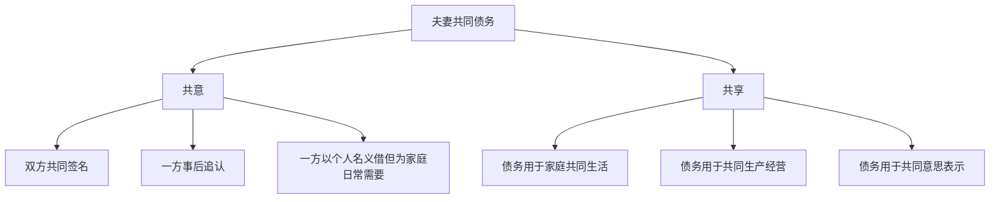
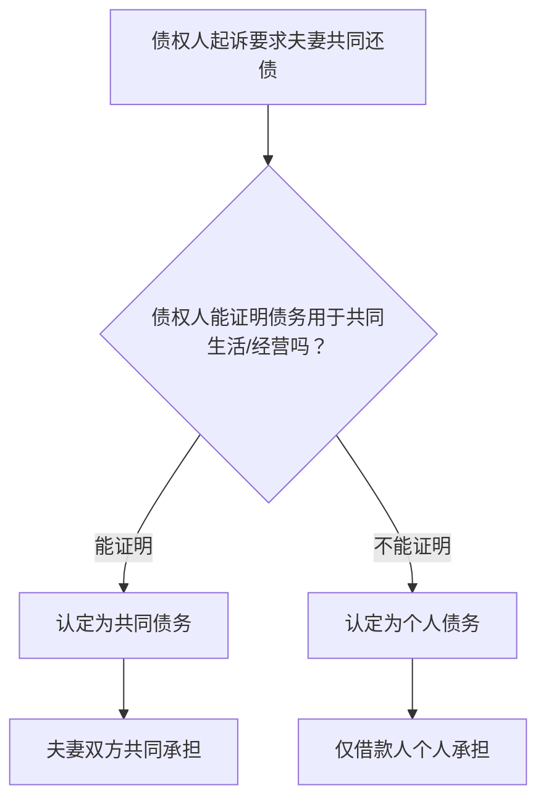

# 第16课：模板讲解——夫妻共同债务怎么认定

## "共意"和"共享"两个核心标准

《民法典》第1064条确立了夫妻共同债务认定的**两个核心标准**：

### 标准一：共意

"共意"是指**双方都同意**这笔债务的产生。包括几种情形：

1. **双方共同签名**：借款合同上有两个人的签名
2. **一方事后追认**：一方借了钱，另一方事后说"我同意"，或者用自己的行为表示了同意（如帮忙还了一部分）
3. **一方以个人名义借款但为家庭日常需要**：比如一方借钱买米买油买菜，不需要另一方签字，也属于共同债务

### 标准二：共享

"共享"是指债务产生的利益被**双方共同享有**。比如：

- 借了100万用来装修共同居住的房子
- 借了50万用于两人共同经营的生意
- 借了30万给孩子交学费

> [!NOTE]
> 这两个标准是**"或"的关系**——要么满足"共意"，要么满足"共享"，只要满足其中一个，这笔债务就可能被认定为夫妻共同债务。

## 判断债务性质的六个维度

在实践中，法院会从以下**六个维度**综合判断一笔债务是个人债务还是共同债务：

| 维度 | 问题 | 认定为个人债务的倾向 | 认定为共同债务的倾向 |
|------|------|----------------------|----------------------|
| **时间** | 婚前还是婚后？ | 婚前所负债务 | 婚后所负债务 |
| **类型** | 什么性质的债务？ | 赌博、高利贷等非法债务 | 购房、装修、教育等 |
| **额度** | 金额多大？ | 远超家庭日常需要的额度 | 在合理范围内 |
| **用途** | 钱用在哪了？ | 一方个人消费（如买奢侈品） | 家庭共同消费或经营 |
| **签字** | 双方都签字了吗？ | 只有一方签字 | 双方签字或一方签字另一方知情 |
| **事后承诺** | 另一方事后表态？ | 明确反对或不知情 | 追认、默认、共同还款 |

> [!TIP]
> 六个维度中，**"用途"是最关键的**。如果能证明债务用于家庭共同生活或共同经营，即使只有一方签字，也很可能被认定为共同债务。

## 违法犯罪债务的处理

### 赌债

> **赌债不是合法债务**。

《民法典》和最高人民法院的司法解释明确规定：**违法债务不受法律保护**。赌博产生的债务，债权人起诉到法院要求偿还，法院不会支持。

> [!WARNING]
> 虽然法律上赌债不用还，但在现实中，赌场或放贷人可能会用非法手段催收（威胁、骚扰等）。所以在婚前协议中约定债务条款，主要目的是在**法律层面**保护自己。

### 嫖娼等违法行为的债务

同样的原则——违法犯罪行为产生的债务，法律不予保护。

> [!NOTE]
> 一方因嫖娼、吸毒等违法行为产生的债务，另一方**完全不需要承担**。这不仅是婚前协议可以约定的，也是法律的直接规定。

## 担保债务的认定

担保债务是一个比较特殊的情况——一方为别人的债务提供担保，这个担保责任是不是夫妻共同债务？

**一般原则**：

- 一方以个人名义为他人提供担保，**原则上属于个人债务**
- 除非另一方也同意担保，或者担保的收益用于家庭共同生活
- 如果担保人因此获得了担保费收入，并且这个收入用于家庭，则可能被认定为共同债务

> [!TIP]
> 对于担保债务，建议在婚前协议中明确约定：
> "任何一方以个人名义对外提供的担保、保证等，所产生的债务由该方个人承担，与另一方无关。另一方不知情、未书面同意的担保行为，不构成共同债务。"

## 大额债务的举证责任

在夫妻共同债务的认定中，**举证责任**的分配非常关键：

**举证规则**：

1. **债权人**需要证明：该债务用于夫妻共同生活、共同生产经营，或者基于夫妻双方共同意思表示
2. 如果债权人**无法证明**，则属于借款人的**个人债务**

> [!NOTE]
> 这个举证规则的出台（2018年最高人民法院司法解释），是对"婚内单方举债"问题的重大纠偏。在此之前，只要是在婚内借的钱，默认就是共同债务（即"婚内债务推定制"）。这个旧规则导致了很多"被负债"的悲剧——一方在外面借了巨款跑了，另一方莫名其妙背上巨额债务。

## 婚前协议中的债务条款模板

**模板原文**：

> 1. 双方确认，截至本协议签署之日，各方名下如有对外债务，由各方自行承担，与另一方无关。
> 2. 本协议生效后，任何一方以个人名义对外所负的债务，未经另一方书面同意，视为该方个人债务，由该方以其个人财产清偿。另一方不承担任何偿还责任。
> 3. 任何一方对外提供担保、保证的，须经另一方书面同意。未经同意的，产生的担保责任由该方个人承担。
> 4. 因一方违法犯罪行为（包括但不限于赌博、嫖娼、吸毒等）产生的债务，由该方个人承担。
> 5. 因一方个人侵权行为（如交通事故）产生的赔偿债务，由该方个人承担。

> [!EXAMPLE]
> **实际案例**：
> 女方婚前做小生意，婚前协议中明确约定了"各自债务各自承担"。婚后男方未经女方同意，以自己的名义借了50万去做投资，结果投资失败。
>
> 按照协议约定：这50万是男方的个人债务，由男方个人偿还。即使债权人起诉到法院，只要女方能拿出婚前协议（证明双方约定了债务各自承担），法院就不会判决女方还钱。

## 延伸阅读

- 上一课：[[0015-mo-ban-hun-hou-shou-ru|第15课：模板讲解——婚后收入怎么约定]]
- 下一课：[[0017-mo-ban-zhai-quan-sheng-huo|第17课：模板讲解——债权债务与生活开销]]
- 相关课程：[[0012-xie-yi-zhu-nei-rong-2|第12课：婚前财产协议主要内容梳理（下）]]

## 自我测试

1. 夫妻共同债务认定的两个核心标准是什么？
2. 判断一笔债务是个人债务还是共同债务，可以从哪六个维度分析？
3. 赌债需要夫妻共同承担吗？法律上是怎么规定的？
4. 大额债务的举证责任由谁承担？