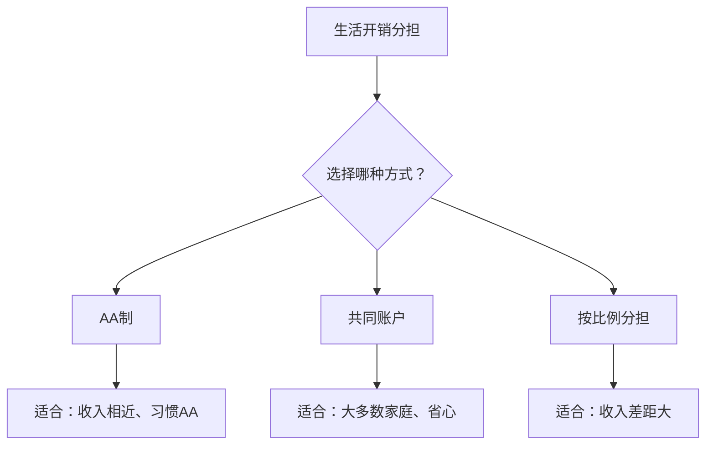
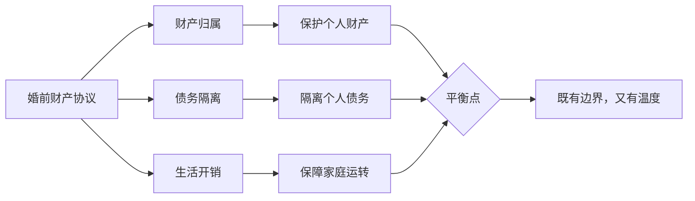

# 第17课：模板讲解——债权债务与生活开销

## 债权债务条款的写法

婚前财产协议中的债权债务条款，主要解决两个问题：

1. **婚前的债谁还？**
2. **婚后的债怎么算？**

### 个人债务与共同债务的列举

**模板原文**：

> **第六条 债务的承担**
>
> 6.1 双方确认，截至本协议签署之日，各自名下的债务（详见本协议附件三《债务清单》）由各自承担。如债权人向另一方主张权利，另一方在承担后可向债务方全额追偿。
>
> 6.2 本协议生效后，以下债务为**夫妻共同债务**，由双方共同承担：
> （1）为购置家庭共同房产所负的债务；
> （2）为家庭日常生活的合理开支所负的债务；
> （3）经双方书面同意后所负的其他债务。
>
> 6.3 本协议生效后，以下债务为**个人债务**，由举债方自行承担：
> （1）一方以个人名义所负的未经另一方书面同意的债务；
> （2）一方对外提供担保所产生的债务；
> （3）一方的个人侵权行为（包括但不限于交通事故）所产生的赔偿债务；
> （4）一方因违法犯罪行为（包括但不限于赌博、嫖娼、吸毒等）所产生的债务；
> （5）其他不属于共同债务的债务。

> [!TIP]
> **条款6.1的"追偿权"很重要**。如果债权人把两个人都告了，你不得不先还了钱，但你可以根据这个条款向对方追偿——让他还给你。这个"追偿权"是你最后的保障。

### 担保的约定

担保是个容易被忽视但风险很大的事项。

**模板原文**：

> 任何一方如需对外提供担保、保证或类似信用增级措施，须事先取得另一方的书面同意。未经书面同意的担保行为，由此产生的全部法律责任由该方个人承担，与另一方无关。

> [!WARNING]
> **再次强调**：担保风险极大。一方对别人的债务做担保，一旦被担保人还不上钱，担保人就要替他还。如果担保债务被认定为夫妻共同债务，另一方的财产也会被用来还债。所以，**建议在协议中明确约定：担保必须双方签字同意。**

## 生活开销分担方式

生活开销条款是协议中最"接地气"的部分。多少人因为"买菜钱谁出"这种小事吵架？这一条就是来解决这个问题的。

### 方式一：AA制

**模板原文**：

> 双方婚姻关系存续期间的家庭日常开销，包括但不限于餐饮、日用品、水电燃气、物业费、通讯费等，由双方平均分担。

**优点**：公平，简单。
**缺点**：过于机械，收入低的一方压力大。

### 方式二：共同账户

**模板原文**：

> 双方应于结婚登记之日起30日内，以双方名义开立联名银行账户作为"家庭共同账户"。
>
> 每月5日前，双方各自向该账户存入当月家庭预算总额的50%（或：双方各自将月收入的30%存入该账户）。
>
> 家庭共同账户资金专项用于以下支出：
> （1）房屋月供或租金；
> （2）物业费、水电燃气费、网络费等；
> （3）家庭日常饮食、生活用品采购；
> （4）家庭医疗费用；
> （5）子女教育费用；
> （6）其他经双方书面同意的家庭支出。

**优点**：兼顾公平与便利，适合大多数家庭。
**缺点**：需要每月记账，稍麻烦。

### 方式三：按比例分担

**模板原文**：

> 双方各自按当月收入的以下比例存入家庭共同账户：
> - 甲方（男方）：月收入的40%
> - 乙方（女方）：月收入的30%
>
> 该账户资金用于家庭共同支出。账户余额不足时，由双方按上述比例补足。

**优点**：收入高的人多出，收入低的人少出，比较公平。
**缺点**：需要双方诚实申报收入。

> [!TIP]
> **三种方式没有绝对的好坏**，关键看双方的经济状况和消费习惯。一般来说：
> - 收入差距不大 → AA制或共同账户
> - 收入差距较大 → 按比例分担
> - 想省事 → 共同账户
> - 想要完全独立 → AA制

## 子女教育费用的分担

子女教育费用是婚后最大的一笔开销之一，建议在协议中提前约定。

**模板原文**：

> 双方所生子女的教育费用（包括但不限于学费、书本费、课外辅导费、兴趣班费用等），由双方共同承担。承担方式为：
> （1）如设有家庭共同账户，从共同账户中支出；
> （2）如无共同账户，双方各自承担50%（或按收入比例分担）。
>
> 子女的重大教育支出（如出国留学、国际学校学费等），须经双方协商一致后决定。

> [!NOTE]
> 子女教育费用的核心问题是**"什么算必要的教育支出"**。一方可能觉得"孩子必须学钢琴"，另一方可能觉得"钢琴太贵没必要"。所以在协议中可以约定：大额教育支出需双方协商一致。

## 老人赡养费用的分担

赡养老人既是法律义务，也是道德义务。婚前协议虽然不能免除赡养义务，但可以约定赡养费的分担方式。

**模板原文**：

> 双方各自父母（包括继父母、养父母）的赡养费用，由各方的子女自行承担。
>
> 如需以家庭共同财产支付赡养费用，须经双方书面同意。
>
> 一方因赡养其父母所产生的合理费用，如该方个人财产不足以支付，另一方应在合理范围内予以协助。

> [!TIP]
> 赡养父母的问题比较敏感。建议协议中保持一定的**弹性和温度**——既要明确各自的责任边界，又要保留相互帮助的空间。毕竟婚姻不仅是法律契约，也是情感共同体。

## 协议的平衡性

> [!EXAMPLE]
> **一份"有温度"的协议应该是这样的**：
> - 财产各自所有 → 保护个人财产权
> - 债务各自承担 → 隔离债务风险
> - 共同账户 → 保障家庭生活质量
> - 合理协助义务 → 保留家人之间的互助空间
>
> 签婚前协议不是"防着对方"，而是**把丑话说在前头，把日子过在后头**。

## 延伸阅读

- 上一课：[[0016-mo-ban-gong-tong-zai-wu|第16课：模板讲解——夫妻共同债务怎么认定]]
- 相关课程：[[0015-mo-ban-hun-hou-shou-ru|第15课：模板讲解——婚后收入怎么约定]]
- 相关课程：[[0012-xie-yi-zhu-nei-rong-2|第12课：婚前财产协议主要内容梳理（下）]]

## 自我测试

1. 个人债务与共同债务的列举条款中，哪些债务明确约定为个人债务？
2. 生活开销的三种分担方式各有什么优缺点？
3. 子女教育费用和老人赡养费用在协议中应该如何约定？需要注意什么？