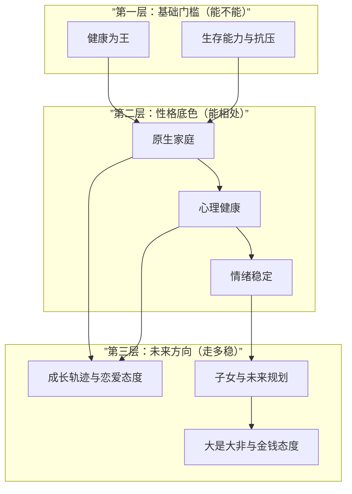

# 第25课：选择伴侣——大是大非与金钱态度

## 课程引言

这是择偶十大原则的最后一课。龙飞律师将两个最重要的底线原则合为一课：**大是大非**和**金钱态度**。前者决定了他在关键时刻是否会"掉链子"，后者决定了你们的日常生活是否和谐。这两者共同构成了婚姻的"底线"和"基本面"。

## 原则一：大是大非——他是否有底线？

### 什么是"大是大非"？

大是大非是指在涉及**诚信、法律、道德**等根本性问题上的立场和选择：

- 是否触犯法律底线
- 是否具备基本的诚信
- 面对诱惑时的选择
- 在利益冲突时是否坚守原则

### 观察的三个维度

**1. 法律底线**

对方是否尊重法律？观察以下行为：
- 是否曾有过违法记录（酒驾、打架、经济犯罪等）
- 对违法行为的态度："偶尔闯红灯没事" vs "规则就是规则"
- 是否会为了"方便"而走灰色地带
- 对合同、协议的履行态度

> [!WARNING]
> **一个人如果觉得"违法没关系，只要不被抓到就行"，这种人在婚姻中也会觉得"出轨/隐瞒/转移财产没关系，只要不被发现就行"。** 法律底线是一个人行为的最低标准。

**2. 诚信底线**

- 是否经常说谎（即使是"善意"的谎言）
- 是否言出必行，还是轻易承诺但不兑现
- 对他人（朋友、同事、前伴侣）是否守信
- 是否愿意为自己的行为负责

**3. 原立场（原则性立场）**

在大是大非问题上的立场往往反映了核心价值观：
- 对性别平等的态度
- 对家庭暴力的态度（是否认为"打老婆是家务事"）
- 对出轨的态度
- 对诈骗、贿赂等违法行为的看法

> [!TIP]
> 不要用"他对我好"来掩盖他在大是大非问题上的问题。一个对社会规则没有敬畏之心的人，在婚姻中也不会对你有真正的尊重和责任感。

## 原则二：金钱态度——婚姻中的日常底线

### 1. 消费观

消费观的不匹配是婚姻中最常见的争吵源头：

| 消费类型 | 理性消费 | 问题消费 |
|---------|---------|---------|
| 日常消费 | 量入为出，有计划 | 超前消费，月光族 |
| 大件消费 | 做功课、比价、理智决策 | 冲动消费、攀比消费 |
| 娱乐消费 | 适度的精神享受 | 无节制的高消费 |
| 社交消费 | 合理的人情往来 | 为了面子过度铺张 |

> [!NOTE]
> 消费观没有"对错"只有"合不合适"。如果一方极度节俭而另一方喜欢享受生活，双方需要在婚前达成消费标准的共识，否则婚后每一天都是冲突。

### 2. 储蓄观

- 是否有储蓄的习惯
- 储蓄的目的是什么（购房、投资、应急、养老）
- 每月储蓄多少比例的收入
- 是否认同"先储蓄后消费"的原则

### 3. 投资观

- 是否了解基本的投资知识
- 风险偏好：保守型、稳健型还是激进型
- 是否参与过高风险投资（炒股、加密货币、P2P等）
- 是否有过重大投资损失，以及当时的态度

> [!WARNING]
> 警惕"暴富心态"。一个总想"一夜暴富"、热衷高风险投机的人，很可能带给家庭的不是财富而是债务。

### 4. 消费水平的匹配

双方消费水平是否匹配的**关键在于"匹配"而非"高低"**：

- 如果双方消费水平相差太大，谁来妥协？
- 是否愿意为了共同目标调整消费习惯？
- 能否在不委屈自己的前提下接受对方的消费方式？

## 婚前财务审查要点

### 是否愿意公开财务状况

> [!TIP]
> **不愿公开财务状况，本身就是一个红灯信号。** 结婚意味着财产的共同管理和责任共担，财务透明是基本前提。

### 是否有隐瞒的债务

对方可能隐瞒的债务类型：
- 信用卡债务
- 网贷/校园贷
- 赌博债务
- 为他人担保的债务
- 创业失败的欠款

### 婚前征信查询建议

龙飞律师强烈建议：**婚前查询对方的征信报告**。

**如何操作**：
1. 双方共同去中国人民银行征信中心查询
2. 也可以通过银行App或征信中心官网自助查询
3. 征信报告可以显示：贷款记录、信用卡记录、逾期记录、担保记录

> [!WARNING]
> **婚前一定要查征信。** 征信报告是"财务体检"，就像婚前体检一样重要。如果对方拒绝查征信，问自己一个问题：他为什么不敢让我知道？这个问题的答案可能比征信报告本身更值得关注。

### 其他需要了解的信息

- 名下的房产、车辆等不动产情况（是否全款/按揭）
- 是否有对外投资（股权、基金等）
- 是否有赡养/抚养义务（前妻/前夫、子女）
- 是否有大额保险支出

## 十大原则的内在逻辑

龙飞律师将选择伴侣的十大原则总结为三个层次，构成了一个完整的评估体系：

### 第一层：基础门槛（第18-19课）

| 原则 | 核心问题 | 为什么在最前面 |
|------|---------|--------------|
| **健康为王** | 他是否健康？和他在一起我会不会受到伤害？ | 身体健康是一切的基础，没有健康其他都无从谈起 |
| **生存能力与抗压** | 他能否养活自己？遇到困难能否扛住？ | 婚姻是需要共同面对现实的，经济基础和抗压能力决定了能不能走下去 |

**这层不过关，直接排除，不需要考虑后面的原则。**

### 第二层：性格底色（第20-22课）

| 原则 | 核心问题 | 为什么是核心层 |
|------|---------|--------------|
| **原生家庭** | 他来自什么样的家庭？他的行为模式从哪里来？ | 原生家庭塑造了一个人的基础价值观和行为模式 |
| **心理健康** | 他的人格是否健康？有没有严重的人格问题？ | 心理不健康的人会耗费你全部的生活能量 |
| **情绪稳定** | 和他在一起是否安心？每天是否轻松？ | 情绪稳定决定了日常生活的质量和安全感 |

**这层决定了你们"能不能好好相处"。**

### 第三层：未来方向（第23-25课）

| 原则 | 核心问题 | 为什么是顶层 |
|------|---------|--------------|
| **成长轨迹与恋爱态度** | 他的过去是否清白？他如何看待亲密关系？ | 过去是预测未来的最好指标 |
| **子女与未来规划** | 你们的"人生地图"是否重合？ | 方向不一致的两个人走不远 |
| **大是大非与金钱态度** | 他的底线在哪里？你们的金钱观是否匹配？ | 底线和金钱观决定了一个人能在婚姻中走多稳 |

**这层决定了你们"能走多远、走多稳"。**

### 十大原则的关系金字塔

### 使用建议

1. **逐层评估**：第一层不过关，不要进入第二层。这就像盖房子——地基不牢，上面装修再好也没用
2. **不要用上层优点掩盖下层缺陷**："他虽然身体不好，但对我特别好"——健康是基础，不能用"对我好"来掩盖
3. **没有完美的伴侣**：每层都有一些不完美是正常的，关键看**核心问题是否达成一致**
4. **相信你的直觉**：如果你觉得"哪里不对"，停下来想一想。直觉往往是你潜意识已经识别出了危险信号

> [!TIP]
> 婚姻中最重要的不是找一个"完美的人"，而是一个**基础健康、方向一致、愿意和你一起面对问题的人**。

## 课程总结

恭喜你完成了全部25课的学习！从法律风险的认知，到彩礼的实操指南，再到婚前财产协议的逐条讲解，最后以十大择偶原则收尾——你已经系统地掌握了婚前法律和择偶判断的核心知识。

记住龙飞律师的最后一句话：**"法律是保护你的铠甲，但选择正确的人，才是不需要动用铠甲的最好方式。"**

---

> [!QUESTION]
> **结课自测**
>
> 1. 为什么说婚前一定要查征信？如果对方拒绝怎么办？
> 2. 十大原则的三个层次分别是什么？各包含哪些原则？
> 3. 龙飞律师认为婚姻中最重要的不是找一个"完美的人"，那是什么？
> 4. 回顾全部十大原则，你认为哪一条对你来说最重要？为什么？
>
> 

> 
点击查看答案

>
> 1. 征信报告是"财务体检"，可以了解对方的贷款记录、信用卡记录、逾期记录、担保记录等。婚前了解这些信息可以避免婚后被对方的债务拖累。如果对方拒绝查征信，你需要认真考虑这个拒绝背后的原因——他可能在隐瞒某些财务问题。婚前不公开财务状况，婚后这些问题迟早会暴露。
> 2. 第一层：基础门槛，包括健康为王、生存能力与抗压能力；第二层：性格底色，包括原生家庭、心理健康、情绪稳定；第三层：未来方向，包括成长轨迹与恋爱态度、子女与未来规划、大是大非与金钱态度。
> 3. 龙飞律师认为，婚姻中最重要的不是一个"完美的人"，而是一个**基础健康、方向一致、愿意一起面对问题的人**。完美的人不存在，但一个在关键问题上和你合拍、愿意为关系努力的人，比任何"条件好但志不同道不合"的人都更适合共度一生。
> 4. （开放性答案，以下供参考）每个人的情况不同，最重要的原则可能不同。如果你容易心软、包容心强，可能需要特别关注"心理健康"和"情绪稳定"——因为你会更容易被不健康的关系消耗。如果你的经济条件一般，可能需要优先关注"生存能力与抗压"。建议你选出对自己最重要的2-3条原则，在和伴侣出现问题时，优先检查这些核心原则是否被满足。
>
> 
