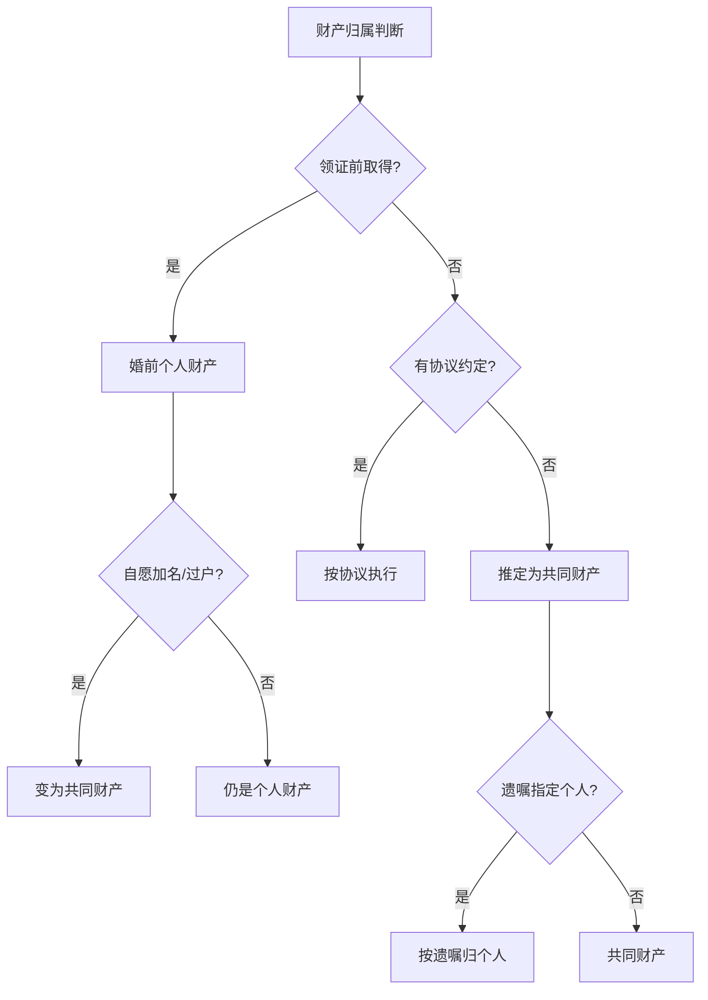

# 核心法条索引

## 民法典第1062条——夫妻共同财产

> 夫妻在婚姻关系存续期间所得的下列财产，为夫妻的共同财产，归夫妻共同所有：
>
> （一）工资、奖金、劳务报酬；
>
> （二）生产、经营、投资的收益；
>
> （三）知识产权的收益；
>
> （四）继承或者受赠的财产，但是本法第一千零六十三条第三项规定的除外；
>
> （五）其他应当归共同所有的财产。
>
> 夫妻对共同财产，有平等的处理权。

### 要点解读

- 时间线：领证后取得的财产才可能成为共同财产
- 第(四)项例外：遗嘱或赠与合同中明确只归一方的，归个人所有
- 第(五)项包括：住房补贴、住房公积金、养老保险金、破产安置补偿等
- 婚前按揭房婚后共同还贷的部分及增值属于共同财产

---

## 民法典第1063条——夫妻个人财产

> 下列财产为夫妻一方的个人财产：
>
> （一）一方的婚前财产；
>
> （二）一方因受到人身损害获得的赔偿或者补偿；
>
> （三）遗嘱或者赠与合同中确定只归一方的财产；
>
> （四）一方专用的生活用品；
>
> （五）其他应当归一方的财产。

### 要点解读

- 第(一)项：结婚时间长短不影响婚前财产归属（废止了"8年转化"旧规）
- 第(二)项：工伤赔偿、交通事故赔偿、保险理赔等
- 第(四)项：牙刷、衣服等日常品不算，金银首饰由法官根据收入水平裁量
- 第(五)项包括：指定受益人的终身寿险保险金、婚前财产的自然孳息和自然增值

---

## 民法典第1064条——夫妻共同债务

> 夫妻双方共同签名或者夫妻一方事后追认等共同意思表示所负的债务，以及夫妻一方在婚姻关系存续期间以个人名义为家庭日常生活需要所负的债务，属于夫妻共同债务。
>
> 夫妻一方在婚姻关系存续期间以个人名义超出家庭日常生活需要所负的债务，不属于夫妻共同债务；但是，债权人能够证明该债务用于夫妻共同生活、共同生产经营或者基于夫妻双方共同意思表示的除外。

### 要点解读

- **共意**：双方签字或事后追认，必须共同偿还
- **共享**：虽未签字但实际受益（如借款买房），必须共同偿还
- 超出日常生活需要的大额债务，举证责任在债权人
- 违法犯罪的债务（赌债、嫖娼欠款）不受法律保护

---

## 民法典第1065条——夫妻财产约定

> 男女双方可以约定婚姻关系存续期间所得的财产以及婚前财产归各自所有、共同所有或者部分各自所有、部分共同所有。约定应当采用书面形式。没有约定或者约定不明确的，适用本法第一千零六十二条、第一千零六十三条的规定。
>
> 夫妻对婚姻关系存续期间所得的财产以及婚前财产的约定，对双方具有法律约束力。

### 要点解读

- 必须以**书面形式**，口头约定无效
- 可在婚前签（婚前财产协议），也可在婚后签（夫妻财产约定书）
- 约定的内容可以灵活：全部共有、全部各自、部分共有部分各自
- 约定对双方具有法律约束力，优先于法定财产制

---

## 彩礼返还（司法解释）

适用以下三种情形，法院支持返还彩礼：
1. 双方未办理结婚登记手续
2. 双方办理结婚登记手续但确未共同生活
3. 婚前给付并导致给付人生活困难

> [!WARNING] 注意：各地法院掌握标准不同，具体案件应咨询当地律师。

> [!TIP] 实用口诀
> 领证前是自己的，领证后是一人一半的；想保个人财产就要签协议，不想给别人就要写遗嘱。
