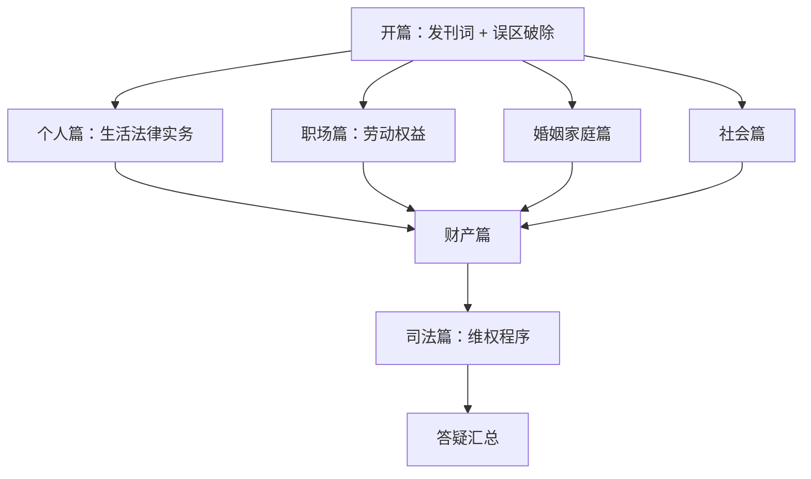

# 课程地图

本课程共 **54 节正课 + 5 节补充课**，按模块组织。建议按模块顺序学习，但个人篇、职场篇、婚姻篇相对独立，可根据需求调整顺序。

## 学习路径



## 模块详情

### 开篇（2 课）
| 课号 | 标题 | 说明 |
|------|------|------|
| 第00课 | 发刊词——人人需要法律课 | 课程总览与民法典简介 |
| 第01课 | 学法、用法中要破除的几个误区 | 常见法律认知误区纠正 |

### 个人篇（13 课）
| 课号 | 标题 | 说明 |
|------|------|------|
| 第02课 | 法律有哪些招数可以对付老赖？ | 债务追索、财产保全、限高措施 |
| 第03课 | 如何避免房屋买卖合同中的坑 | 购房合同审查、限购政策 |
| 第04课 | 买到假货给差评被骚扰怎么办？ | 消费维权 |
| 第05课 | 长租公寓暴雷跑路怎么办？ | 租房维权、租金贷 |
| 第06课 | 医疗纠纷维权注意事项 | 医疗损害 |
| 第07课 | 买新车要知道的法律点 | 购车合同 |
| 第08课 | 交通事故处理指南 | 事故应对 |
| 第09课 | 借车出事故责任由谁担？ | 借用与租借责任 |
| 第10课 | 民法典肖像权新规 | 肖像权保护 |
| 第11课 | 个人信息被贩卖怎么办？ | 隐私保护 |
| 补充课01 | 春节法律盲区 | 假期法律风险 |
| 补充课02 | 消费避坑与维权指南 | 315特别节目 |

### 职场篇（11 课）
| 课号 | 标题 | 说明 |
|------|------|------|
| 第12课 | 劳动合同还是劳务合同？ | 合同性质区分 |
| 第13课 | 公司没交五险一金怎么维权？ | 社保维权 |
| 第14课 | 自愿放弃社保有什么风险？ | 社保放弃后果 |
| 第15课 | 加班费与带薪年假 | 工时福利 |
| 第16课 | 年底离职能否主张年终奖？ | 年终奖金 |
| 第17课 | 劳动仲裁有用吗？ | 劳动争议解决 |
| 第18课 | 离职证明与社保档案转移 | 离职手续 |
| 第19课 | 无固定期限劳动合同 | 铁饭碗合同 |
| 第20课 | 职场女性权益保护 | 女职工特殊保护 |
| 第21课 | 工伤认定标准 | 工伤认定 |
| 第22课 | 养老退休政策 | 养老保险 |

### 婚姻家庭篇（12 课）
| 课号 | 标题 | 说明 |
|------|------|------|
| 第23课 | 结婚的法定条件 | 婚姻要件 |
| 第24课 | 婚前协议的运用技巧 | 婚前财产约定 |
| 第25课 | 同居财产怎么分？ | 同居关系财产 |
| 第26课 | 彩礼嫁妆归属于谁？ | 彩礼纠纷 |
| 第27课 | 房产证加名的法律意义 | 房产产权 |
| 第28课 | 家庭暴力的法律界定 | 家暴与保护令 |
| 第29课 | 出轨维权与证据收集 | 出轨后果 |
| 第30课 | 离婚财产维权 | 离婚财产分割 |
| 第31课 | 哪些情况不能办离婚？ | 离婚限制 |
| 第32课 | 收养子女的条件 | 收养规定 |
| 第33课 | 子女赡养义务 | 赡养父母 |
| 第34课 | 婚姻无效与可撤销 | 婚姻效力 |

### 社会篇（8 课）
| 课号 | 标题 | 说明 |
|------|------|------|
| 第35课 | 误入传销怎么办？ | 传销防范 |
| 第36课 | 遭遇碰瓷如何反击？ | 碰瓷应对 |
| 第37课 | 正当防卫的十大标准 | 正当防卫 |
| 第38课 | 老年人保健品骗局 | 老年防骗 |
| 第39课 | 民法典物业新规 | 物业管理 |
| 第40课 | 网约车法律风险 | 网约车纠纷 |
| 第41课 | P2P暴雷怎么办？ | 投资风险 |
| 第42课 | 个体户还是一人有限公司？ | 创业注册 |

### 财产篇（8 课）
| 课号 | 标题 | 说明 |
|------|------|------|
| 第43课 | 共同财产与个人财产 | 财产区分 |
| 第44课 | 夫妻共同债务 | 婚后债务 |
| 第45课 | 有效遗嘱新规 | 遗嘱形式 |
| 第46课 | 可继承遗产的范围 | 遗产范围 |
| 第47课 | 法定继承顺序 | 继承顺序 |
| 第48课 | 父母为子女买房 | 出资性质 |
| 第49课 | 离婚时转移财产 | 转移财产应对 |
| 第50课 | 赠与撤销 | 房产赠与 |

### 司法篇（4 课）
| 课号 | 标题 | 说明 |
|------|------|------|
| 第51课 | 公检法职能分工 | 司法机关 |
| 第52课 | 刑民事诉讼流程 | 诉讼程序 |
| 第53课 | 如何写起诉状 | 起诉状模板 |
| 第54课 | 案件管辖怎么确定？ | 管辖规则 |

### 答疑（3 课）
| 课号 | 标题 | 说明 |
|------|------|------|
| 补充课03 | 评论区提问汇总（一） | 综合性答疑 |
| 补充课04 | 婚姻家庭相关答疑 | 婚姻家庭问答 |
| 补充课05 | 家庭与个人相关答疑 | 综合问答 |

## 依赖关系

- 开篇 → 所有模块（建议先学）
- 个人篇 → 财产篇（财产篇中多处涉及个人篇概念）
- 职场篇 → 独立，可随时学习
- 婚姻家庭篇 → 财产篇（财产篇大量涉及婚姻财产）
- 社会篇 → 司法篇（了解维权途径后需要了解司法程序）
- 司法篇 → 答疑（答疑涉及司法程序问题）

## 推荐学习顺序

```
开篇 → 个人篇 → 职场篇 → 婚姻家庭篇 → 社会篇 → 财产篇 → 司法篇 → 答疑
```

也可按需跳转：遇到具体问题（如离职、买房、离婚），直接查阅对应课程。