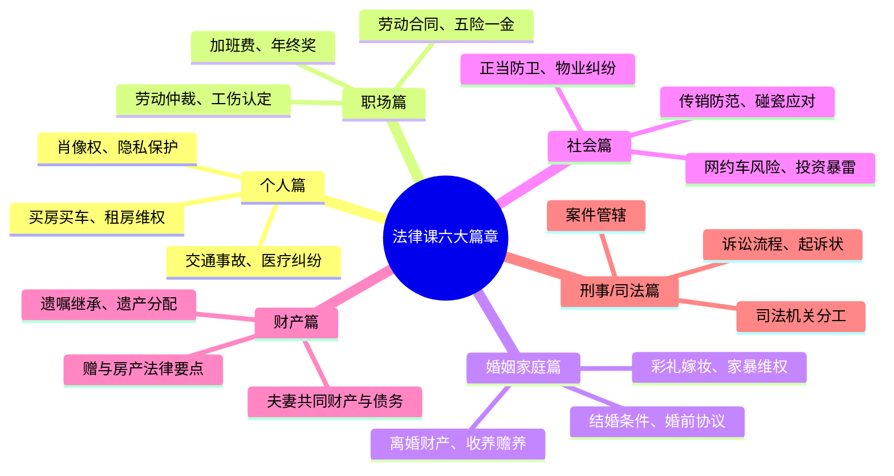
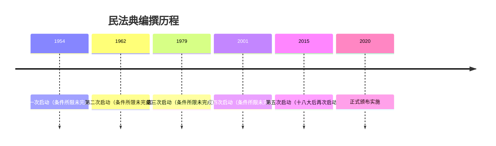

# 第00课：发刊词——人人需要法律课

## Learning Objectives

- 了解课程六大篇章的整体框架与覆盖范围
- 认识民法典的重要地位与五次编撰历程
- 建立"知法、懂法、守法、用法"的法律意识
- 思考赌债是否具有法律效力的基础问题

---

## 一、为什么人人都需要法律课

生活中，违法和犯罪有时只有一步之遥。许多当事人因不懂法、不知法而吃亏入狱：

- 非法吸收公众存款案中，好心帮忙拉人，却成了共同被告人
- 高速路斗气别车，扔矿泉水瓶砸碎对方玻璃，被定寻衅滋事罪
- 被判死刑后追悔莫及的无助眼神

> [!warning] 法律风险无处不在
> 联系律师一小时上千元的咨询费让人望而却步，但只需掌握基础法律知识，就能规避大量风险、省下高额律师费。

---

## 二、课程六大篇章

> [!tip] 课程覆盖范围
> 大到创业、结婚离婚、买车买房，小到物业缴费、拖延工资、熊孩子惹事，都能从中找到答案。

---

## 三、民法典：社会生活的百科全书

### 3.1 漫长而艰苦的编撰历程

民法典是新中国成立以来**第一部以"法典"命名的法律**，经历了五次启动编撰：

- **42.5万人**参与讨论
- 提出 **100多万条** 修改意见
- 最后一次代表大会上，代表们结合疫情对其中10多条内容做了修改

### 3.2 民法典的重要意义

> [!law] 民法典不是简单的法律汇编
> 编撰民法典不是制定全新的民事法律，也不是简单的法律汇编，而是对现有法律进行修订和纂修——修改不适应新情况的规定，对经济生活中的新问题做出有针对性的新规定。

民法典实施后，以下 **九部法律全部废止**：
- 婚姻法、继承法、收养法、合同法、物权法
- 担保法、侵权责任法、民法通则、民法总则

### 3.3 民法典带来的重要变化

| 领域 | 主要变化 |
|------|---------|
| 离婚 | 增加**离婚冷静期**，针对草率离婚问题 |
| 小区物业 | 明确**广告收入归业主**、维修费使用规则 |
| 正当防卫 | 明确**防卫后果**的界定标准 |
| 个人信息 | 加强**个人信息保护** |
| 结婚离婚 | 修改结婚离婚制度和条件 |
| 继承 | 扩大继承范围、调整遗嘱形式 |

> [!quote] "从摇篮到坟墓"
> 民法典涉及百姓从出生到死亡之后的方方面面，被称为社会生活的百科全书。

---

## 四、学习法律的意义

课程的核心理念：**以案说法，听得懂、用得上、玩得转**。

- 每一集通过真实案例让学员感同身受
- 在听故事的同时收获法律知识
- 揭秘案件中的法律关系
- 学会法律人的思维方式
- 寻找解决问题的良方

---

## 五、思考题回顾

> [!question] 思考题：赌债还需要还吗？
> 赌债是在赌博过程中产生的债务，属于**非法债务**，不受法律保护。
> 对于赌博行为，还可以到公安机关举报——因为赌博本身就是一种犯罪。

---

## 本课小结

- 课程涵盖**六大篇章**（个人、职场、婚姻家庭、社会、财产、刑事/司法），覆盖生活方方面面
- 民法典历经**五次编撰**，42.5万人参与，是第一部以法典命名的法律
- 民法典实施后**九部法律**同步废止，影响从摇篮到坟墓的各类事务
- 学法的目的是**知法、懂法、守法、用法**，用法律武器保护自己和家人

---

> [!summary] 下节课预告
> 下一课：[学法用法中要破除的几个误区](0001-common-misconceptions.md)