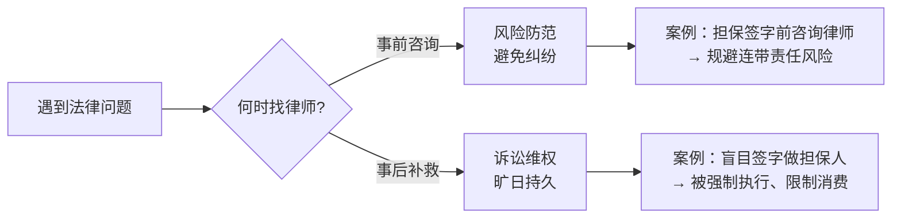
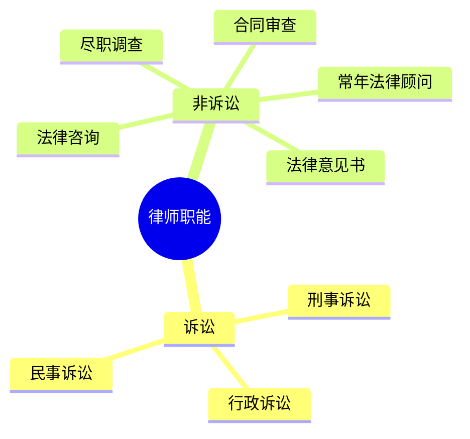

# 第01课：学法、用法中要破除的几个误区

## Learning Objectives

- 破除"不犯法就不需要学法"的常见误解
- 理解守法、违法、犯罪之间的界限与转化
- 认识律师在打官司之外的非诉讼职能
- 建立事前风险防范意识

---

## 思考题回顾：赌债需要还吗？

> [!question] 上节课思考题答案
> 赌债**不需要还**。赌债是在赌博过程中产生的非法债务，不受法律保护。赌博本身就是犯罪，可到公安机关举报。

---

## 二、常见误区辨析

### 误区一：我不干违法的事，学习法律有什么用？

> [!danger] 违法和犯罪只有一步之遥
> 守法、违法和犯罪之间并非不可逾越的鸿沟，而是**一步之遥**的渐进关系。

**典型案例对比**：

| 行为 | 轻则（道德/行政） | 重则（刑事犯罪） |
|------|-----------------|-----------------|
| 小偷小摸 | 批评教育 | 北京地区盗窃**2000元以上**构成盗窃罪 |
| 小打小闹 | 赔礼道歉 | 鉴定构成**轻伤**标准，追究刑事责任 |
| 遭遇袭击 | 正当防卫 | 超出必要限度构成**防卫过当** |

**即使不违法，也离不开民法**：

- 每天点外卖、去菜市场买菜 → 涉及**买卖合同**
- 扫码付款故意说"没扫上"、售货员多找钱拒不归还 → 构成**不当得利**

> [!tip] 法律就在你身边
> 从出生到死亡，一生中的各个阶段行为都离不开法律的规范。无论你愿意不愿意，生活中时处处都有法律的影子。

**常见俗语误区**：

| 流行说法 | 法律规定 |
|---------|---------|
| 法不责众 | 跟风转发谣言同样违法，轻则拘留重则判刑 |
| 嫁出去的女儿泼出去的水 | 出嫁女未迁户口，**有权获得娘家拆迁补偿** |
| 犯罪过追溯时效就不追了 | 立案后逃跑的**不受追溯期限限制** |

### 误区二：律师就是打官司的，出了事才需要找律师

> [!warning] 律师不只是"消防员"
> 律师帮你打官司是最后的手段，如同消防员灭火。好的律师应该教会你在**事前**控制和防范风险。

**真实案例：担保签字涉险**

老张为P2P平台筹措资金，自己投了一千多万，又动员前女友加入。前女友要求老张做担保人，在收据上写明"如果被骗，老张承担返还责任"。结果平台跑路，老张不仅自己的钱没要回来，还被前女友诉至法院强制执行，名下的财产被限制消费。

> [!tip] 签字前问律师
> 如果在签字前打个电话问问律师，事后的损失就不会发生了。

**另一个案例：电视剧《三十而已》中的顾家**

如果能买下茶园之前请教律师，对茶园做个尽职调查，就不会被欺骗，也不会接受资质有问题的茶园导致巨额经济损失。

---

## 三、律师还能做什么？

律师的工作分为**两大类**：

### 诉讼类

- 代理民事诉讼（合同纠纷、侵权纠纷等）
- 代理刑事诉讼（辩护、代理）
- 代理行政诉讼

### 非诉讼类

- **常年法律顾问**：为企业或个人提供日常法律服务
- **法律咨询**：回答法律问题，分析风险
- **合同审查**：审查、修改各类合同，规避条款风险
- **出具法律意见书**：对特定事项出具专业法律意见
- **尽职调查**：对交易对象、投资项目、购房等进行背景调查

> [!quote] 事后的救济不如事前的防范
> 做好事先的风险防范，才是明智的选择。否则出了问题，即使有补救余地，也要面临旷日持久的诉讼。

---

## 思考题回顾

> [!question] 思考题：你了解律师吗？律师除了打官司还可以做什么？
> 律师工作分为两类：**诉讼**（打官司）和**非诉**（不打官司）。非诉业务包括：担任常年法律顾问、提供法律咨询、审查修改合同、出具法律意见书、做尽职调查等。

---

## 本课小结

- **误区一**："我不犯法就不需要学法"是错误的——违法和犯罪只一步之遥，且生活中处处是民法关系
- **误区二**：律师不只是打官司的，**事前风险防范**比事后诉讼更重要
- 常见的法律误区包括**法不责众、嫁女不分财、追溯时效误解**等
- 法律学习可以让人**辨真伪、明是非、知所以然**，防患于未然

---

> [!summary] 下节课预告
> 下一课：[法律有哪些招数可以对付老赖](0002-dealing-with-deadbeats.md)