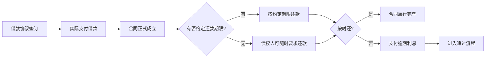
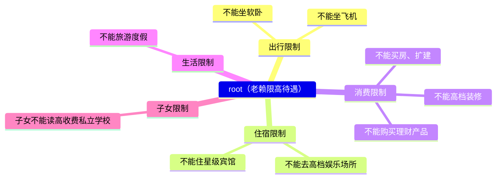
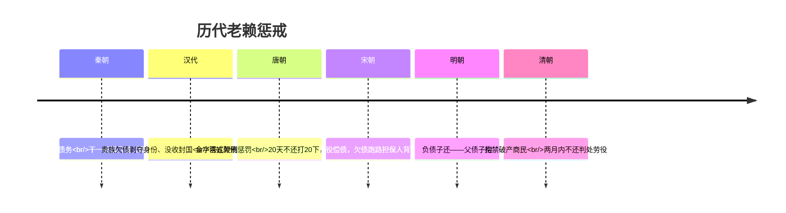

# 第02课：法律有哪些招数可以对付老赖？

## Learning Objectives

- 掌握"老赖"的法律定义与认定标准
- 理解借款合同四大必备条款（民法典第668/675/676/679条）
- 学会对付老赖的四步法律流程
- 了解失信被执行人黑名单与限高措施的具体内容

---

## 一、什么是老赖？

### 1.1 老赖的法律定义

> [!law] 老赖的构成要件
> 法律意义上的老赖一般是指在民商领域的债务人，其**拥有偿还到期债务的能力**，但基于某种原因**拒不偿还**全部或部分债务。

**核心特征**：
- 主观上有**故意拖延履行债务**的恶意
- 客观上**拒不执行到期债务**

> [!warning] 数额大小不是关键
> 老赖（失信人）与**行为**有关，与**钱的数额**无关。只要与对方签了合法的协议，拒不执行就有可能成为老赖。

### 1.2 知名老赖案例

- **王思聪**：成为失信被执行人，被法院下令限高
- **罗永浩**：公司欠巨额债务资不抵债，被限制高消费（后直播卖货积极还债）

---

## 二、借款合同的四大关键条款

民法典专门规定了借款合同的写法要点，逐条分析如下：

### 2.1 合同形式与内容

> [!law] 《民法典》第668条
> 借款合同应当采用**书面形式**（自然人之间借款另有规定的除外）。
> 内容包括：借款种类、币种、用途、数额、利率、期限、还款方式等条款。

### 2.2 还款期限

> [!law] 《民法典》第675条
> 借款人应当按照约定的期限返还借款。对借款期限没有约定或约定不明确的，借款人可以随时还，贷款人也可以随时要求借款人在合同期内返还。

**关键点**：借款合同中没有规定还款期限的，**债权人随时可以要求债务人还款**。

### 2.3 逾期利息（违约责任）

> [!law] 《民法典》第676条
> 借款人未按约定期限返还借款的，应当按照约定或者国家有关规定**支付逾期利息**。

**关键点**：即使借款协议上没有约定利息或约定不清楚，也按国家规定支付逾期利息。

### 2.4 合同成立时间

> [!law] 《民法典》第679条
> 自然人之间的借款合同，自**贷款人提供借款时成立**。

---

## 三、对付老赖的四步法律招数

### 第一招：起诉

> [!tip] 起诉是成为法律上老赖的第一步
> 债务人躲避债务、找不到人、联系不上时，债权人应带上**借条、银行转账凭证、身份证信息**向法院提起诉诉。

- 胜诉后拿到**判决书**，即可到执行厅申请执行
- 经法院认定程序后，才能对老赖采取法律强制执行措施

### 第二招：财产保全

> [!warning] 起诉时务必申请财产保全
> 很多人不知道起诉时就可以申请**冻结被告的财产**。等判决下来，对方早已转移资产。

**财产保全的两大好处**：
1. 避免被告转移财产
2. 判决后法院可直接将冻结财产划归债权人

**真实案例**：当事人在执行案件中后悔——起诉时忘了保全，被告当时有偿还能力，但不断拖延时间（先提管辖异议，又多次改期），一年后赢了官司但钱已被转移。当时说："如果我知道保全就好了……真是欲苦无泪。"

### 第三招：提供财产线索

法院不是万能的，执行法官手中的案子非常多。当事人要积极主动提供财产线索：

| 财产类型 | 具体内容 |
|---------|---------|
| 银行账户 | 各类银行存款 |
| 不动产 | 房产、土地 |
| 动产 | 车辆 |
| 电子账户 | 支付宝、微信账户 |
| 金融资产 | 股票账户 |
| 新型资产 | 有价值的手机号（如尾号666666等） |
| 直播收入 | 直播平台打赏账户余额 |

**真实案例**：被执行人是网络歌手，名下无任何可供执行财产。债权人查到该歌手的直播平台打赏账户有钱，让直播平台配合执行法官冻结，顺利兑现了部分债权。

### 第四招：悬赏

> [!quote] 重赏之下必有勇夫
> 法院可发布悬赏令，通过社会力量查找被执行人下落。

**真实案例**：济南市长清区人民法院判决被告玻璃厂支付原告物流公司43万多元，进入执行程序后穷尽一切手段未执行到位。法院发布悬赏令——提供被执行人线索奖励6万元。悬赏公告仅公布一天，法院就接到举报电话，当天下午成功抓获被执行人。

---

## 四、失信被执行人黑名单制度

### 4.1 黑名单查询

2013年11月起，最高人民法院执行局与中国人民银行征信中心合作，建立了**网上的老赖黑名单系统**。

> [!tip] 查询方式
> 在网上搜索"全国法院失信被执行人名单信息公布与查询"，输入姓名即可查询失信被执行人名单信息。

### 4.2 限制高消费（限高）

根据2015年7月实施的《最高人民法院关于限制被执行人高消费及有关消费的若干规定》：

> [!warning] 限高切断享受之路
> 老赖不还钱是因为把钱用到了别处。限高切断了这个念想——有再多钱没地花也是白搭，只能保持最低生活标准。

### 4.3 创新惩戒措施

法院不断创新惩戒手段：

**彩铃惩戒**：某法院与电信部门联合，将老赖顾某的手机铃声设为："您拨打的机主已经被人民法院公布为失信被执行人了"。结果**第二天**顾某就凑齐钱还清了债务。

---

## 五、历史上的老赖惩戒措施

> [!quote] 古今中外，对老赖都不客气
> 虽然现代惩戒老赖的措施日渐完善，但执行难依然任重道远。

---

## 思考题回顾

> [!question] 思考题：我向老赖追债，不动手打人，但天天跟着他、守在他楼下，这种方法违法吗？
> 只要你**没有限制他人身自由、没有侵犯个人隐私**，就不违法。这是一种没有办法的办法——功夫不负有心人，只要有毅力坚持下去，可能就会有收获。

---

## 本课小结

- 老赖的认定核心是**有钱但拒不偿还**，与金额大小无关
- 借款合同四大要点：**书面形式、还款期限、逾期利息、成立时间**（民法典第668/675/676/679条）
- 对付老赖四步：**起诉 → 财产保全 → 提供线索 → 悬赏**
- 老赖将面临**黑名单曝光、限高、子女教育受限**等多重惩戒

---

> [!summary] 下节课预告
> 下一课：[如何避免房屋买卖合同中的那些坑](0003-house-purchase-contract.md)