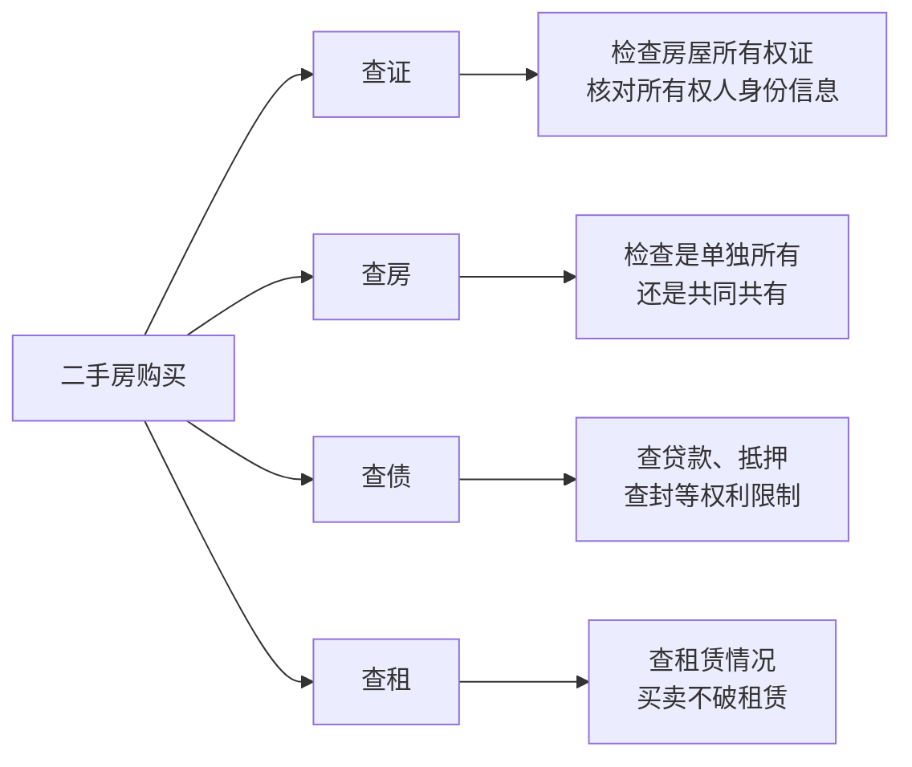

# 第03课：如何避免房屋买卖合同中的那些坑

## Learning Objectives

- 识别商品房买卖中开发商的常见陷阱和虚假宣传
- 掌握一审房（新房）买卖合同的关键审查要素
- 掌握二手房买卖的"四查"要点（查证、查房、查债、查租）
- 理解不动产物权登记效力与定金的法律规则

---

## 一、买房：人生大事中的法律风险

买房给买房人带来无限憧憬，也可能带来无尽意外。开发商想多赚钱，就在商品房中埋下"坑"，而购房者因不懂法、社会经验少，可能事后烦心不已。

> [!warning] 常见购房陷阱
> 一房两卖、定金无法过户、房屋户口无法迁出、学区房办不了手续…… 究其原因在于**房屋买卖合同书写不规范、约定不明确**。

---

## 二、一审房（新房）的坑

### 2.1 格式合同的风险

绝大部分房屋买卖合同来自中介公司或网上的格式合同，这类合同或多或少存在问题。

### 2.2 开发商虚假宣传

**典型案例：学区房六年有效期事件**

开发商在售房宣传时承诺属于"北京四中学区房"，打出广告"百万平米教育大盘，成就无限未来——买长阳半岛上北京四中"，引来家长抢购。

但业主随后得知：就读北京四中房山校区**超过六年不再享有就读条件**。业主大规模维权无果，一纸诉状将开发商诉至法院。

> [!law] 法院判决
> 法院认为"学区对购房行为及房价有着重要的影响"，最终判决：开发商在销售广告中承诺的"长阳半岛业主子女可按照国家九年义务教育制度就读该项目配建的北京四中房山校区的允诺——一房一名额"对其具有约束力。

**启示**：
- 开发商的宣传广告可能构成**合同要约**，具有法律约束力
- 购房者要注意保存开发商的宣传资料、广告作为证据
- 如果没有把握，请律师做尽职调查

### 2.3 一手房合同避坑要素

签订一手房买卖合同时应重点关注：

| 审查要点 | 说明 |
|---------|------|
| 房屋信息 | 房号、面积、楼层、朝向等基本信息 |
| 价格与付款 | 总价、单价、付款方式、付款期限 |
| 交付标准 | 装修情况、附属设施、家电家具等留存物品需列出清单 |
| 交付时间 | 明确交房日期及延期交房的违约责任 |
| 产权办理 | 约定办理房产证的时间及违约责任 |
| 质量保证 | 房屋质量、延期交房、合同解除等细节的违约处理方式 |
| 交付清单 | 详细列出房屋装修、附属设施、家电设备等，避免"保持原样交付"一笔带过 |

> [!danger] 精装修被拆除的教训
> 合同中只写"保持房屋原样交付"而不列具体物品清单，看房时很满意，交付时一贫如洗——精装修被拆除的案例屡见不鲜。

---

## 三、二手房的坑

### 3.1 四查原则

二手房交易需要关注的信息更多，郝律师总结"四查"原则：

### 3.2 查证：核对所有权信息

- 检查房屋所有权证上的所有权人姓名与卖方身份证信息是否一致
- 检查房产证与契税完税凭证记载信息是否一致
- 避免**无处分权人擅自处分**父母、兄弟姐妹、朋友的房屋

### 3.3 查房：区分单独所有与共同共有

> [!warning] 共有房屋的风险
> 如果未查明房屋共有情况就签合同，很可能发生夫妻一方未经对方同意擅自出售房屋，这种处分行为侵犯了另一方的财产共有权，会被认定为**合同买卖无效**。

当房屋是共同共有时，买方必须查清**所有共有权人是否同意出售**。

### 3.4 查债：检查房屋的权利负担

需要检查该房屋是否存在以下情形：
- **贷款未清**
- **存在抵押**
- **被司法机关查封**

> [!law] 《民法典》物权编第209条（不动产物权登记效力）
> 不动产物权的设立、变更、转让和消灭，经依法登记发生效力，未经登记的不发生效力。房屋所有权以**登记**为准，未过户登记，该房屋所有权还是人家的。

**如何查债？**
1. 要求卖房人持房产证原件到房管局查询房屋权属登记信息（俗称"查档"）
2. 亲自确认该房屋没有抵押、不存在影响过户的情形
3. 顺便确认房产证真伪
4. **不要轻信卖房承诺就交付定金或房款**

**容易被忽略的债务**：该房屋是否有拖欠物业费、水电煤气费等费用——常年累积也不是小数目。

> [!tip] 预留尾款
> 双方可在合同中约定：办理房屋交付手续前的水电煤气费、物业费、供暖费、有线电视费等由卖方承担；交付后由买方承担。如果一时不能查清，可在交付房款时**预留尾款**，防止做"接盘侠"。

### 3.5 查租：买卖不破租赁

> [!law] 买卖不破租赁
> 房屋所有权转移后，原承租人仍可继续在租赁期内使用该房屋，买方无权也无法要求承租人搬出去。

另外，**承租人还享有在同等条件下的优先购买权**。

如果已知有租赁但仍想购买，可以要求房主让承租人签署一份**《放弃行使优先购买权的声明》**。

---

## 四、定金的法律规则

> [!danger] "定金"与"订金"一字之差
> 这里的"定金"一定是**宝盖头的定**，不能是言字边的订。一字之差，法律后果差之千里。

**定金的法律效力**：

| 情形 | 法律后果 |
|------|---------|
| 给付定金方不履行合同 | **无法要求退回定金** |
| 收受定金方不履行约定 | **应当双倍返还定金** |

如果前期给付了大额定金，遇到了不诚信的房主或中介，不想卖又不想退定金，就会找出各种理由提出苛刻条件。

---

## 五、房屋交付的关键事项

### 5.1 交付清单

房屋交付标准应在合同附件清单中详细列出：
- 装修情况
- 附属设施
- 家电设备
- 家具等留存物品

### 5.2 风险转移时点

> [!tip] 约定房屋毁损灭失的风险转移
> 合同中应明确：房屋毁损灭失的风险**自房屋交付之日起转移给买方**。在此之前，房屋灭失毁损的风险由卖方承担。

### 5.3 给卖方的提醒

> [!warning] 过户前勿轻易交房
> 在房屋**没有完成所有过户手续之前**，最好不要轻易将房屋交付给买方。

---

## 思考题回顾

> [!question] 回顾思考
> 1. 开发商在广告中承诺学区房，是否具有法律效力？
>    - 法院认定：学区对购房行为及房价有重要影响，广告承诺具有约束力。
> 2. "定金"和"订金"有什么不同？
>    - 定金是担保，付定金方违约不退，收定金方违约双倍返还。
> 3. 查档时应该重点确认哪些信息？
>    - 房屋所有权人信息、单独/共同共有、有无抵押或查封、有无租赁。

---

## 本课小结

- **一手房**：重点防范**格式合同陷阱**和**开发商虚假宣传**，保存宣传资料作为证据
- **二手房**：严格遵循**四查原则**（查证、查房、查债、查租），避免权属不清和权利负担
- **定金规则**：只能写宝盖头的"定"，违约不退或双倍返还
- **交付清单**：列明装修、家电、家具等具体物品，避免"保持原样"一笔带过
- **风险转移**：毁损灭失风险自**房屋交付之日**转移，过户前不要轻易交房

---

> [!summary] 下节课预告
> 下一课：[买到假货给差评，被商家骚扰、威胁怎么办](0005-fake-goods-complaint.md)