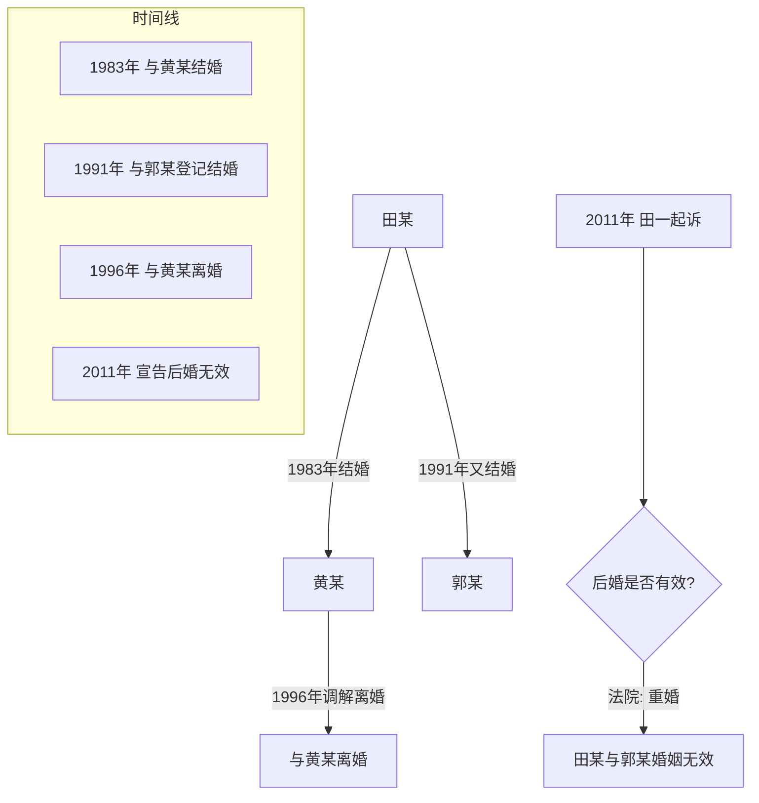
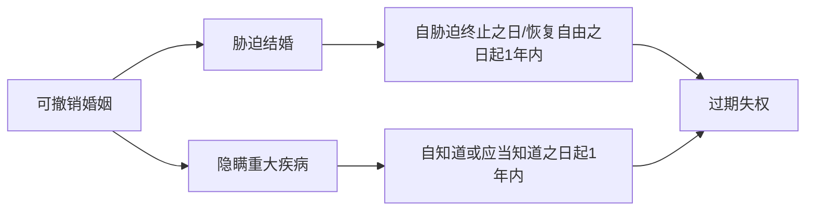

# 第34课：哪些情况下婚姻是无效的？哪些婚姻可以撤销？

## Learning Objectives

- 掌握婚姻无效的三种法定情形
- 理解可撤销婚姻的两种情形及其条件
- 记住撤销权的除斥期间（一年）
- 区分无效婚姻与可撤销婚姻的法律后果

---

## 一、婚姻无效的三种情形

> [!danger] 法律后果
> 婚姻被宣告无效或被撤销的，该婚姻 **自始没有法律约束力**，视为从未发生过。当事人之间不具有夫妻的权利义务。

### 情形一：重婚

- 一方已有配偶又与他人结婚
- 违反 **一夫一妻制**
- 即使前婚已经合法终止，后婚仍然无效

> [!warning] 重婚不因前婚终止而合法化
> 重婚行为从性质上不应当产生从违法到合法的转化问题。无论申请确认婚姻无效时重婚者是存在两个还是一个婚姻关系，都应确认构成重婚的婚姻无效。

#### 案例：田某先后与两人结婚

**裁判要旨**：田某在与郭某登记结婚时并未与黄某离婚，同时存在两个婚姻关系，违反一夫一妻制，构成重婚。即使前婚已终止，后婚仍无效。

### 情形二：禁止结婚的亲属关系

- **直系血亲**：父母子女、祖孙等
- **三代以内旁系血亲**：兄弟姐妹、堂表兄弟姐妹、叔伯姑舅姨

> [!example] 林黛玉与贾宝玉
> 网上数三代都是贾母，属于三代以内旁系血亲，不能结婚。

### 情形三：未达法定婚龄

- 男不满 **22周岁**
- 女不满 **20周岁**

#### 重要例外：补正规则

> [!important] 关键规则
> 如果申请确认婚姻无效时，未达婚龄的情形 **已经不存在**（双方均已达到法定婚龄），则不能以此为由申请确认婚姻无效。

#### 案例：未达婚龄骗取登记

女方未满20岁，用欺骗方式办理了结婚登记。十余年后双方感情破裂，女方请求确认婚姻无效。

**法院判决**：无效情形在起诉时已不存在（双方均已达到法定婚龄），婚姻合法有效，驳回请求。

---

## 二、可撤销婚姻的两种情形

### 情形一：胁迫结婚

- 受胁迫方可自 **胁迫行为终止之日起一年内** 请求撤销
- 被非法限制人身自由的，自 **恢复人身自由之日起一年内** 请求撤销

### 情形二：隐瞒重大疾病

- 《民法典》修正了旧法：患有重大疾病 **可以结婚**，但需在登记前 **如实告知** 另一方
- 未如实告知的，另一方自 **知道或应当知道之日起一年内** 可请求撤销

> [!warning] 撤销权除斥期间
> 可撤销婚姻的撤销权除斥期间为 **一年**，不适用诉讼时效中止、中断的规定，过期即失权。

---

## 三、无效/撤销的法律后果

| 维度 | 后果 |
|------|------|
| 婚姻效力 | **自始无效**，视为从未发生过 |
| 夫妻权利义务 | 不具有，无相互扶养义务 |
| 继承权 | 不能继承对方财产 |
| 财产分割 | 不能按婚姻法分配，按 **协议处理**，协议不成由法院按照顾无过错方原则判决 |

---

## 四、事实婚姻的补充

### 时间分水岭：1994年2月1日

| 时间 | 规则 |
|------|------|
| **1994年2月1日前** | 符合结婚实质要件的，按事实婚姻处理 |
| **1994年2月1日后** | 不再承认事实婚姻，按非法同居对待 |

### 1994年后的重婚风险

> [!warning] 刑事风险
> 1994年2月1日后，有配偶者与他人以夫妻名义同居，仍可按 **重婚罪** 定罪处罚。

### 案例：常某事实婚姻案

常某（男，1946年生）与王某1966年举行婚礼同居，育三子。1985年常某离家，1991年与高某以夫妻名义同居，育二子，2004年补办结婚证。王某诉常某和高某重婚罪。

**法院判决**：不构成重婚罪。常某与王某的事实婚姻、常某与高某的事实婚姻均已先后解除，没有同时保持两个婚姻关系，无重婚故意。

---

## 五、实操提醒

> [!todo] 行动指南
> 1. **婚前必须领证** — 只办酒席、只同居在法律上不算结婚
> 2. **领证必须双方亲自到场** — 不可代办、不可委托
> 3. **有重大疾病需如实告知** — 隐瞒的后果是婚姻可能被撤销
> 4. **发现胁迫婚姻要及时行动** — 一年除斥期间，过期失权
> 5. **1994年后的同居都不是事实婚姻** — 及时补办结婚登记

---

## 总结

| 类别 | 情形 | 时效 |
|------|------|------|
| 无效婚姻 | 重婚 | 无时效限制 |
| 无效婚姻 | 近亲结婚（直系/三代以内旁系） | 无时效限制 |
| 无效婚姻 | 未达法定婚龄 | 达到婚龄后不能主张 |
| 可撤销婚姻 | 胁迫结婚 | 自胁迫终止起1年内 |
| 可撤销婚姻 | 隐瞒重大疾病 | 自知道起1年内 |

---

## 思考题

**男孩的姥姥跟女孩的父亲是亲兄妹，那么男孩跟女孩可以结婚吗？**

> [!note] 答案提示
> - 男孩：第一代
> - 男孩姥姥：第三代
> - 男孩姥姥与女孩父亲是亲兄妹（同源父母）
> - 女孩：第四代（以代数多的为准）
> - 属于 **四代旁系血亲**，不在禁止结婚的三代以内
> - **可以结婚**

---

*此课为婚姻模块基础课，建议与第23课"结婚的法定条件"对照学习*